# Technical Specification

# 1. Introduction

## 1.1 Executive Summary

The codebase documented in this Technical Specification is an **early-stage, skeleton Java project** that scaffolds two closely related order-commerce domains: an **Order Service** (order lifecycle management) and a nested **Pricing Engine** (order pricing computation). The repository presents itself through three short `README.md` files and two minimal Java classes; it is best characterized as an initial structural scaffold rather than a running application.

In its current state the entire codebase consists of exactly five tracked files: three Markdown README documents and two nine-line Java source files (`order-service/OrderService.java` and `order-service/pricing-engine/DiscountCalculator.java`). Only two behaviors are actually implemented today — `OrderService.createOrder()` returns the fixed string `"Order Created"`, and `DiscountCalculator.calculate(double price)` returns `price * 0.9` (a fixed 10% discount). No build tooling, dependency manifests, frameworks, tests, configuration, persistence, networking, or application entry point exist anywhere in the repository.

**Repository at a glance:**

| Attribute | Observed Value |
| --- | --- |
| Declared domains | Order Service (order lifecycle) and Pricing Engine (pricing) |
| Implemented source | 2 Java classes, ~18 lines total, no packages/imports |
| Implemented behaviors | Fixed create-order response; fixed 10% discount |
| Documentation | 3 README files listing intended responsibilities |
| Build / dependencies / tests | None present |
| Application entry point | None present |

**Core business problem.** The repository's README files frame the intended problem domain even where code does not yet exist. The Order Service README (`order-service/README.md`) states the area handles *Create order*, *Update order*, and *Cancel order*, while both the root README (`README.md`) and the nested Pricing Engine README (`order-service/pricing-engine/README.md`) state the engine handles *Price calculation*, *Discount calculation*, and *Tax calculation*. Taken together, the documented business problem is the management of an order's lifecycle combined with the computation of an order's monetary total (base price, discounts, and tax). At present, only order creation (as a fixed acknowledgement) and discounting (as a fixed 10% reduction) are realized in code.

**Key stakeholders and users.** The repository does not explicitly name any stakeholders, personas, service-level agreements, or user groups. The stakeholder categories below are *inferred from the documented responsibilities* and are each tied to a specific declared function; they should be read as domain-implied roles rather than repository-defined facts.

| Stakeholder / User (inferred) | Tie to Documented Responsibility |
| --- | --- |
| Order operations / fulfillment users | Order Service create / update / cancel responsibilities |
| Pricing, finance, or promotions users | Pricing Engine price / discount / tax responsibilities |
| Developers and maintainers | Owners of the Java classes and README scaffolding |

**Expected business impact and value proposition.** Because the codebase is a skeleton, its demonstrated value today is structural: it establishes a named, directory-organized starting point that separates order-lifecycle concerns from pricing concerns, with the Pricing Engine nested inside the Order Service directory. The *intended* value expressed by the READMEs is a consolidated capability for handling orders and computing their prices; realizing that value would require implementing the remaining documented responsibilities (order update/cancel, and price and tax calculation) and adding the build, test, and integration infrastructure that the repository currently lacks.

**A note on naming.** The Git remote identifies this repository as `Healthcare-platform`, yet every in-repository artifact describes an order-management and pricing domain ("Order Service" and "Pricing Engine"). No healthcare-specific code, terminology, or files are present. This specification documents the repository strictly by its observed content; the healthcare naming of the remote is noted here for transparency and is not reflected anywhere in the implementation.

## 1.2 System Overview

This overview describes the system as it exists in the repository today. The system is a minimal, two-domain Java scaffold: an Order Service directory that contains a nested Pricing Engine directory. Each domain carries a README describing intended responsibilities and a single Java class implementing one behavior. The subsections below establish the project's context, provide a high-level description of the implemented and documented elements, and record the (absence of) formal success criteria.

### 1.2.1 Project Context

**Business context and market positioning.** The repository's documentation situates the work in an order-commerce domain. The root README (`README.md`) titles the project "Pricing Engine" and the `order-service/README.md` titles its area "Order Service"; together they describe handling orders and computing their prices. The repository contains **no market-positioning material** — there is no description of target customers, competitors, pricing tiers, business model, or go-to-market intent anywhere in the tracked files. Any such positioning is therefore undetermined by the codebase.

**Current system limitations.** The repository is a greenfield scaffold; there is no evidence that it replaces or upgrades a prior system. The limitations described here are the limitations of the current codebase itself:

| Area | Observed Limitation |
| --- | --- |
| Order operations | Only `createOrder()` exists; it returns a hardcoded `"Order Created"` string with no order data, persistence, or validation. Update and cancel are documented but not implemented. |
| Pricing operations | Only `DiscountCalculator.calculate()` exists; it applies a fixed 10% discount. Price and tax calculation are documented but not implemented. |
| Composition | `OrderService` does not reference `DiscountCalculator`; the two classes are not wired together and there is no orchestration between them. |
| Runtime & infra | No `main()`/entry point, no build tooling, no dependencies, no tests, no configuration, no persistence, and no network/API layer. |

**Integration with the existing enterprise landscape.** The repository defines **no integrations**. There are no imports, no external libraries, no API clients or servers, no messaging, no database drivers, and no configuration referencing external systems. Both Java classes are self-contained, package-less, and dependency-free, so at present the system does not connect to any surrounding enterprise landscape.

### 1.2.2 High-Level Description

**Primary system capabilities.** The capabilities fall into two groups — those implemented in code, and those documented in the READMEs but not yet implemented.

| Capability | Status | Evidence |
| --- | --- | --- |
| Create order (fixed acknowledgement) | Implemented | `order-service/OrderService.java` — `createOrder()` returns `"Order Created"` |
| Discount calculation (fixed 10%) | Implemented | `order-service/pricing-engine/DiscountCalculator.java` — `calculate(price)` returns `price * 0.9` |
| Update order, Cancel order | Documented only | `order-service/README.md` |
| Price calculation, Tax calculation | Documented only | `README.md`, `order-service/pricing-engine/README.md` |

**Major system components.** The repository comprises two code components and three documentation artifacts organized across a two-level directory hierarchy:

| Component | Type | Role |
| --- | --- | --- |
| `OrderService` | Java class | Exposes `createOrder(): String` returning a fixed acknowledgement |
| `DiscountCalculator` | Java class | Exposes `calculate(double): double` applying a fixed 10% discount |
| Three `README.md` files | Documentation | Declare Order Service and Pricing Engine responsibilities |

The structural layout of these components is shown below (directory containment is conveyed by nesting; there are no code-level edges because the classes are not wired to one another):

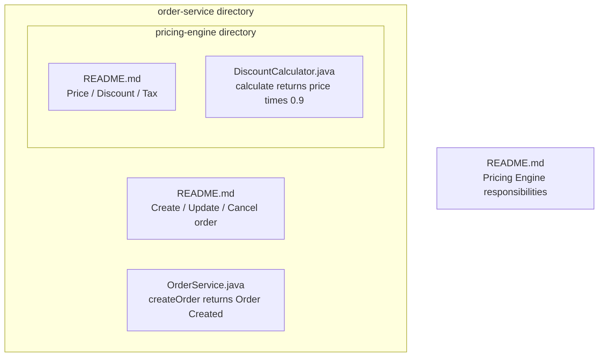
```mermaid
graph TD
    RootReadme["README.md<br/>Pricing Engine responsibilities"]

    subgraph OrderServiceDir["order-service directory"]
        OSReadme["README.md<br/>Create / Update / Cancel order"]
        OSJava["OrderService.java<br/>createOrder returns Order Created"]

        subgraph PricingEngineDir["pricing-engine directory"]
            PEReadme["README.md<br/>Price / Discount / Tax"]
            DCJava["DiscountCalculator.java<br/>calculate returns price times 0.9"]
        end
    end
```

**Core technical approach.** The implementation is plain, framework-free Java. Both classes are declared without a `package` statement, import nothing, hold no fields, define no explicit constructor, and expose a single public, synchronous, stateless instance method. The two implemented methods are, in their entirety:

```java
public String createOrder(){ return "Order Created"; }
public double calculate(double price){ return price * 0.9; }
```

There is no dependency-injection container, no annotations, no interfaces or inheritance, no concurrency, and no error handling — the technical approach is the simplest possible Java expression of the two behaviors.

### 1.2.3 Success Criteria

The repository defines **no formal success criteria**. There are no measurable objectives, critical success factors, service-level agreements, or key performance indicators (KPIs) recorded in any tracked file, and there is no test suite, benchmark, or acceptance criterion against which success could be measured. Consistent with the evidence-based scope of this specification, none are invented here.

| Category | Status in Repository |
| --- | --- |
| Measurable objectives | None defined |
| Critical success factors | None defined |
| Key performance indicators (KPIs) | None defined |

The only objectively verifiable facts currently present are the two deterministic method outputs: `createOrder()` always returns the string `"Order Created"`, and `calculate(price)` always returns `price * 0.9`. Establishing genuine success criteria and KPIs would require product and quality goals that the repository does not yet contain.

## 1.3 Scope

The repository does not contain an explicit scope statement. The boundaries below are therefore derived directly from observed evidence: *in-scope* denotes what the current codebase actually implements, and *out-of-scope* denotes documented-but-unimplemented responsibilities together with the infrastructure, integrations, and use cases that are absent from the repository.

### 1.3.1 In-Scope

**Core features and functionalities.** The functionality genuinely covered by the current codebase is limited to the two implemented methods.

| In-Scope Item | Description | Evidence |
| --- | --- | --- |
| Fixed create-order acknowledgement | `createOrder()` returns the constant string `"Order Created"` | `order-service/OrderService.java` |
| Fixed 10% discount calculation | `calculate(price)` returns `price * 0.9` | `order-service/pricing-engine/DiscountCalculator.java` |
| Responsibility documentation | Three READMEs naming Order Service and Pricing Engine responsibilities | `README.md`, `order-service/README.md`, `order-service/pricing-engine/README.md` |

Considered against the prompt's dimensions:

- **Must-have capabilities:** the two deterministic methods above are the only capabilities present.
- **Primary user workflows:** none are wired end-to-end. Each method can only be invoked directly on its class; there is no orchestration, no request/response flow, and `OrderService` does not call `DiscountCalculator`.
- **Essential integrations:** none — the classes have no imports and no external dependencies.
- **Key technical requirements:** the only requirement evidenced is a Java compiler capable of compiling two package-less classes; no JDK version, build tool, or runtime requirement is declared anywhere in the repository.

**Implementation boundaries.**

| Boundary Dimension | Observed Extent |
| --- | --- |
| System boundary | Two standalone JVM classes (`OrderService`, `DiscountCalculator`); no process, service, or network boundary is defined |
| User groups covered | None — no authentication, authorization, roles, or user interface exist |
| Geographic / market coverage | None specified anywhere in the repository |
| Data domains included | A single numeric `price` input (`double`) and two constant outputs; no order, customer, catalog, or tax data model exists |

### 1.3.2 Out-of-Scope

The following are **not covered** by the repository in its current state. Items marked "documented" appear in the READMEs as intended responsibilities but have no implementation and are therefore outside the scope of the current code.

| Excluded Area | Detail | Source of Expectation |
| --- | --- | --- |
| Order update / cancel | Named in the Order Service README but not implemented | `order-service/README.md` |
| Price calculation / Tax calculation | Named in the Pricing Engine READMEs but not implemented | `README.md`, `order-service/pricing-engine/README.md` |
| Real order data & dynamic pricing | Outputs are hardcoded; no order model, configurable discount, or price/tax logic exists | Observed code |
| Cross-component orchestration | `OrderService` does not invoke `DiscountCalculator`; no composition layer exists | Observed code |
| Platform infrastructure | No build tooling, dependencies, tests, configuration, persistence, API/UI, security, logging, or CI/CD | Observed repository |

**Future phase considerations.** Although the repository does not define a roadmap, the documented-but-unimplemented responsibilities are the natural candidates for subsequent phases: implementing order update and cancel; implementing price and tax calculation; parameterizing the discount rate; wiring the Order Service to the Pricing Engine; and introducing build, dependency, test, and integration infrastructure.

**Integration points not covered.** No external integration points (databases, message queues, REST/gRPC services, payment or tax providers, identity systems) are present or referenced, so none are in scope.

**Unsupported use cases.** Any scenario requiring persisted or validated order data, order modification or cancellation, base-price or tax computation, configurable or conditional discounting, concurrency, error handling, or interaction with external systems is unsupported by the current implementation.

## 1.4 References

The following repository artifacts were inspected as evidence for this Introduction. Every factual claim above is grounded in these files, folders, and repository metadata.

**Files examined:**

- `README.md` — Root documentation; established the project title "Pricing Engine" and the documented responsibilities Price calculation, Discount calculation, and Tax calculation.
- `order-service/OrderService.java` — Established the sole implemented order behavior: a package-less, stateless `OrderService` class whose `createOrder()` method returns the fixed string `"Order Created"`.
- `order-service/README.md` — Established the "Order Service" area title and its documented responsibilities: Create order, Update order, and Cancel order.
- `order-service/pricing-engine/DiscountCalculator.java` — Established the sole implemented pricing behavior: a package-less, stateless `DiscountCalculator` class whose `calculate(double price)` method returns `price * 0.9` (a fixed 10% discount).
- `order-service/pricing-engine/README.md` — Established the nested "Pricing Engine" title and its documented responsibilities: Price calculation, Discount calculation, and Tax calculation.

**Folders examined:**

- `` (repository root) — Confirmed the two top-level children (`README.md`, `order-service/`) and the absence of any root-level build, dependency, configuration, or test artifacts.
- `order-service/` — The top-level Order Service directory containing `OrderService.java`, `README.md`, and the nested `pricing-engine/` module.
- `order-service/pricing-engine/` — The nested Pricing Engine module containing `DiscountCalculator.java` and `README.md`.

**Repository metadata (verified via terminal):**

- Git tracked-file listing and directory scan — Confirmed the complete inventory of exactly five tracked files and the absence of build tooling, tests, configuration, and CI/CD.
- Git remote and commit history — Confirmed the remote repository name `Healthcare-platform` (versus the order/pricing content) and a five-commit "Create/Update file" history consistent with an early-stage skeleton.

**External sources:** None. No web sources were consulted; all content is derived from the repository itself.

# 2. Product Requirements

## 2.1 Feature Catalog

This section decomposes the system into discrete, testable features derived **strictly** from the repository's observed contents: two Java source files and three `README.md` documents. Two features are realized in code today; four additional features are declared in the READMEs' "Handles:" lists but have no implementation. Consistent with the evidence established in Section 1.2 (System Overview) and Section 1.3 (Scope), no capability, priority, or success metric is invented here beyond what the repository states or demonstrably implements.

**Identifier conventions.** Features use the identifier form `F-XXX` and their requirements (Section 2.2) use `F-XXX-RQ-YYY`. Identifiers are stable and are reused across the Functional Requirements (2.2), Feature Relationships (2.3), Implementation Considerations (2.4), and Traceability Matrix (2.5) sub-sections.

**Status and priority legend.** The status values used are *Proposed*, *Approved*, *In Development*, and *Completed*. A feature is marked **In Development** when a partial (stub-level) implementation exists in code, and **Proposed** when it appears only as a documented responsibility with no code. Priority uses *Critical / High / Medium / Low*.

**How features were derived.** Two features map to concrete Java behavior; four map to documented-but-unimplemented responsibilities:

| Feature ID | Feature Name | Category | Priority |
| --- | --- | --- | --- |
| F-001 | Order Creation | Order Management | Critical |
| F-002 | Discount Calculation | Pricing | High |
| F-003 | Order Update | Order Management | Medium |
| F-004 | Order Cancellation | Order Management | Medium |
| F-005 | Price Calculation | Pricing | High |
| F-006 | Tax Calculation | Pricing | Medium |

| Feature ID | Status | Primary Evidence |
| --- | --- | --- |
| F-001 | In Development | `order-service/OrderService.java`, `order-service/README.md` |
| F-002 | In Development | `order-service/pricing-engine/DiscountCalculator.java`, `README.md` |
| F-003 | Proposed | `order-service/README.md` ("Update order") |
| F-004 | Proposed | `order-service/README.md` ("Cancel order") |
| F-005 | Proposed | `README.md`, `order-service/pricing-engine/README.md` ("Price calculation") |
| F-006 | Proposed | `README.md`, `order-service/pricing-engine/README.md` ("Tax calculation") |

**Assumptions and constraints (apply to the entire section).**

- **No repository-declared priorities or metrics.** The repository declares no priorities, service-level agreements (SLAs), or key performance indicators (KPIs) — a fact confirmed in Section 1.2.3 (Success Criteria). All *Priority*, *Status*, MoSCoW, and *Complexity* values in this section are therefore analytical assessments grounded in the documented responsibilities and observed code, not repository-declared facts.
- **Documented-only features.** F-003, F-004, F-005, and F-006 are derived directly from the READMEs' "Handles:" lists and have no implementation. Their acceptance criteria are **future target criteria**, not descriptions of current behavior.
- **No cross-component orchestration.** `OrderService` does not reference or invoke `DiscountCalculator` (verified by source inspection). The only relationship between the two implemented components is directory containment (see Section 2.3).
- **Deterministic, hardcoded behavior.** The two implemented methods perform no validation, rounding, I/O, persistence, or configuration; there is no order, customer, catalog, or tax data model anywhere in the repository.
- **Requirement versioning.** All requirements in this section are at baseline **version 1.0**. The Git history shows only file-creation/update commits with no revision to the two implemented behaviors, so no superseded requirement versions exist.
- **Naming.** The repository/remote is named `Healthcare-platform`, but every artifact describes an Order Service and Pricing Engine domain; no healthcare feature exists (see Section 1.1).

### 2.1.1 F-001: Order Creation

**Feature Metadata**

| Attribute | Value |
| --- | --- |
| Unique ID | F-001 |
| Feature Name | Order Creation |
| Feature Category | Order Management |
| Priority Level | Critical (assessed) |
| Status | In Development (minimal stub implemented) |

**Description**

- **Overview:** Exposes a single order-creation operation on the `OrderService` class. In its current form, `createOrder()` accepts no arguments and returns the fixed acknowledgement string `"Order Created"`, with no order data, validation, or persistence. The broader "Create order" responsibility is documented in `order-service/README.md`.
- **Business Value:** Establishes the entry point of the order lifecycle — the foundational operation on which the documented update, cancel, and pricing responsibilities logically depend. As implemented, its value today is structural (a named, callable service seam).
- **User Benefits:** For the order-operations/fulfillment role implied by the Order Service README, the operation provides a deterministic create-order acknowledgement that a caller can invoke directly.
- **Technical Context:** Implemented as a package-less, stateless `OrderService` class with no fields, no explicit constructor, and one public synchronous instance method that declares no checked exceptions.

**Dependencies**

| Dependency Type | Detail |
| --- | --- |
| Prerequisite Features | None — this is the root operation of the order domain |
| System Dependencies | A Java compiler/JVM capable of compiling one package-less class (no JDK version is declared in the repository) |
| External Dependencies | None — the class has no imports and uses no third-party libraries |
| Integration Requirements | None present — no API/controller, no persistence, and no in-repository caller invokes `createOrder()` |

### 2.1.2 F-002: Discount Calculation

**Feature Metadata**

| Attribute | Value |
| --- | --- |
| Unique ID | F-002 |
| Feature Name | Discount Calculation |
| Feature Category | Pricing |
| Priority Level | High (assessed) |
| Status | In Development (fixed-rate implementation) |

**Description**

- **Overview:** Exposes a discount computation on the `DiscountCalculator` class. `calculate(double price)` returns `price * 0.9`, i.e. a fixed 10% reduction of the supplied price. This is the only implemented member of the "Discount calculation" responsibility documented in `README.md` and `order-service/pricing-engine/README.md`.
- **Business Value:** Realizes the discounting portion of the Pricing Engine, reducing an order's price by a fixed percentage. It is the single working pricing behavior in the repository.
- **User Benefits:** For the pricing/promotions role implied by the Pricing Engine README, the operation returns a deterministic discounted amount for any numeric price.
- **Technical Context:** Implemented as a package-less, stateless `DiscountCalculator` class with a single public synchronous method that takes a primitive `double` and returns a primitive `double`; there is no rounding, currency handling, bounds checking, or configuration of the discount rate.

**Dependencies**

| Dependency Type | Detail |
| --- | --- |
| Prerequisite Features | None in code. Conceptually the documented Price Calculation (F-005) would supply the input `price`, but no such wiring exists |
| System Dependencies | A Java compiler/JVM capable of compiling one package-less class (no JDK version declared) |
| External Dependencies | None — the class has no imports and uses no third-party libraries |
| Integration Requirements | None present — `DiscountCalculator` is not referenced by `OrderService` or any other class |

### 2.1.3 F-003: Order Update

**Feature Metadata**

| Attribute | Value |
| --- | --- |
| Unique ID | F-003 |
| Feature Name | Order Update |
| Feature Category | Order Management |
| Priority Level | Medium (assessed) |
| Status | Proposed (documented only; no implementation) |

**Description**

- **Overview:** Listed as "Update order" in `order-service/README.md`. No method, class, or data model implementing order modification exists in the repository.
- **Business Value:** Would enable modification of an existing order after creation, completing part of the documented order lifecycle.
- **User Benefits:** Would allow the order-operations role to amend order details rather than only creating orders.
- **Technical Context:** Not implemented. Realizing it would require an order data model and mutable order state, neither of which is present (`OrderService` holds no fields and manages no state).

**Dependencies**

| Dependency Type | Detail |
| --- | --- |
| Prerequisite Features | F-001 (Order Creation) — an order must exist before it can be updated |
| System Dependencies | Would require an order data model and a persistence mechanism; none exist today |
| External Dependencies | None declared |
| Integration Requirements | Would require order retrieval/storage integration that is not present |

### 2.1.4 F-004: Order Cancellation

**Feature Metadata**

| Attribute | Value |
| --- | --- |
| Unique ID | F-004 |
| Feature Name | Order Cancellation |
| Feature Category | Order Management |
| Priority Level | Medium (assessed) |
| Status | Proposed (documented only; no implementation) |

**Description**

- **Overview:** Listed as "Cancel order" in `order-service/README.md`. No method, class, or data model implementing order cancellation exists in the repository.
- **Business Value:** Would enable termination of an existing order, completing the documented create/update/cancel lifecycle.
- **User Benefits:** Would allow the order-operations role to cancel orders.
- **Technical Context:** Not implemented. Realizing it would require order state and status transitions, neither of which exists.

**Dependencies**

| Dependency Type | Detail |
| --- | --- |
| Prerequisite Features | F-001 (Order Creation) — an order must exist before it can be cancelled |
| System Dependencies | Would require an order data model with a status/lifecycle representation; none exists today |
| External Dependencies | None declared |
| Integration Requirements | Would require order retrieval/storage integration that is not present |

### 2.1.5 F-005: Price Calculation

**Feature Metadata**

| Attribute | Value |
| --- | --- |
| Unique ID | F-005 |
| Feature Name | Price Calculation |
| Feature Category | Pricing |
| Priority Level | High (assessed) |
| Status | Proposed (documented only; no implementation) |

**Description**

- **Overview:** Listed as "Price calculation" in `README.md` and `order-service/pricing-engine/README.md`. No method or class computing a base price exists; only the fixed-rate discount (F-002) is implemented in the Pricing Engine.
- **Business Value:** Would establish the base monetary amount of an order — the input that discount (F-002) and tax (F-006) logically operate on.
- **User Benefits:** Would allow the pricing role to determine an order's base price prior to applying discounts and tax.
- **Technical Context:** Not implemented. Realizing it would require line-item/catalog inputs and pricing rules, none of which are present (the only pricing input in code is a single `double price` passed directly to the discount method).

**Dependencies**

| Dependency Type | Detail |
| --- | --- |
| Prerequisite Features | None in code; conceptually a precondition for F-002 and F-006 |
| System Dependencies | Would require a catalog/line-item data model; none exists today |
| External Dependencies | None declared |
| Integration Requirements | Would need to supply price inputs to the discount/tax operations; no such wiring exists |

### 2.1.6 F-006: Tax Calculation

**Feature Metadata**

| Attribute | Value |
| --- | --- |
| Unique ID | F-006 |
| Feature Name | Tax Calculation |
| Feature Category | Pricing |
| Priority Level | Medium (assessed) |
| Status | Proposed (documented only; no implementation) |

**Description**

- **Overview:** Listed as "Tax calculation" in `README.md` and `order-service/pricing-engine/README.md`. No method or class computing tax exists in the repository.
- **Business Value:** Would compute the tax component of an order's total, completing the documented price/discount/tax pricing responsibility.
- **User Benefits:** Would allow the pricing/finance role to obtain a tax-inclusive order total.
- **Technical Context:** Not implemented. Realizing it would require tax rate/jurisdiction rules and a taxable-amount input, none of which exist.

**Dependencies**

| Dependency Type | Detail |
| --- | --- |
| Prerequisite Features | Conceptually F-005 (Price Calculation) and/or F-002 (Discount Calculation) to supply the taxable amount; no wiring exists |
| System Dependencies | Would require tax-rate/jurisdiction configuration; none exists today |
| External Dependencies | None declared |
| Integration Requirements | Would require an input amount from the pricing flow; no such integration is present |

## 2.2 Functional Requirements

Each feature from Section 2.1 is expanded here into testable requirements identified as `F-XXX-RQ-YYY`. For the two implemented features (F-001, F-002) the requirements describe **actual, verifiable behavior** in the source code. For the four documented-only features (F-003–F-006) each carries a single **target** requirement whose acceptance criteria describe intended future behavior and are **not verifiable against the current codebase**.

**Legend.** Priority uses MoSCoW (*Must-Have / Should-Have / Could-Have*); Complexity uses *High / Medium / Low*.

**Section-wide technical notes (apply to every requirement below).**

- **Performance criteria:** None are defined anywhere in the repository (see Section 1.2.3). The two implemented methods are deterministic, in-memory, and constant-time (O(1)); they perform no I/O, networking, or concurrency.
- **Security requirements:** None are declared. There is no authentication, authorization, input sanitization, encryption, secrets handling, or logging anywhere in the repository.
- **Compliance requirements:** None are declared. No regulatory, audit, data-retention, or privacy requirement appears in any tracked file.

### 2.2.1 F-001: Order Creation

**Requirement Details**

| Requirement ID | Description | Priority | Complexity |
| --- | --- | --- | --- |
| F-001-RQ-001 | The `OrderService` class exposes a public, no-argument `createOrder()` operation returning a `String`. | Must-Have | Low |
| F-001-RQ-002 | `createOrder()` returns the exact literal `"Order Created"` on every invocation. | Must-Have | Low |

**Acceptance Criteria**

| Requirement ID | Acceptance Criteria |
| --- | --- |
| F-001-RQ-001 | `OrderService` compiles; `createOrder()` is `public`, takes no parameters, declares no checked exceptions, and has return type `String`. |
| F-001-RQ-002 | A direct call to `createOrder()` returns a `String` equal to `"Order Created"` deterministically (identical result on repeated calls). |

**Technical Specifications**

| Requirement ID | Input Parameters | Output / Response | Data Requirements |
| --- | --- | --- | --- |
| F-001-RQ-001 | None | `String` | None — no order/customer data model exists |
| F-001-RQ-002 | None | `String` literal `"Order Created"` | None — no persisted or reference data |

**Validation Rules**

| Requirement ID | Business Rules | Data Validation |
| --- | --- | --- |
| F-001-RQ-001 | Fixed acknowledgement operation; no conditional business logic | None — there are no inputs to validate |
| F-001-RQ-002 | Output is a constant; no branching or state | None |

Security and compliance requirements: none declared (see section-wide notes). Version: 1.0.

### 2.2.2 F-002: Discount Calculation

**Requirement Details**

| Requirement ID | Description | Priority | Complexity |
| --- | --- | --- | --- |
| F-002-RQ-001 | The `DiscountCalculator` class exposes a public `calculate(double price)` operation returning a `double`. | Must-Have | Low |
| F-002-RQ-002 | `calculate(price)` applies a fixed 10% discount, returning `price * 0.9`. | Must-Have | Low |

**Acceptance Criteria**

| Requirement ID | Acceptance Criteria |
| --- | --- |
| F-002-RQ-001 | `DiscountCalculator` compiles; `calculate` is `public`, accepts one `double` parameter, and returns `double`. |
| F-002-RQ-002 | For any input `price`, the return value equals `price * 0.9` (e.g., `100.0` → `90.0`; `0.0` → `0.0`), deterministically. |

**Technical Specifications**

| Requirement ID | Input Parameters | Output / Response | Data Requirements |
| --- | --- | --- | --- |
| F-002-RQ-001 | `double price` | `double` | A single numeric price; no catalog/order model |
| F-002-RQ-002 | `double price` | `double` equal to `price * 0.9` | None — no persisted or reference data |

**Validation Rules**

| Requirement ID | Business Rules | Data Validation |
| --- | --- | --- |
| F-002-RQ-001 | Discount rate is fixed at 10% and is not configurable | None — any `double` (including negative or zero) is accepted without checks |
| F-002-RQ-002 | Result is 90% of input; no rounding or currency handling | None — no bounds or precision checks; standard IEEE-754 `double` arithmetic |

Security and compliance requirements: none declared (see section-wide notes). Version: 1.0.

### 2.2.3 F-003: Order Update

**Requirement Details**

| Requirement ID | Description | Priority | Complexity |
| --- | --- | --- | --- |
| F-003-RQ-001 | Provide an operation to update an existing order's details (documented as "Update order"; not implemented). | Should-Have | Medium |

This requirement is **Proposed** and derived from `order-service/README.md`. Its specification is a forward-looking target; no code, data model, or test currently exists for it.

| Attribute | Detail |
| --- | --- |
| Acceptance Criteria (target) | Given an existing order, its mutable fields can be modified and the change is reflected on subsequent retrieval. Not verifiable today — no implementation. |
| Input Parameters | To be defined — an order identifier plus the fields to change (no order model exists) |
| Output / Response | To be defined |
| Data Requirements | Requires a persisted, mutable order entity — absent from the repository |
| Business & Validation Rules | To be defined — none exist today |
| Security / Compliance | None declared |

Version: 1.0 (target).

### 2.2.4 F-004: Order Cancellation

**Requirement Details**

| Requirement ID | Description | Priority | Complexity |
| --- | --- | --- | --- |
| F-004-RQ-001 | Provide an operation to cancel an existing order (documented as "Cancel order"; not implemented). | Should-Have | Medium |

This requirement is **Proposed** and derived from `order-service/README.md`. Its specification is a forward-looking target; no code, data model, or test currently exists for it.

| Attribute | Detail |
| --- | --- |
| Acceptance Criteria (target) | Given an existing order, it transitions to a cancelled state and the cancellation is reflected on subsequent retrieval. Not verifiable today — no implementation. |
| Input Parameters | To be defined — an order identifier (no order model exists) |
| Output / Response | To be defined |
| Data Requirements | Requires an order entity with a status/lifecycle representation — absent from the repository |
| Business & Validation Rules | To be defined — none exist today |
| Security / Compliance | None declared |

Version: 1.0 (target).

### 2.2.5 F-005: Price Calculation

**Requirement Details**

| Requirement ID | Description | Priority | Complexity |
| --- | --- | --- | --- |
| F-005-RQ-001 | Provide an operation to compute an order's base price (documented as "Price calculation"; not implemented). | Should-Have | Medium |

This requirement is **Proposed** and derived from `README.md` and `order-service/pricing-engine/README.md`. Its specification is a forward-looking target; no code, data model, or test currently exists for it.

| Attribute | Detail |
| --- | --- |
| Acceptance Criteria (target) | Given an order's line items, the operation returns the computed base price. Not verifiable today — no implementation. |
| Input Parameters | To be defined — line items and/or catalog references (no such model exists) |
| Output / Response | To be defined — a numeric base price |
| Data Requirements | Requires a catalog/line-item data model — absent from the repository |
| Business & Validation Rules | To be defined — none exist today |
| Security / Compliance | None declared |

Version: 1.0 (target).

### 2.2.6 F-006: Tax Calculation

**Requirement Details**

| Requirement ID | Description | Priority | Complexity |
| --- | --- | --- | --- |
| F-006-RQ-001 | Provide an operation to compute tax on an order's price (documented as "Tax calculation"; not implemented). | Could-Have | Medium |

This requirement is **Proposed** and derived from `README.md` and `order-service/pricing-engine/README.md`. Its specification is a forward-looking target; no code, data model, or test currently exists for it.

| Attribute | Detail |
| --- | --- |
| Acceptance Criteria (target) | Given a taxable amount (and an applicable rate/jurisdiction), the operation returns the tax amount. Not verifiable today — no implementation. |
| Input Parameters | To be defined — a taxable amount plus rate/jurisdiction inputs |
| Output / Response | To be defined — a numeric tax amount |
| Data Requirements | Requires tax-rate/jurisdiction configuration — absent from the repository |
| Business & Validation Rules | To be defined — none exist today |
| Security / Compliance | None declared |

Version: 1.0 (target).

## 2.3 Feature Relationships

The repository exhibits **one concrete, code-observable relationship**: the directory containment of the Pricing Engine within the Order Service directory. There is **no code-level coupling** between features — `OrderService` does not import, reference, or invoke `DiscountCalculator`, and the two classes declare no package, share no types, and expose no common interface. Accordingly, this sub-section distinguishes the single structural relationship that exists from the conceptual (documented-only) dependencies implied by the READMEs, which have no wiring in code.

### 2.3.1 Feature Dependency Map

**Structural relationship (evidence-based).** The only relationship present in the codebase is directory nesting: `order-service/pricing-engine/` is a sub-directory of `order-service/`. This organizes the Pricing Engine features (F-002, F-005, F-006) beneath the Order Service features (F-001, F-003, F-004) but creates no runtime dependency. This mirrors the structural layout established in Section 1.2.2.

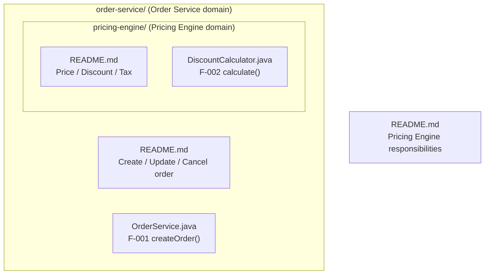
```mermaid
flowchart TD
    RootReadme["README.md<br/>Pricing Engine responsibilities"]
    subgraph OSDir["order-service/ (Order Service domain)"]
        OSReadme["README.md<br/>Create / Update / Cancel order"]
        OSJava["OrderService.java<br/>F-001 createOrder()"]
        subgraph PEDir["pricing-engine/ (Pricing Engine domain)"]
            PEReadme["README.md<br/>Price / Discount / Tax"]
            DCJava["DiscountCalculator.java<br/>F-002 calculate()"]
        end
    end
```

**Conceptual dependencies (documented-only, NOT wired in code).** The dependencies below are logical preconditions inferred from the documented responsibilities. They are shown with dashed edges to emphasize that **no such calls or references exist in the source**; they represent how the features would relate if the Proposed features were implemented and orchestrated.

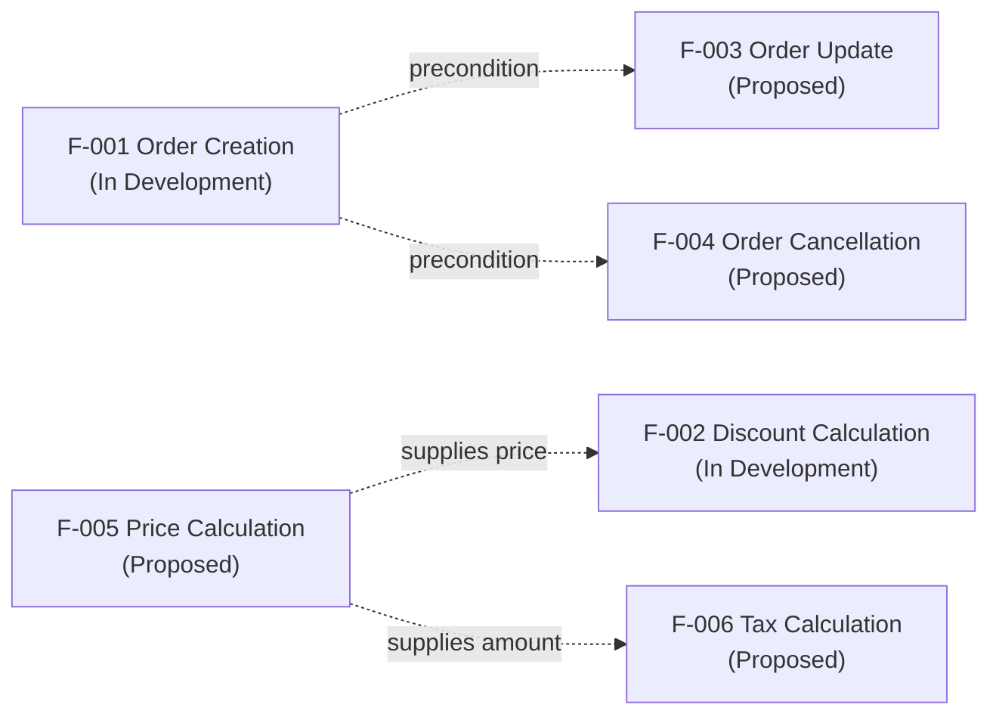
```mermaid
flowchart LR
    F001["F-001 Order Creation<br/>(In Development)"]
    F003["F-003 Order Update<br/>(Proposed)"]
    F004["F-004 Order Cancellation<br/>(Proposed)"]
    F005["F-005 Price Calculation<br/>(Proposed)"]
    F002["F-002 Discount Calculation<br/>(In Development)"]
    F006["F-006 Tax Calculation<br/>(Proposed)"]
    F001 -.->|"precondition"| F003
    F001 -.->|"precondition"| F004
    F005 -.->|"supplies price"| F002
    F005 -.->|"supplies amount"| F006
```

| Dependent Feature | Depends On (conceptual) | Basis |
| --- | --- | --- |
| F-003 Order Update | F-001 Order Creation | An order must exist before it can be updated |
| F-004 Order Cancellation | F-001 Order Creation | An order must exist before it can be cancelled |
| F-002 Discount Calculation | F-005 Price Calculation | A discount logically applies to a base price |
| F-006 Tax Calculation | F-005 Price Calculation | Tax logically applies to a (priced) amount |

**Implemented behavior process flow.** The two implemented features execute as independent, single-step flows with no interaction between them:

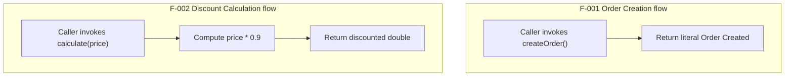
```mermaid
flowchart TD
    subgraph OC["F-001 Order Creation flow"]
        A1["Caller invokes createOrder()"] --> A2["Return literal Order Created"]
    end
    subgraph DC["F-002 Discount Calculation flow"]
        B1["Caller invokes calculate(price)"] --> B2["Compute price * 0.9"]
        B2 --> B3["Return discounted double"]
    end
```

### 2.3.2 Integration Points

No integration points exist. The classes have no imports, and the repository contains no API layer, message queue, database driver, HTTP client/server, or configuration referencing an external system — consistent with the "no integrations" finding in Section 1.2.1.

| Integration Category | Status in Repository |
| --- | --- |
| Inter-feature (in-process) calls | None — `OrderService` does not invoke `DiscountCalculator` |
| External services / APIs | None — no clients, servers, or endpoints |
| Persistence / messaging | None — no databases, queues, or drivers |
| Configuration-based integration | None — no configuration files exist |

### 2.3.3 Shared Components and Common Services

No shared components and no common services exist across features. Each implemented behavior resides in its own standalone, package-less class; there is no shared base class, interface, utility, model, dependency-injection container, configuration service, logging facility, or error-handling component anywhere in the repository.

| Candidate Shared Element | Status in Repository |
| --- | --- |
| Common base class / interface | None — classes have no inheritance or implemented interfaces |
| Shared data model (order, price, tax) | None — no domain model exists |
| Shared package / namespace | None — both classes are package-less |
| Common service (DI, config, logging, error handling) | None present |

## 2.4 Implementation Considerations

The considerations below apply the five dimensions — technical constraints, performance, scalability, security, and maintenance — to each feature. Because the repository is a greenfield scaffold, several considerations are uniform across all features and are stated once here, then specialized per feature in the matrices that follow.

**System-wide considerations (apply to all features).**

- **No build/runtime.** There is no build tooling, dependency manifest, or application entry point; the two classes can only be compiled individually (e.g., with `javac`) and invoked directly. No feature can currently run as a deployable service. No JDK version is declared.
- **Package-less classes.** Both implemented classes omit a `package` declaration, which constrains growth: introducing additional classes or namespaces would require restructuring into packages before the codebase can scale cleanly.
- **No tests.** The absence of any test suite means no feature has a regression safety net; every change must be verified manually.
- **No security or observability.** There is no authentication, authorization, input validation, logging, or error handling anywhere, so every feature inherits a "no controls" baseline.

**Technical constraints and scalability (per feature).**

| Feature ID | Technical Constraints | Scalability Considerations |
| --- | --- | --- |
| F-001 Order Creation | Package-less class; returns a hardcoded string; no order model; no caller/entry point invokes it | Stateless and in-memory, so trivially replicable in principle, but there is no runtime/service to scale and no persistence tier |
| F-002 Discount Calculation | Package-less class; 10% rate hardcoded; uses primitive `double` (no currency/precision type); no input validation | Stateless pure function — trivially replicable; no shared state to contend on |
| F-003 Order Update | Not implemented; requires an order data model and mutable, persisted order state | Would be bounded by the (currently absent) persistence choice |
| F-004 Order Cancellation | Not implemented; requires an order entity with status/lifecycle transitions | Would be bounded by the (currently absent) persistence choice |
| F-005 Price Calculation | Not implemented; requires catalog/line-item inputs and pricing rules | Would depend on catalog/data-access design |
| F-006 Tax Calculation | Not implemented; requires tax-rate/jurisdiction configuration | Would depend on rate-lookup/config design |

**Performance, security, and maintenance (per feature).**

| Feature ID | Performance | Security Implications | Maintenance Requirements |
| --- | --- | --- | --- |
| F-001 Order Creation | O(1); returns a constant — negligible cost | No inputs/I/O ⇒ no current attack surface, but also no validation/authz for real orders | To become functional needs an order model, validation, persistence, and tests |
| F-002 Discount Calculation | O(1); single multiplication — negligible cost | Accepts any `double` (incl. negative/zero) without checks; `double` risks rounding errors for money | Changing the discount rate requires a code edit and recompile; needs configurability, currency-safe types, and tests |
| F-003 Order Update | Not applicable (unimplemented) | Would require authorization to modify orders and validation of updates | Net-new implementation plus tests required |
| F-004 Order Cancellation | Not applicable (unimplemented) | Would require authorization to cancel and safe state transitions | Net-new implementation plus tests required |
| F-005 Price Calculation | Not applicable (unimplemented) | Would require validation of price/line-item inputs | Net-new implementation plus tests required |
| F-006 Tax Calculation | Not applicable (unimplemented) | Correctness/compliance sensitivity for tax; requires validated rate inputs | Net-new implementation plus tests; jurisdiction rules change over time |

## 2.5 Traceability Matrix

This matrix traces every requirement to the repository artifact that evidences it and to its implementation status. "Implemented" means the code realizing the requirement exists and is verifiable; "Not implemented (Proposed)" means the requirement is traced to a documented responsibility in a README but has no supporting code.

**Requirement-to-evidence traceability.**

| Requirement ID | Parent Feature | Source Evidence | Implementation Status |
| --- | --- | --- | --- |
| F-001-RQ-001 | F-001 Order Creation | `order-service/OrderService.java` | Implemented |
| F-001-RQ-002 | F-001 Order Creation | `order-service/OrderService.java` | Implemented |
| F-002-RQ-001 | F-002 Discount Calculation | `order-service/pricing-engine/DiscountCalculator.java` | Implemented |
| F-002-RQ-002 | F-002 Discount Calculation | `order-service/pricing-engine/DiscountCalculator.java` | Implemented |
| F-003-RQ-001 | F-003 Order Update | `order-service/README.md` | Not implemented (Proposed) |
| F-004-RQ-001 | F-004 Order Cancellation | `order-service/README.md` | Not implemented (Proposed) |
| F-005-RQ-001 | F-005 Price Calculation | `README.md`, `order-service/pricing-engine/README.md` | Not implemented (Proposed) |
| F-006-RQ-001 | F-006 Tax Calculation | `README.md`, `order-service/pricing-engine/README.md` | Not implemented (Proposed) |

**Feature-to-specification cross-reference.** Each feature maps back to the capabilities and scope boundaries established in Section 1.

| Feature ID | Section 1 Cross-Reference |
| --- | --- |
| F-001 Order Creation | 1.2.2 implemented capability "Create order"; classified In-Scope in 1.3.1 |
| F-002 Discount Calculation | 1.2.2 implemented capability "Discount calculation"; classified In-Scope in 1.3.1 |
| F-003 Order Update | 1.2.2 documented-only capability; classified Out-of-Scope in 1.3.2 |
| F-004 Order Cancellation | 1.2.2 documented-only capability; classified Out-of-Scope in 1.3.2 |
| F-005 Price Calculation | 1.2.2 documented-only capability; classified Out-of-Scope in 1.3.2 |
| F-006 Tax Calculation | 1.2.2 documented-only capability; classified Out-of-Scope in 1.3.2 |

**Coverage summary.**

| Metric | Value |
| --- | --- |
| Features implemented (In Development) | 2 of 6 (F-001, F-002) |
| Features documented only (Proposed) | 4 of 6 (F-003, F-004, F-005, F-006) |
| Requirements with implemented, verifiable behavior | 4 of 8 (all F-001-RQ / F-002-RQ) |
| Requirements that are forward-looking targets | 4 of 8 (F-003-RQ-001 … F-006-RQ-001) |

## 2.6 References

Every feature, requirement, and relationship in this section is grounded in the repository artifacts and cross-referenced specification sections listed below.

**Files examined:**

- `README.md` — Root "Pricing Engine" README; established the documented Pricing Engine responsibilities (Price calculation → F-005, Discount calculation → F-002, Tax calculation → F-006).
- `order-service/README.md` — "Order Service" README; established the documented Order Service responsibilities (Create order → F-001, Update order → F-003, Cancel order → F-004).
- `order-service/OrderService.java` — Established F-001's implemented behavior: `createOrder()` returns the fixed string `"Order Created"`; confirmed the package-less, stateless, single-method structure and the absence of any reference to `DiscountCalculator`.
- `order-service/pricing-engine/README.md` — Nested "Pricing Engine" README; corroborated the F-002/F-005/F-006 responsibilities.
- `order-service/pricing-engine/DiscountCalculator.java` — Established F-002's implemented behavior: `calculate(double price)` returns `price * 0.9` (fixed 10% discount); confirmed the package-less, stateless, single-method structure.

**Folders examined:**

- `` (repository root) — Confirmed the two top-level children (`README.md`, `order-service/`) and the absence of root-level build, dependency, configuration, and test artifacts.
- `order-service/` — Order Service directory containing `OrderService.java`, `README.md`, and the nested `pricing-engine/` module.
- `order-service/pricing-engine/` — Nested Pricing Engine module containing `DiscountCalculator.java` and `README.md`.

**Repository metadata (verified via terminal):**

- Tracked-file scan and `grep` — Confirmed the complete inventory of exactly five files, the absence of build tooling/tests/dependencies, and that `OrderService` contains no `import`/`package`/instantiation linking it to `DiscountCalculator` (basis for the "no code-level relationship" findings in Section 2.3).
- Git remote and commit history — Confirmed the remote name `Healthcare-platform` (versus the order/pricing content) and a create/update-only commit history consistent with an early-stage skeleton.

**Cross-referenced specification sections:**

- Section 1.1 Executive Summary — Skeleton-scaffold characterization and the repository naming note.
- Section 1.2 System Overview — Implemented-versus-documented capability split, the absence of cross-component wiring, and the absence of success criteria/KPIs (Section 1.2.3) that underpins the "assessed" priority/status labels.
- Section 1.3 Scope — In-Scope/Out-of-Scope classification reused in the traceability matrix (Section 2.5).

**External sources:** None. No web sources were consulted; all content is derived from the repository itself and the cross-referenced specification sections.

# 3. Technology Stack

## 3.1 Programming Languages

The repository's technology footprint is deliberately narrow. It is a greenfield Java scaffold with a single implementation language and, as the following subsections establish with evidence, no declared frameworks, third-party dependencies, external services, datastores, or build/deployment tooling. This subsection catalogs the one language actually present; subsections 3.2 through 3.6 document — with direct evidence from the repository — the technology categories that are **not** present, so that the stack is characterized unambiguously and the reader is never left to assume capabilities the code does not contain. Every claim in Section 3 is grounded in the five tracked files of the repository.

### 3.1.1 Language Inventory by Component

Java is the sole programming language in the codebase. The only non-Java tracked files are three Markdown README documents, which are documentation rather than an implementation, markup, or configuration language for the runtime.

| Component / Path | Language | Source Artifact | Implemented Behavior |
| --- | --- | --- | --- |
| Order Service (`order-service/`) | Java | `order-service/OrderService.java` | `createOrder()` returns the literal `"Order Created"` |
| Pricing Engine (`order-service/pricing-engine/`) | Java | `order-service/pricing-engine/DiscountCalculator.java` | `calculate(double price)` returns `price * 0.9` |
| Documentation (all domains) | Markdown | `README.md`, `order-service/README.md`, `order-service/pricing-engine/README.md` | Declares Order Service / Pricing Engine responsibilities only |

The diagram below maps the single language to the two code components and the directories that contain them. No edge connects the two classes because `OrderService` does not reference `DiscountCalculator` (confirmed by source inspection); the only inter-component relationship is directory containment.

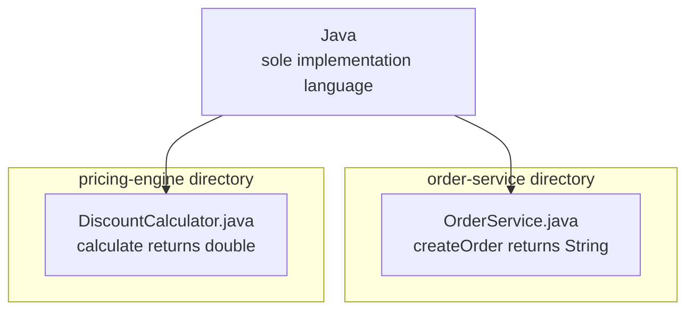
```mermaid
graph TD
    Java["Java<br/>sole implementation language"]
    subgraph OrderServiceDir["order-service directory"]
        OS["OrderService.java<br/>createOrder returns String"]
    end
    subgraph PricingEngineDir["pricing-engine directory"]
        DC["DiscountCalculator.java<br/>calculate returns double"]
    end
    Java --> OS
    Java --> DC
```

### 3.1.2 Language Features Exercised

Both classes use only elementary, long-stable Java constructs. Each declares a single top-level `public` class with one `public` instance method; the code uses the `String` reference type, the primitive `double` type, a single string literal, and one arithmetic multiplication. The two implemented methods in their entirety are:

```java
public String createOrder(){ return "Order Created"; }
public double calculate(double price){ return price * 0.9; }
```

There are no generics, annotations, lambdas, streams, records, `var`, modules (`module-info.java`), interfaces, inheritance, enums, checked/unchecked exception handling, or concurrency primitives anywhere in the source. Because only foundational syntax present since the earliest Java releases is used, the sources are not tied to any modern language level and would compile under any contemporary JDK.

### 3.1.3 Selection Criteria and Justification

The repository contains no architecture decision record, design note, or README statement explaining why Java was chosen; the rationale below is therefore **inferred from observable properties of the code**, not a repository-declared decision:

- **Consistency across domains.** Both the Order Service and the Pricing Engine are written in the same language, so no polyglot interoperability layer, foreign-function interface, or serialization bridge is required between the two components.
- **Static typing and compile-time safety.** Java is a statically typed, compiled, class-based JVM language; the method signatures (`createOrder(): String`, `calculate(double): double`) are checked at compile time, which is appropriate for the order-management and pricing domain the READMEs describe.
- **Low toolchain barrier for a scaffold.** Because each source file is a self-contained, package-less class using only the standard library, a single Java compiler is sufficient to build the code, which suits an early-stage scaffold with no dependency-management needs yet.

### 3.1.4 Constraints and Dependencies

| Constraint | Evidence | Implication |
| --- | --- | --- |
| No declared language/JDK version | No build file, toolchain file, or `module-info.java`; consistent with Sections 1.3 and 2.4 ("no JDK version is declared") | The required Java version is unpinned; builds are not reproducible against a guaranteed language level |
| Default (unnamed) package | `grep` confirms zero `package` statements in both `.java` files | Constrains growth — adding namespaces later requires restructuring into packages; classes are not addressable within a package hierarchy |
| Primitive `double` for monetary values | `DiscountCalculator.calculate(double price)` returns `price * 0.9` | `double` is subject to binary floating-point rounding error, which is a correctness/security concern for money (see Section 2.4) |
| No inter-component wiring | `OrderService` does not import or instantiate `DiscountCalculator` (and vice versa) | The two Java components share no runtime language-level integration; they are independent compilation units |
| Standard library only | No `import` statements in either file | No third-party or open-source language dependency is introduced (see 3.2 and 3.3) |

### 3.1.5 Version Summary

Per the section prompt's directive to record version numbers, the table makes explicit that **no version is pinned anywhere in the repository** — an important finding in its own right rather than an omission from this document.

| Language / Tool | Version Declared in Repository | Notes |
| --- | --- | --- |
| Java (language) | None declared | No build manifest, `.java-version`, toolchain, or `module-info.java` pins a JDK/language level; code uses only baseline syntax and is broadly JDK-compatible |
| Markdown | Not applicable | Plain README prose; no processor, linter, or version is configured |

## 3.2 Frameworks & Libraries

No application framework or third-party library is present in the repository. Both Java classes compile and run against the **Java standard library alone**; neither file contains an `import` statement, and there is no dependency manifest that could introduce a framework. This framework-free posture is consistent with the scaffold status established in Sections 1.2 and 1.3.

### 3.2.1 Framework and Library Assessment

The table records the common Java framework/library categories that a service in this domain might use, each checked against the actual repository contents. Every category is **absent**, evidenced by the absence of both imports and any dependency declaration.

| Category | Representative Technologies | Present? | Evidence |
| --- | --- | --- | --- |
| Application / web framework | Spring Boot, Jakarta EE, Micronaut, Quarkus | Absent | No imports, annotations, or dependency manifest |
| Dependency-injection container | Spring, CDI, Guice | Absent | No annotations, no configuration, classes instantiated by no one |
| Persistence / ORM | Hibernate, JPA, MyBatis | Absent | No datastore, no entity classes, no imports |
| HTTP / REST / RPC | JAX-RS, Spring MVC, gRPC | Absent | No controllers, servers, or clients (see 3.4) |
| Logging | SLF4J, Log4j, Logback | Absent | No imports; no logging is performed anywhere |
| Testing | JUnit, TestNG, Mockito | Absent | No test files or test directories exist |
| Serialization / JSON | Jackson, Gson | Absent | No serialization; outputs are a `String` literal and a `double` |

### 3.2.2 Standard Library Usage

The only "library" the code relies on is the Java Development Kit's own standard library. Specifically, it uses `java.lang.String` (implicitly imported) and the primitive `double` type. These ship with every JDK and are not external artifacts, so they impose no additional supply-chain surface.

### 3.2.3 Compatibility Requirements

The sole compatibility requirement is a Java compiler and runtime that provide the standard library. Because only baseline language and standard-library features are used, no minimum framework or library version applies, and no version is pinned in the repository. There are consequently no framework-to-framework or framework-to-runtime version compatibility constraints to manage today.

### 3.2.4 Justification and Security Implications

- **Justification (inferred).** For a two-class scaffold whose implemented methods return a constant string and a single multiplication, a framework would add build, dependency, and configuration overhead without providing needed behavior. The framework-free choice is not accompanied by any documented rationale in the repository; it is inferred from the minimal code.
- **Security implications.** With no frameworks or libraries, the code carries **no framework/library-derived vulnerability surface** (for example, no exposure to logging-library CVE classes). The corresponding trade-off is that there are also **no framework-provided security controls** — no input validation, authentication/authorization, output encoding, or secure-logging facilities — so any such controls must be added explicitly when the documented-but-unimplemented features (F-003 through F-006) are built out.

### 3.2.5 Version Summary

| Framework / Library | Version Declared in Repository | Notes |
| --- | --- | --- |
| Application/web framework | None — not present | No framework is used |
| Supporting libraries | None — not present | No third-party libraries are used |
| Java standard library | None declared | Provided by the (unpinned) JDK; not an external dependency |

## 3.3 Open Source Dependencies

The repository declares **zero open-source or third-party dependencies**. There is no dependency manifest of any kind, no lockfile, and no package registry (such as Maven Central, npm, or PyPI) is referenced anywhere. The complete set of tracked files — two `.java` sources and three `.md` documents — contains no artifact that could resolve an external package.

### 3.3.1 Dependency Manifests and Registries

Each common dependency-declaration mechanism was checked across the whole repository and found absent:

| Manifest / Lockfile | Ecosystem / Registry | Result |
| --- | --- | --- |
| `pom.xml` | Maven / Maven Central | Not present |
| `build.gradle`, `settings.gradle`, `gradle.lockfile` | Gradle / Maven Central | Not present |
| `module-info.java` | Java Platform Module System | Not present |
| `package.json`, `package-lock.json` | npm | Not present |
| `requirements.txt`, `pyproject.toml` | PyPI | Not present |

Because there is no manifest, there are **no third-party package coordinates, no registries, and no versions** to enumerate. The only code-level "dependency" is the JDK standard library described in Section 3.2.2, which is not an open-source package the project pulls in but the platform the project runs on.

### 3.3.2 Supply-Chain and Security Implications

- **No third-party attack surface today.** With no direct or transitive open-source dependencies, the project currently has no dependency-derived vulnerability exposure and no risk from compromised or typo-squatted packages.
- **No dependency governance in place.** Conversely, there is no Software Bill of Materials (SBOM), no dependency-vulnerability scanning, no version-pinning, and no update/patch mechanism. When dependencies are eventually introduced (for example, a persistence driver for the proposed order-update/cancel features, or a testing framework), the project will need to adopt a manifest, a registry, pinned versions, and vulnerability scanning to keep the supply chain controlled.

### 3.3.3 Version Summary

| Dependency | Registry | Version Declared in Repository |
| --- | --- | --- |
| (none) | (none) | Not applicable — no open-source dependencies are declared |

## 3.4 Third-Party Services

The system integrates with **no external or third-party services**. There are no SDK imports, API clients or servers, credentials, environment configuration, or any file that references an external system. This is consistent with Section 1.2's finding that the repository "defines no integrations" and Section 1.3's finding that "no external integration points … are present or referenced."

### 3.4.1 External Service Assessment

| Service Category | Representative Technologies | Present? | Evidence |
| --- | --- | --- | --- |
| External API / integration | Payment, tax, catalog, or shipping providers | Absent | No HTTP/RPC clients, no imports, no endpoint configuration |
| Authentication / identity | Auth0, OAuth2/OIDC, Okta, JWT | Absent | No authentication code, tokens, or security configuration anywhere |
| Monitoring / observability | APM agents, metrics, tracing, log aggregation | Absent | No agents, no logging, no metrics; nothing is instrumented |
| Cloud services | AWS, GCP, Azure SDKs / managed services | Absent | No cloud SDK, credentials, region, or service configuration |
| Messaging / streaming | Kafka, RabbitMQ, SQS/SNS | Absent | No producers, consumers, or broker clients |

### 3.4.2 Integration Requirements

No integration requirements exist in the current implementation. The two classes are invoked directly on the JVM with no request/response flow, no network boundary, and no service-to-service communication. Among the documented-but-unimplemented features, Tax Calculation (F-006) would plausibly require an external tax-rate provider in a future phase, but no such provider is referenced anywhere today, so it remains outside the current stack.

### 3.4.3 Security Implications

- **No external attack surface or secrets.** With no outbound or inbound integrations, there are no API keys, client secrets, connection strings, or credentials to store, rotate, or leak, and no external endpoints to defend.
- **No identity or runtime visibility.** The flip side is that there is no identity provider (hence no authentication or authorization) and no monitoring/observability service, so a future runtime would begin with no external security or operational visibility. These would need to be added alongside any real integrations.

### 3.4.4 Version Summary

| Service | Provider | Version / Endpoint Declared in Repository |
| --- | --- | --- |
| (none) | (none) | Not applicable — no third-party services are integrated |

## 3.5 Databases & Storage

There is **no database or storage technology of any kind** in the repository. The system persists nothing: both implemented methods are stateless and operate purely in memory, and there is no order, customer, catalog, or tax data model anywhere (confirmed in Sections 1.2 and 1.3).

### 3.5.1 Storage Assessment

| Storage Concern | Representative Technologies | Present? | Evidence |
| --- | --- | --- | --- |
| Primary database | PostgreSQL, MySQL, MongoDB | Absent | No driver, connection, schema, or configuration |
| Secondary database | Any relational/NoSQL/search store | Absent | None present |
| Persistence / data access | JDBC, JPA/Hibernate, MyBatis | Absent | No imports; classes hold no fields and manage no state |
| Caching | Redis, Memcached, Caffeine, Ehcache | Absent | No cache libraries; there is no state or query result to cache |
| Object / file / blob storage | Amazon S3, GCS, local file I/O | Absent | No file I/O, streams, or storage SDK |

### 3.5.2 Data Persistence Strategy

The data-persistence strategy is, in effect, **none — all data is transient**. `OrderService.createOrder()` returns the constant `String` `"Order Created"`, and `DiscountCalculator.calculate(double price)` returns a `double` computed from its input argument; neither method reads from or writes to any store, file, or cache. The only data that flows through the system is the single `double price` input and the two deterministic outputs, all held in memory for the duration of a call.

### 3.5.3 Security Implications

- **No data at rest.** Because nothing is persisted, there are currently no encryption-at-rest, key-management, backup, or data-retention obligations, and no stored personally identifiable information (PII) to protect.
- **No durability or audit trail.** Conversely, there is no durability, no transactional integrity, and no audit logging. The documented-but-unimplemented order lifecycle features — Order Update (F-003) and Order Cancellation (F-004) — cannot be realized without introducing a persistence tier, at which point data-protection controls would become necessary.

### 3.5.4 Version Summary

| Datastore / Cache / Storage | Type | Version Declared in Repository |
| --- | --- | --- |
| (none) | (none) | Not applicable — no database, cache, or storage service is used |

## 3.6 Development & Deployment

The repository carries almost no development or deployment tooling: there is no build system, no containerization, no continuous integration/continuous delivery (CI/CD), and no infrastructure-as-code. The single tooling element genuinely present is **version control**. The only viable path from source to executable bytecode is manual compilation with a Java compiler, and even then no application entry point exists to launch. The overview table summarizes each concern; the subsections that follow provide the detail and evidence.

| Concern | Technology Present | Evidence / Notes |
| --- | --- | --- |
| Version control | Git, hosted on GitHub | `.git` directory present; remote repository named `Healthcare-platform`; single `main` branch with 6 file-creation commits |
| Development tools | JDK (`javac` / `java`) — version not declared | Needed to compile the two `.java` files; no IDE, formatter, or linter configuration is committed |
| Build system | None | No Maven, Gradle, or Ant files; compilation is manual and per-class |
| Artifact packaging | None | No JAR/WAR, no manifest, and no `main()` entry point exists |
| Containerization | None | No `Dockerfile`, `docker-compose.yml`, or `.dockerignore` |
| CI/CD | None | No `.github/workflows/`, `Jenkinsfile`, GitLab CI, or other pipeline files |
| Infrastructure as Code | None | No Terraform (`*.tf`), CloudFormation, Helm, or Kubernetes manifests |

### 3.6.1 Version Control and Development Tools

**Version control (present).** The project is tracked in Git and hosted on GitHub under the repository name `Healthcare-platform`. The history consists of a single `main` branch with six commits, all of which are simple file creations/updates — indicating a greenfield scaffold with no branching, tagging, or release workflow yet.

**Development tools.** The only tool required to build the code is a Java Development Kit, used to run the compiler (`javac`) over the two source files. No JDK version is declared anywhere, and no IDE project files (for example `.idea/`, `.vscode/`, `.project`), code-formatter settings, or static-analysis/linter configuration (for example `.editorconfig`, Checkstyle, SpotBugs, Spotless) are committed to the repository.

### 3.6.2 Build System and Artifact Packaging

There is **no build system**. No Maven (`pom.xml`), Gradle (`build.gradle`), or Ant configuration exists, so dependency resolution, compilation orchestration, and packaging are not automated. Consistent with Section 2.4, "the two classes can only be compiled individually (e.g., with `javac`) and invoked directly." No JAR/WAR is produced, no manifest declares a main class, and — critically — **no `main()` method or application entry point exists**, so the compiled classes cannot be launched as a standalone program; they can only be compiled and then invoked from another class or an interactive harness.

The diagram shows the only realizable build path (solid) alongside the packaging, containerization, CI/CD, and deployment stages that are **absent** from the repository (dotted):

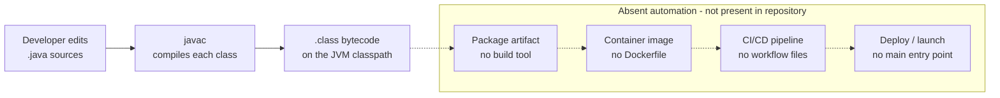
```mermaid
flowchart LR
    Dev["Developer edits<br/>.java sources"]
    Compile["javac<br/>compiles each class"]
    Classes[".class bytecode<br/>on the JVM classpath"]
    subgraph AbsentPipeline["Absent automation - not present in repository"]
        Package["Package artifact<br/>no build tool"]
        Container["Container image<br/>no Dockerfile"]
        CICD["CI/CD pipeline<br/>no workflow files"]
        Deploy["Deploy / launch<br/>no main entry point"]
    end
    Dev --> Compile
    Compile --> Classes
    Classes -.-> Package
    Package -.-> Container
    Container -.-> CICD
    CICD -.-> Deploy
```

### 3.6.3 Containerization, CI/CD, and Infrastructure as Code

None of these deployment technologies are present:

- **Containerization.** There is no `Dockerfile`, `docker-compose.yml`, `.dockerignore`, or any other OCI/container image definition; the application is not containerized.
- **CI/CD.** There are no pipeline definitions of any kind — no `.github/workflows/` (despite the GitHub remote), no `Jenkinsfile`, and no GitLab/CircleCI/Travis configuration. No build, test, scan, or deploy step is automated.
- **Infrastructure as Code.** There is no Terraform, CloudFormation, Ansible, Helm chart, or Kubernetes manifest, so no infrastructure is described or provisioned by the repository.

### 3.6.4 Security Implications and Version Summary

**Security implications.**

- **No automated quality/security gates.** With no CI/CD, there is no automated test execution (there are no tests to run in any case), no static application security testing (SAST), no dependency/vulnerability scanning, and no policy enforcement before code lands on `main`.
- **No build reproducibility or supply-chain provenance.** Manual, per-class `javac` compilation with no pinned JDK version yields no reproducible artifact, no build metadata, and no signed/attested output.
- **No runtime isolation defined.** Without containerization or IaC, no runtime sandbox, resource limit, network policy, or hardened base image is described for the code.

**Version summary.**

| Tool / Platform | Version Declared in Repository | Notes |
| --- | --- | --- |
| Git / GitHub | None declared | VCS is present; no tags or releases exist |
| JDK (`javac` / `java`) | None declared | Required for compilation; language level is unpinned |
| Build system | Not applicable | No build tool is present |
| Container runtime | Not applicable | No container definition is present |
| CI/CD platform | Not applicable | No pipeline is defined |
| Infrastructure as Code | Not applicable | No IaC is present |

## 3.7 References

All findings in Section 3 derive from direct inspection of the repository. No web sources were consulted.

**Files examined**

- `README.md` — Root README titling the project "Pricing Engine"; established Markdown as the documentation language and the Pricing Engine responsibilities (price/discount/tax).
- `order-service/OrderService.java` — Established Java as an implementation language, the `createOrder()` behavior returning `"Order Created"`, and the package-less, import-free, standard-library-only structure.
- `order-service/README.md` — Established the Order Service responsibilities (create/update/cancel), documented in Markdown.
- `order-service/pricing-engine/DiscountCalculator.java` — Established the `calculate(double price)` behavior (`price * 0.9`), primitive `double` usage for money, and the framework-free structure.
- `order-service/pricing-engine/README.md` — Established the Pricing Engine responsibilities, documented in Markdown.

**Folders examined**

- `` (repository root) — Confirmed only `README.md` and the `order-service/` folder exist at the root; no root-level build, manifest, or configuration files.
- `order-service/` — Confirmed `OrderService.java`, `README.md`, and the nested `pricing-engine/` folder; no build, dependency, framework, test, or CI files.
- `order-service/pricing-engine/` — Confirmed `DiscountCalculator.java` and `README.md`; no build or dependency files.

**Repository metadata inspected**

- Git history and remote — Confirmed a single `main` branch, six file-creation commits, and the GitHub repository name `Healthcare-platform`; used to establish version control and the absence of CI/CD, tags, and releases (the tokenized remote URL is intentionally not reproduced).
- Source inspection via `find`/`grep` — Confirmed zero `package` and zero `import` statements in both `.java` files and the absence of any build, dependency-manifest, containerization, CI/CD, or infrastructure-as-code files.

**Cross-referenced specification sections**

- 1.2 System Overview — Corroborated the "minimal, two-domain Java scaffold," the framework-free classes, and the absence of build tooling, dependencies, tests, and persistence.
- 1.3 Scope — Corroborated that "a Java compiler capable of compiling two package-less classes" is the only evidenced requirement and the out-of-scope infrastructure list (no build tooling, dependencies, tests, configuration, persistence, API/UI, security, logging, or CI/CD).
- 2.1 Feature Catalog — Provided the feature identifiers (F-001 through F-006) referenced in this section.
- 2.4 Implementation Considerations — Corroborated that "no JDK version is declared" and the `double`-for-money precision/rounding concern.

# 4. Process Flowchart

## 4.1 System Workflows

This section documents the process flows **as they exist in the repository today**. The system is a minimal, two-domain Java scaffold (established in Sections 1.2 and 2.3), so the "workflows" are two isolated, synchronous, in-process method executions rather than orchestrated multi-step business processes. Where the flowchart requirements in the prompt (decision diamonds, error/recovery paths, SLA/timing, integration and batch sequences) have no counterpart in the code, that absence is stated explicitly rather than invented. Documented-but-unimplemented capabilities (F-003 Order Update, F-004 Order Cancellation, F-005 Price Calculation, F-006 Tax Calculation) are called out as roadmap items and are not part of any runnable flow.

Two behaviors are actually executable:

| Process | Feature | Entry Method | Result | Evidence |
| --- | --- | --- | --- | --- |
| Order Creation | F-001 | `OrderService.createOrder()` | Returns the literal `"Order Created"` | `order-service/OrderService.java` |
| Discount Calculation | F-002 | `DiscountCalculator.calculate(double price)` | Returns `price * 0.9` | `order-service/pricing-engine/DiscountCalculator.java` |

### 4.1.1 Core Business Processes

**End-to-end journey and system boundary.** There is no user-facing entry point in the repository — no `main()` method, no REST/HTTP layer, no CLI, and no UI (confirmed in Sections 1.2.1 and 2.3.2). Consequently, a "user journey" begins and ends inside a single JVM: calling code (for example a developer's test harness or another class instantiating the component) directly invokes one public instance method and receives a return value in the same call. No process crosses a network, a persistence tier, or an external service boundary.

**System interactions.** The two implemented processes do not interact with each other. `OrderService` does not import, reference, or invoke `DiscountCalculator` (verified by source inspection and in Section 2.3), so there is no orchestration in which order creation triggers pricing. Each process is a self-contained, single-responsibility method call.

**Decision points.** Neither implemented method contains a conditional branch. `createOrder()` unconditionally returns a constant string, and `calculate(price)` unconditionally evaluates a single arithmetic expression. There are therefore **no decision diamonds in the executed code**; the only decision represented in the high-level diagram below is the caller's choice of which behavior to invoke.

**Error handling paths.** No method declares checked exceptions or contains a `try`/`catch` block. There are no defined error states, compensating actions, or recovery paths in either process; any runtime exception raised by the JVM would propagate uncaught to the caller (detailed further in Section 4.3.2).

**Timing / SLA considerations.** No service-level agreements, latency budgets, throughput targets, or KPIs are declared anywhere in the repository (Sections 1.2.3 and 2.2). Both operations are deterministic, in-memory, and constant-time (O(1)) with no I/O, so their cost is negligible; this is an observation about the code, not a committed SLA.

The following high-level workflow uses swim lanes to separate the caller/boundary from the two implemented components. It satisfies the "start/end points, process steps, system boundaries, and user touchpoints" requirement for the system as a whole.

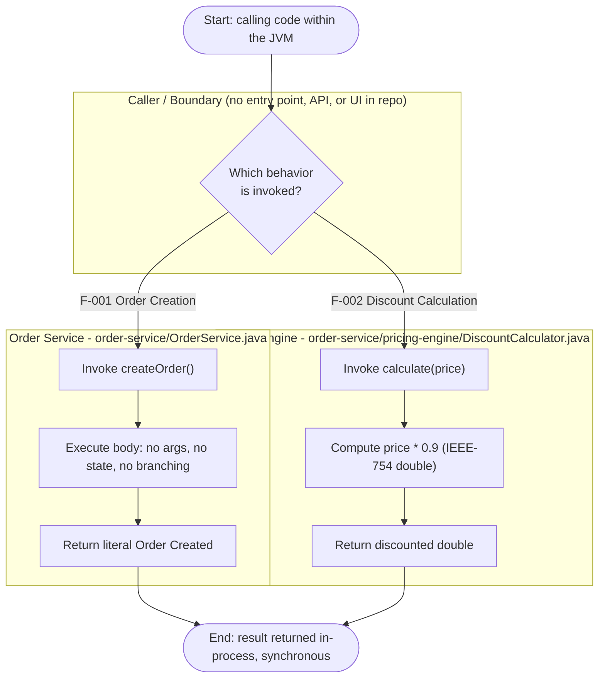
```mermaid
flowchart TB
    Start([Start: calling code within the JVM]) --> Choice{Which behavior<br/>is invoked?}

    subgraph CallerLane["Caller / Boundary (no entry point, API, or UI in repo)"]
        direction TB
        Choice
    end

    subgraph OrderLane["Order Service - order-service/OrderService.java"]
        direction TB
        OSCall["Invoke createOrder()"]
        OSExec["Execute body: no args, no state, no branching"]
        OSRet["Return literal Order Created"]
        OSCall --> OSExec --> OSRet
    end

    subgraph PricingLane["Pricing Engine - order-service/pricing-engine/DiscountCalculator.java"]
        direction TB
        PECall["Invoke calculate(price)"]
        PEExec["Compute price * 0.9 (IEEE-754 double)"]
        PERet["Return discounted double"]
        PECall --> PEExec --> PERet
    end

    Choice -->|"F-001 Order Creation"| OSCall
    Choice -->|"F-002 Discount Calculation"| PECall
    OSRet --> Done([End: result returned in-process, synchronous])
    PERet --> Done
```

**Core-process attributes summary** (applying the flowchart requirements to each implemented process):

| Attribute | F-001 Order Creation | F-002 Discount Calculation |
| --- | --- | --- |
| Start point | Caller invokes `createOrder()` | Caller invokes `calculate(price)` |
| Process steps | Execute body → return constant | Multiply `price * 0.9` → return |
| End point | Caller receives `String` `"Order Created"` | Caller receives discounted `double` |
| Decision diamonds | None (branch-free) | None (branch-free) |
| User touchpoints | None (in-process call only) | None (in-process call only) |
| Error / recovery states | None defined | None defined |
| Timing / SLA | None declared; O(1) in-memory | None declared; O(1) in-memory |
| Requirements | F-001-RQ-001, F-001-RQ-002 | F-002-RQ-001, F-002-RQ-002 |

### 4.1.2 Integration Workflows

The repository defines **no integration workflows**. This is a direct consequence of the "no integrations" finding in Sections 1.2.1 and 2.3.2: the two classes are package-less, import nothing, and there is no API layer, message broker, database driver, HTTP client/server, scheduler, or configuration referencing an external system.

**Data flow between systems.** The only data that flows anywhere is the single `double price` argument passed into `calculate(price)` and the two deterministic return values; all of it is held in memory for the duration of a single call and is never handed off to another component or system. There is no cross-component data flow because `OrderService` and `DiscountCalculator` do not communicate. The relationship between them is purely structural (directory nesting), not runtime.

**API interactions.** None. There are no inbound or outbound API endpoints, no serialization/deserialization, and no request/response contracts — the components are invoked as plain Java methods.

**Event processing flows.** None. There is no event bus, message queue, publisher/subscriber, listener, or callback anywhere in the code; nothing is emitted or consumed asynchronously.

**Batch processing sequences.** None. There is no scheduler, cron trigger, job runner, or bulk/stream processing; each method processes at most a single in-memory value per direct call.

The sequence diagram below depicts the only interaction that occurs — a caller directly invoking each method — and explicitly annotates the absence of any message flow between the two components.

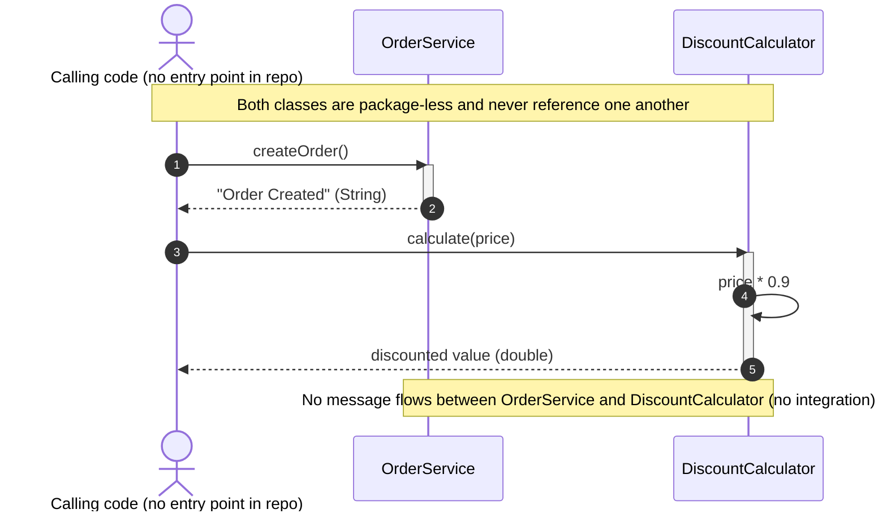
```mermaid
sequenceDiagram
    autonumber
    actor Caller as Calling code (no entry point in repo)
    participant OS as OrderService
    participant DC as DiscountCalculator

    Note over Caller,DC: Both classes are package-less and never reference one another
    Caller->>OS: createOrder()
    activate OS
    OS-->>Caller: "Order Created" (String)
    deactivate OS

    Caller->>DC: calculate(price)
    activate DC
    DC->>DC: price * 0.9
    DC-->>Caller: discounted value (double)
    deactivate DC

    Note over OS,DC: No message flows between OrderService and DiscountCalculator (no integration)
```

**Integration inventory** (all categories confirmed absent):

| Integration Category | Status in Repository |
| --- | --- |
| Inter-component (in-process) calls | None — `OrderService` does not call `DiscountCalculator` |
| External services / APIs | None — no clients, servers, or endpoints |
| Event / messaging flows | None — no queue, bus, or listeners |
| Batch / scheduled sequences | None — no scheduler or job runner |
| Persistence data flow | None — nothing read from or written to a store |
| Configuration-driven integration | None — no configuration files exist |

## 4.2 Detailed Process Flows and Flowchart Requirements

This section provides a detailed process flow for each implemented core feature and then consolidates the validation, authorization, and compliance posture across them. Applying the prompt's flowchart requirements to a scaffold of this size produces short, linear flows; each diagram therefore also annotates — with dashed edges into an "Absent" lane — the process steps that a production implementation would introduce but that are demonstrably not present in the code. These annotations are labelled as absent so they are never mistaken for implemented behavior.

### 4.2.1 Order Creation Process Flow (F-001)

`OrderService.createOrder()` is the entire Order Creation feature. Its body is a single return statement:

```java
public String createOrder(){ return "Order Created"; }
```

**Flow narrative.** The flow starts when calling code invokes `createOrder()`. The method takes no parameters, reads no state, performs no branching or I/O, and returns the constant `String` `"Order Created"`; control returns synchronously to the caller, which is the end of the flow. There is exactly one path from start to end.

**Flowchart requirements mapping.**

| Requirement element | How it appears in F-001 |
| --- | --- |
| Start point | Caller invokes `createOrder()` |
| Process steps | Execute body → return constant string |
| Decision diamonds | None — the method is unconditional |
| System boundaries | A single JVM; no network, persistence, or external boundary is crossed |
| User touchpoints | None — invoked as an in-process method (no UI/API/CLI) |
| Error states / recovery | None — no `try`/`catch`, no checked exceptions, no compensation |
| Timing / SLA | None declared; O(1), in-memory (per Sections 1.2.3, 2.2) |
| Related requirements | F-001-RQ-001 (signature), F-001-RQ-002 (constant output) |

The diagram shows the implemented linear path (solid) and, in the "Absent" lane, the validation, authorization, persistence, and error-handling steps a real order-creation flow would require (dashed, clearly marked not implemented):

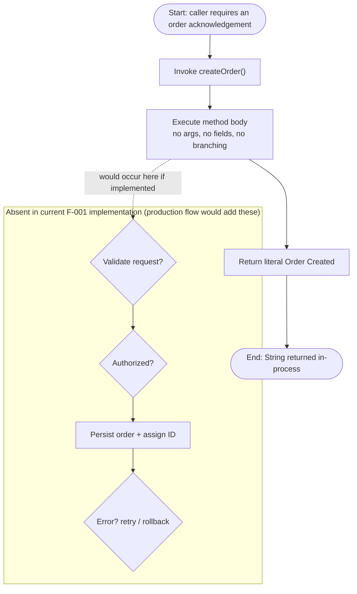
```mermaid
flowchart TB
    Start([Start: caller requires an order acknowledgement]) --> Invoke["Invoke createOrder()"]
    Invoke --> Exec["Execute method body<br/>no args, no fields, no branching"]
    Exec --> Ret["Return literal Order Created"]
    Ret --> Done([End: String returned in-process])

    subgraph Absent["Absent in current F-001 implementation (production flow would add these)"]
        direction TB
        Gap{Validate request?} --> Auth{Authorized?}
        Auth --> Persist[Persist order + assign ID]
        Persist --> Err{Error? retry / rollback}
    end

    Exec -. would occur here if implemented .-> Gap
```

### 4.2.2 Discount Calculation Process Flow (F-002)

`DiscountCalculator.calculate(double price)` is the entire Discount Calculation feature. Its body is a single arithmetic expression:

```java
public double calculate(double price){ return price * 0.9; }
```

**Flow narrative.** The flow starts when calling code invokes `calculate(price)` with a single `double`. The method evaluates `price * 0.9` (a fixed 10% discount) using standard IEEE-754 `double` arithmetic and returns the result synchronously. There is one path from start to end, with no guards before the computation — any `double`, including negative, zero, or `NaN`, is accepted and processed.

**Flowchart requirements mapping.**

| Requirement element | How it appears in F-002 |
| --- | --- |
| Start point | Caller invokes `calculate(price)` |
| Process steps | Multiply `price * 0.9` → return result |
| Decision diamonds | None — no bounds/precision checks or branching |
| System boundaries | A single JVM; no network, persistence, or external boundary is crossed |
| User touchpoints | None — invoked as an in-process method |
| Error states / recovery | None — no validation, no exceptions handled |
| Timing / SLA | None declared; O(1), single multiplication (per Sections 1.2.3, 2.2) |
| Related requirements | F-002-RQ-001 (signature), F-002-RQ-002 (`price * 0.9`) |

The diagram shows the implemented linear path (solid) and, in the "Absent" lane, the input validation, currency rounding, and rate configurability a production pricing flow would require (dashed, clearly marked not implemented):

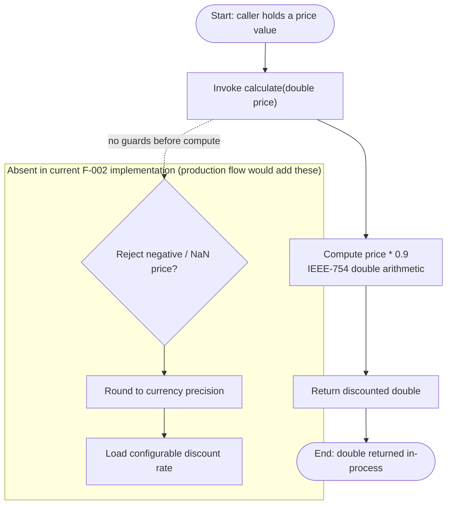
```mermaid
flowchart TB
    Start([Start: caller holds a price value]) --> Invoke["Invoke calculate(double price)"]
    Invoke --> Compute["Compute price * 0.9<br/>IEEE-754 double arithmetic"]
    Compute --> Ret["Return discounted double"]
    Ret --> Done([End: double returned in-process])

    subgraph Absent["Absent in current F-002 implementation (production flow would add these)"]
        direction TB
        Neg{Reject negative / NaN price?} --> Round[Round to currency precision]
        Round --> Cfg[Load configurable discount rate]
    end

    Invoke -. no guards before compute .-> Neg
```

### 4.2.3 Validation Rules, Authorization, and Compliance Checkpoints

Consistent with the section-wide notes in Section 2.2 and the maintenance findings in Section 2.4, **no data validation, authorization, or compliance checkpoint exists at any step of either flow**. The only "rules" present are the fixed behaviors of the two methods themselves.

**Business rules at each step.**

| Step | Business rule (as implemented) |
| --- | --- |
| F-001 `createOrder()` | Fixed-acknowledgement operation: always returns the constant `"Order Created"`; no conditional business logic (F-001-RQ-002). |
| F-002 `calculate(price)` | Discount rate is fixed at 10% and is **not configurable**; result is 90% of the input with no rounding or currency handling (F-002-RQ-002). |

**Data validation requirements.**

| Flow | Data validation in code |
| --- | --- |
| F-001 Order Creation | None — the method has no inputs to validate. |
| F-002 Discount Calculation | None — any `double` (including negative, zero, or `NaN`) is accepted; no bounds, precision, or currency checks (F-002-RQ-001). |

**Authorization checkpoints.** None. There is no authentication or authorization anywhere in the repository — no identity, roles, tokens, or access checks guard either method (Sections 2.2 and 2.4). Both methods are `public` and callable without any credential.

**Regulatory compliance checks.** None. No regulatory, audit-logging, data-retention, or privacy requirement appears in any tracked file (Section 2.2). Because nothing is persisted (Section 3.5), there is currently no stored data subject to compliance controls.

**Consolidated checkpoint matrix.**

| Checkpoint type | F-001 Order Creation | F-002 Discount Calculation |
| --- | --- | --- |
| Business rule | Constant acknowledgement | Fixed 10% discount (`price * 0.9`) |
| Data validation | None (no inputs) | None (any `double` accepted) |
| Authorization | None | None |
| Regulatory / compliance | None | None |

For the four documented-only features, validation, authorization, and compliance rules are all "to be defined" — Section 2.2 records that F-003 and F-004 would require authorization to modify/cancel orders and validation of an (absent) order model, F-005 would require validation of price/line-item inputs, and F-006 carries correctness/compliance sensitivity for tax with validated rate inputs. None of these exist in code.

## 4.3 Technical Implementation Flows

This section covers the state-management and error-handling dimensions of the implemented flows. Both are minimal by construction: the two methods are stateless pure operations, and there is no error-handling machinery of any kind. The findings below restate, at the process level, the persistence facts from Section 3.5 and the "no error handling / no observability" facts from Sections 1.2.2 and 2.4.

### 4.3.1 State Management

**State transitions.** Neither implemented component holds state. `OrderService` and `DiscountCalculator` declare no fields, no static mutable data, and no explicit constructor; each exposes a single stateless instance method (Section 1.2.2). There is therefore no in-memory state machine and no state to transition between across calls — every invocation is independent and side-effect-free. (The documented-only order lifecycle that a stateful implementation *would* introduce is modelled separately in Section 4.4.1.)

**Data persistence points.** There are none. As established in Section 3.5, the system persists nothing: neither method reads from or writes to a database, file, or cache. The only data in play is the single `double price` argument and the deterministic return values, all held in memory strictly for the duration of a single method call and then discarded with the stack frame.

**Caching requirements.** None are present. No caching library or layer exists (Redis, Memcached, Caffeine, and Ehcache are all absent per Section 3.5.1), and there is no state or query result to cache. `createOrder()` returns a compile-time constant and `calculate(price)` is a pure function of its input, so while both are theoretically memoizable, no cache is implemented or required by the current code.

**Transaction boundaries.** None exist. There is no transactional resource (no database, message queue, or file system participation), no atomic multi-step operation, and no commit/rollback semantics. Each method call is a single synchronous evaluation that either returns a value or (in principle) throws; there is no unit of work to demarcate. Section 3.5.3 confirms there is "no durability" and "no transactional integrity."

| State-management concern | Status in implemented flows |
| --- | --- |
| Instance / persisted state | None — stateless classes, no fields |
| State transitions | None — each call independent |
| Data persistence points | None — no store/file/cache writes; data is transient in-memory |
| Caching | None — no cache layer; nothing cached |
| Transaction boundaries | None — no transactional resource or commit/rollback |

### 4.3.2 Error Handling

**Current error behavior.** Neither method contains a `try`/`catch` block, declares a checked exception, or defines a custom exception type; Section 2.4 records that there is "no error handling anywhere." In the normal case each method returns its result deterministically. Should the JVM raise a runtime error during execution (for example a virtual-machine-level error), nothing in the code intercepts it — the exception simply propagates uncaught up the caller's stack, leaving the caller solely responsible for any handling.

The flowchart below models this behavior and lists, in the "Absent" lane, the resilience capabilities that are not implemented anywhere in the repository:

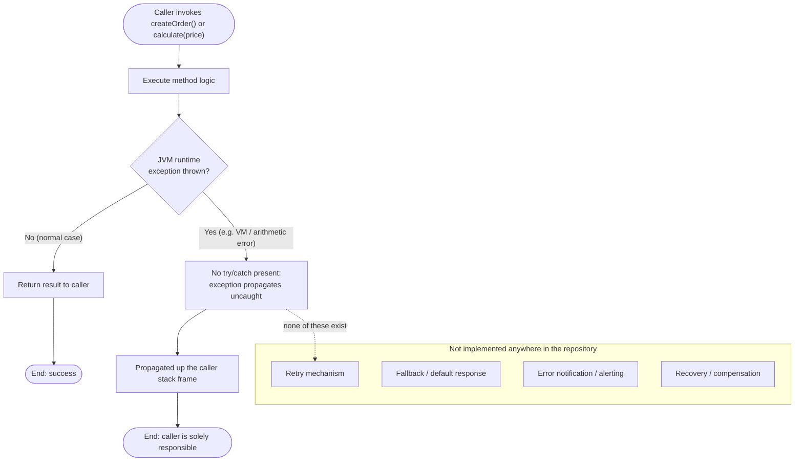
```mermaid
flowchart TB
    Call(["Caller invokes createOrder() or calculate(price)"]) --> Exec[Execute method logic]
    Exec --> Q{JVM runtime<br/>exception thrown?}
    Q -->|"No (normal case)"| Ok[Return result to caller]
    Ok --> EndOk([End: success])
    Q -->|"Yes (e.g. VM / arithmetic error)"| Prop["No try/catch present:<br/>exception propagates uncaught"]
    Prop --> Bubble[Propagated up the caller stack frame]
    Bubble --> EndErr([End: caller is solely responsible])

    subgraph Absent["Not implemented anywhere in the repository"]
        direction TB
        R[Retry mechanism]
        F[Fallback / default response]
        N[Error notification / alerting]
        Rec[Recovery / compensation]
    end

    Prop -. none of these exist .-> R
```

**Retry mechanisms.** None. There is no retry loop, backoff policy, or idempotency handling — a failed call is simply a failed call.

**Fallback processes.** None. There is no default value, circuit breaker, or degraded-mode path; if execution does not complete normally there is no alternative branch.

**Error notification flows.** None. There is no logging framework, metrics emitter, or alerting integration anywhere in the repository (Sections 2.2 and 2.4), so failures are neither recorded nor surfaced to any operator or downstream system.

**Recovery procedures.** None. Because nothing is persisted and no transaction is opened (Section 3.5.3), there is no compensation, rollback, or replay procedure to execute after a failure.

| Error-handling concern | Status in implemented flows |
| --- | --- |
| Exception handling | None — no `try`/`catch`; runtime exceptions propagate uncaught |
| Retry mechanism | None |
| Fallback / degraded mode | None |
| Error notification / alerting | None — no logging or metrics |
| Recovery / compensation | None — nothing persisted or transactional to recover |

## 4.4 State Transition Diagrams

Because the implemented components are stateless (Section 4.3.1), there is no domain state machine in the running code. Two distinct views are useful here and are kept clearly separate: the **documented-intent order lifecycle** (a roadmap derived from the READMEs, largely not implemented) and the **actual component invocation lifecycle** (the transient states a stateless method passes through during a call).

### 4.4.1 Order Lifecycle State Transitions (documented intent)

The `order-service/README.md` documents three order operations — Create, Update, Cancel — which imply an order lifecycle. **Only the entry into the Created state is implemented, and even then no order entity is persisted**: `createOrder()` returns the constant string `"Order Created"` without creating or storing any stateful order (Sections 1.2.2 and 4.2.1). The Updated and Cancelled states correspond to the Proposed features F-003 and F-004, which Section 2.2 records as requiring an (absent) persisted, mutable order entity with a status/lifecycle representation. The diagram below is therefore a **roadmap**, not a description of running behavior; each transition is annotated with its implementation status.

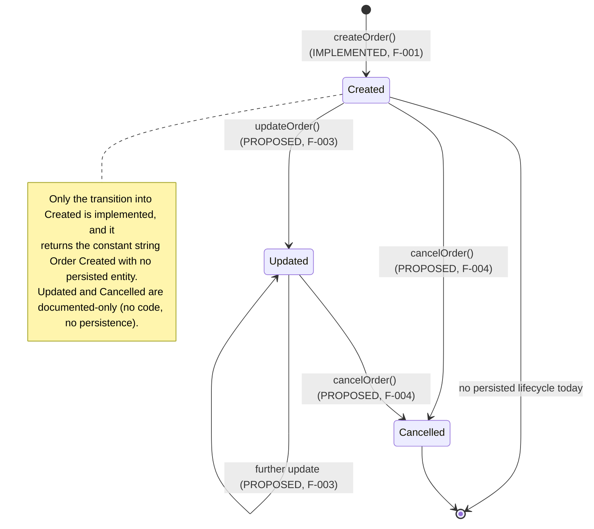
```mermaid
stateDiagram-v2
    [*] --> Created: createOrder() (IMPLEMENTED, F-001)
    Created --> Updated: updateOrder() (PROPOSED, F-003)
    Updated --> Updated: further update (PROPOSED, F-003)
    Created --> Cancelled: cancelOrder() (PROPOSED, F-004)
    Updated --> Cancelled: cancelOrder() (PROPOSED, F-004)
    Created --> [*]: no persisted lifecycle today
    Cancelled --> [*]
    note right of Created
        Only the transition into Created is implemented, and it
        returns the constant string Order Created with no persisted entity.
        Updated and Cancelled are documented-only (no code, no persistence).
    end note
```

| Transition | Trigger | Status | Basis |
| --- | --- | --- | --- |
| `[*]` → Created | `createOrder()` | Implemented (returns constant; no persisted entity) | F-001 — `order-service/OrderService.java` |
| Created → Updated | `updateOrder()` | Proposed / not implemented | F-003 — `order-service/README.md` |
| Created / Updated → Cancelled | `cancelOrder()` | Proposed / not implemented | F-004 — `order-service/README.md` |

The conceptual precondition that an order must exist (Created) before it can be Updated or Cancelled matches the documented-only dependency map in Section 2.3.1; none of these transitions is wired in code.

### 4.4.2 Component Execution (Invocation) States

This diagram models what actually happens at runtime: a stateless component is loaded, a public method executes for the duration of one call, a value is returned, and the stack frame is discarded with no state retained between calls. It applies equally to `OrderService` and `DiscountCalculator`.

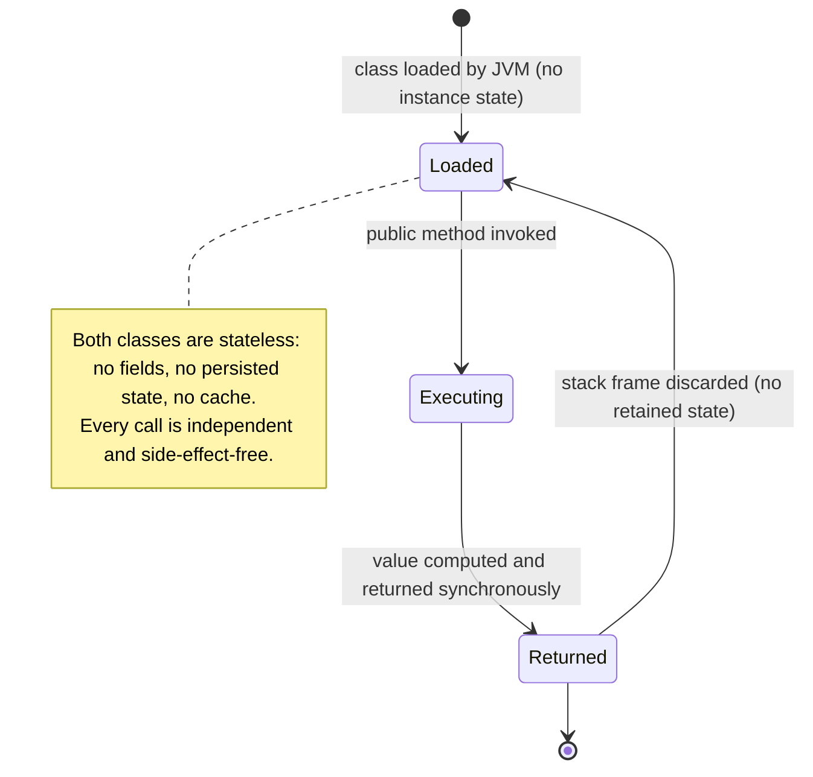
```mermaid
stateDiagram-v2
    [*] --> Loaded: class loaded by JVM (no instance state)
    Loaded --> Executing: public method invoked
    Executing --> Returned: value computed and returned synchronously
    Returned --> Loaded: stack frame discarded (no retained state)
    Returned --> [*]
    note right of Loaded
        Both classes are stateless: no fields, no persisted state, no cache.
        Every call is independent and side-effect-free.
    end note
```

| State | Meaning | Notes |
| --- | --- | --- |
| Loaded | Class available in the JVM; no instance data | No fields or static mutable state to initialize |
| Executing | A single method call is in progress | `createOrder()` returns a constant; `calculate(price)` computes `price * 0.9` |
| Returned | The synchronous result has been handed back to the caller | Nothing is persisted or cached; the next call starts fresh from Loaded |

There are no other runtime states — no "waiting", "retrying", "compensating", or "persisted" states exist, consistent with the absence of concurrency, error handling, and persistence documented in Sections 4.3.1 and 4.3.2.

## 4.5 References

The process flows, diagrams, and absence findings in this section were derived directly from the following repository artifacts and corroborated against previously authored specification sections. No external web sources were required.

**Repository files examined**

- `README.md` — Root "Pricing Engine" documentation; established the Price/Discount/Tax calculation responsibilities used to frame the pricing flows and the documented-only features F-005/F-006.
- `order-service/OrderService.java` — Source of the F-001 Order Creation flow; confirmed the single `createOrder()` method returning the literal `"Order Created"` with no arguments, state, branching, persistence, or error handling.
- `order-service/README.md` — "Order Service" documentation; established the Create/Update/Cancel order responsibilities that underpin the documented-intent order lifecycle (F-001, F-003, F-004) in Section 4.4.1.
- `order-service/pricing-engine/DiscountCalculator.java` — Source of the F-002 Discount Calculation flow; confirmed the single `calculate(double price)` method returning `price * 0.9` with no validation, rounding, or error handling.
- `order-service/pricing-engine/README.md` — Nested "Pricing Engine" documentation; corroborated the Price/Discount/Tax calculation responsibilities.

**Repository folders examined**

- `` (repository root) — Confirmed only `README.md` and the `order-service/` folder exist at the top level; no build files, configuration, tests, or integration artifacts.
- `order-service/` — The Order Service domain; contains `OrderService.java`, its `README.md`, and the nested `pricing-engine/` directory.
- `order-service/pricing-engine/` — The Pricing Engine domain nested within Order Service; contains `DiscountCalculator.java` and its `README.md`. This directory nesting is the only structural relationship between the two components (no code-level coupling).

**Repository-wide verification** — An exhaustive `find`/`grep` sweep confirmed the absences documented throughout this section: no `.blitzyignore` files; no build/config/integration files (no `pom.xml`, `build.gradle`, Dockerfile, `.yml`/`.yaml`, `.xml`, `.properties`, `.tf`, or `.sql`); no `import`, `package`, annotation, `main()`, or cross-reference between `OrderService` and `DiscountCalculator`.

**Cross-referenced specification sections**

- Section 1.2 System Overview — Framing of the minimal two-domain Java scaffold, framework-free technical approach, absence of integrations, and absence of formal success criteria/KPIs.
- Section 2.2 Functional Requirements — Feature and requirement identifiers (F-001–F-006, F-XXX-RQ-YYY), MoSCoW priorities, and the section-wide "no performance/security/compliance" notes referenced in Sections 4.1–4.3.
- Section 2.3 Feature Relationships — Confirmation that `OrderService` does not invoke `DiscountCalculator`, the absence of integration points, and the conceptual (documented-only) dependency map reflected in Section 4.4.1.
- Section 2.4 Implementation Considerations — The "no error handling / no security / no observability" baseline and the recompile-to-change-rate constraint referenced in Sections 4.2.3 and 4.3.
- Section 3.5 Databases & Storage — Confirmation of no persistence, no caching, no durability, and no transactional integrity, underpinning Section 4.3.1.

# 5. System Architecture

## 5.1 High-Level Architecture

This section describes the architecture **as it exists in the repository today**. The system is the minimal, two-domain Java scaffold established in Sections 1.2 and 3.2: two package-less, stateless plain-Java classes organized into nested domain directories, accompanied by three README specifications that declare intended-but-unimplemented responsibilities. Because the repository contains no runtime host (no `main()`, no web/API layer, no build tooling, no configuration, no persistence, and no external integrations), the "architecture" documented here is a **source-level organization** rather than a deployed, distributed topology. Where the section prompt calls for elements that a mature service would exhibit (external integrations, SLAs, caches, brokers), their absence is stated plainly and evidenced, rather than invented.

### 5.1.1 System Overview

**Overall architecture style and rationale.** The implemented architecture is a **flat, framework-free, single-module Java source tree partitioned into two domains by directory** — an Order Service domain (`order-service/`) with a nested Pricing Engine domain (`order-service/pricing-engine/`). Each domain contains exactly one public class exposing one public method (`order-service/OrderService.java`, `order-service/pricing-engine/DiscountCalculator.java`). There is no layered, hexagonal, microservice, event-driven, or client-server runtime architecture present; the only structural boundary is the directory hierarchy. No architectural rationale is documented anywhere in the tracked files, so the rationale is **inferred**: for a scaffold whose two implemented behaviors are a constant-string return and a single multiplication, the simplest possible Java expression avoids the build, dependency, and configuration overhead that any framework or layered topology would impose (consistent with the framework-free justification in Section 3.2.4).

**Key architectural principles and patterns (observable).** The only design patterns evident in the code are the most elementary ones:

- **One class, one responsibility, one operation** — each class exposes a single public method and does nothing else (`createOrder()`; `calculate(double)`).
- **Stateless, pure-behavior components** — neither class declares fields, a constructor, or static mutable data; every call is independent and side-effect-free (confirmed in Section 4.3.1).
- **Domain-by-directory separation** — the Pricing Engine is nested under the Order Service purely as a directory, with no code coupling between the two.

The following common architectural mechanisms are **absent** (verified across both source files): dependency injection, interfaces/abstractions, inheritance, annotations, generics, concurrency, and any error-handling construct. These are noted because their absence defines the architecture as much as the two behaviors that are present.

**System boundaries and major interfaces.** The system boundary is a **single JVM process** into which the two compiled classes are loaded; there is no network, persistence, or external-service boundary. The only "interfaces" the system exposes are the two **public Java method signatures**, invoked in-process by calling code (for example a developer harness or another class):

- `OrderService.createOrder()` → returns the `String` literal `"Order Created"`.
- `DiscountCalculator.calculate(double price)` → returns `price * 0.9` (a `double`).

There is no inbound or outbound remote interface — no REST/HTTP endpoint, RPC surface, CLI, message consumer, or database connection (consistent with Sections 2.3.2 and 3.4.1). The two components do not call one another, so there is no internal component-to-component interface either. The diagram below fixes these boundaries and interfaces.

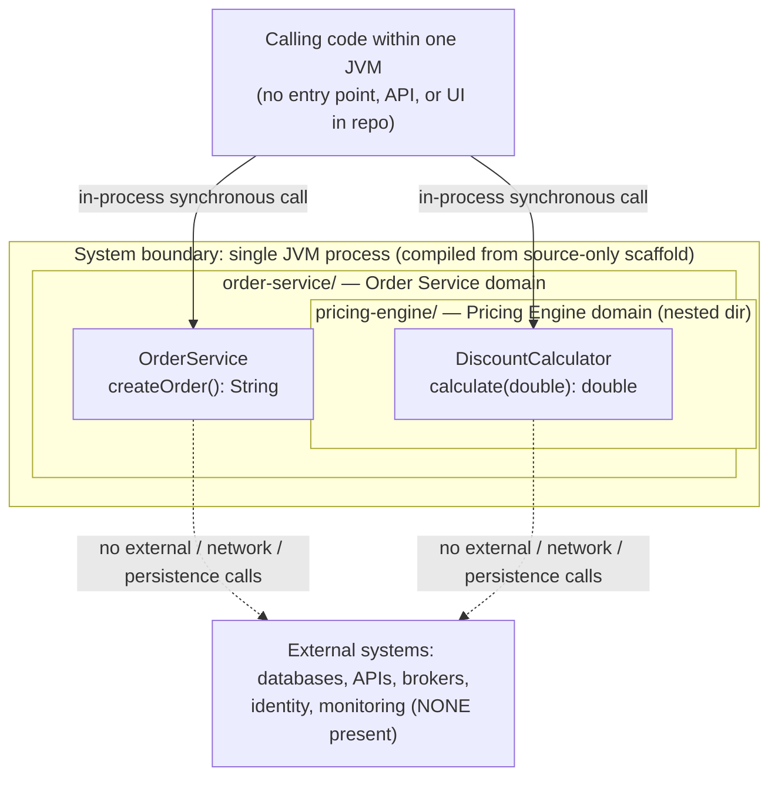
```mermaid
flowchart TB
    Caller["Calling code within one JVM<br/>(no entry point, API, or UI in repo)"]

    subgraph JVM["System boundary: single JVM process (compiled from source-only scaffold)"]
        direction TB
        subgraph OSD["order-service/ — Order Service domain"]
            direction TB
            OS["OrderService<br/>createOrder(): String"]
            subgraph PED["pricing-engine/ — Pricing Engine domain (nested dir)"]
                DC["DiscountCalculator<br/>calculate(double): double"]
            end
        end
    end

    Ext["External systems: databases, APIs, brokers,<br/>identity, monitoring (NONE present)"]

    Caller -->|"in-process synchronous call"| OS
    Caller -->|"in-process synchronous call"| DC
    OS -. "no external / network / persistence calls" .-> Ext
    DC -. "no external / network / persistence calls" .-> Ext
```

### 5.1.2 Core Components

The repository comprises **two executable components** (the Java classes) and a **documentation-artifact component** (the three README files that declare domain responsibilities, established as a component group in Section 1.2.2). Because the prompt's five requested attributes exceed the four-column table limit, the core-components inventory is presented as two linked tables that share the Component Name key.

| Component Name | Primary Responsibility | Key Dependencies |
| --- | --- | --- |
| `OrderService` (`order-service/OrderService.java`) | Expose F-001 Order Creation: return a fixed acknowledgement `"Order Created"` | Java standard library only (`java.lang.String`); no third-party or internal dependency |
| `DiscountCalculator` (`order-service/pricing-engine/DiscountCalculator.java`) | Expose F-002 Discount Calculation: apply a fixed 10% discount (`price * 0.9`) | Java standard library only (primitive `double`); no third-party or internal dependency |
| Domain README specifications (root `README.md`, `order-service/README.md`, `order-service/pricing-engine/README.md`) | Declare intended domain responsibilities (Create/Update/Cancel order; Price/Discount/Tax calculation) | None (Markdown documentation) |

| Component Name | Integration Points | Critical Considerations |
| --- | --- | --- |
| `OrderService` | None — invoked as a plain in-process Java method; does not reference `DiscountCalculator` or any external system | Returns a hardcoded constant with no order entity, validation, or persistence; F-003 Update and F-004 Cancel are documented-only (`order-service/README.md`) |
| `DiscountCalculator` | None — invoked as a plain in-process Java method; not called by `OrderService` | Fixed 10% rate hardcoded as `price * 0.9`; uses IEEE-754 `double` (monetary rounding risk per Section 2.4); no input validation of negative/`NaN`; F-005 Price and F-006 Tax are documented-only |
| Domain README specifications | None (not executable) | Describe a roadmap broader than the code; the documented responsibilities are largely unimplemented and must not be read as current behavior |

### 5.1.3 Data Flow Description

**Primary data flows.** Data movement is confined to a single synchronous method call and its return value; nothing crosses a process, network, or storage boundary (consistent with Section 4.1.2):

- **F-001 Order Creation** — the caller invokes `createOrder()` with **no input arguments**; the method returns the constant `String` `"Order Created"`. No order data is accepted, produced, or stored.
- **F-002 Discount Calculation** — the caller passes a single primitive `double price` argument; the method returns the discounted `double` (`price * 0.9`). The input and output live only on the JVM call stack for the duration of the call and are discarded with the stack frame.

There is **no data flow between the two components** — `OrderService` does not pass data to `DiscountCalculator` or vice versa, because they are not wired together (verified in Section 2.3.1). The relationship between them is purely structural (directory nesting).

**Integration patterns and protocols.** The sole communication pattern is a **synchronous, in-process Java method invocation** over the JVM call stack. There are no network protocols (no HTTP, gRPC, JDBC, or messaging), no serialization/deserialization, and no request/response contracts beyond the Java method signatures themselves.

**Data transformation points.** The only transformation in the system is the arithmetic expression `price * 0.9` inside `DiscountCalculator.calculate(...)`, which maps an input price to a discounted price using IEEE-754 double-precision arithmetic. `createOrder()` performs **no transformation** — it emits a compile-time constant regardless of any (nonexistent) input.

**Key data stores and caches.** There are **none**. The system persists nothing (no database, file, or object store) and caches nothing (no Redis/Memcached/Caffeine/Ehcache), as established in Sections 3.5 and 4.3.1. Both operations are pure and constant-time (O(1)); although each is theoretically memoizable, no cache is implemented or required by the current code.

### 5.1.4 External Integration Points

The system has **no external integration points**. There are no SDK imports, API clients or servers, database drivers, message-broker clients, credentials, or environment configuration referencing any external system (consistent with Sections 3.4 and 2.3.2). The table below records the external-system categories a service in this order/pricing domain might eventually integrate with — several implied by the documented-but-unimplemented features F-003 through F-006 — each assessed against the actual repository. Every category is **Absent**, and because nothing is integrated, **no SLA is defined or applicable** for any of them.

| External System / Category | Expected Integration Type | Protocol / Format (would-be) |
| --- | --- | --- |
| Persistent datastore (needed for F-003 Update, F-004 Cancel) | Outbound persistence | JDBC / SQL or NoSQL driver |
| Tax-rate provider (implied by F-006 Tax Calculation) | Outbound API client | HTTPS / REST / JSON |
| Product-catalog or pricing source (implied by F-005 Price Calculation) | Inbound data source | HTTPS / REST / JSON |
| Identity provider (authentication / authorization) | Security integration | OAuth2 / OIDC |
| Message broker / event bus | Asynchronous messaging | AMQP / Kafka protocol |
| Monitoring / observability backend | Telemetry export | Metrics / traces / logs |

| External System / Category | Present in Repository? | SLA Requirements |
| --- | --- | --- |
| Persistent datastore | Absent — no driver, connection string, or schema | None defined (not applicable) |
| Tax-rate provider | Absent — referenced only conceptually via README | None defined (not applicable) |
| Product-catalog or pricing source | Absent — no client or configuration | None defined (not applicable) |
| Identity provider | Absent — no auth code, tokens, or config | None defined (not applicable) |
| Message broker / event bus | Absent — no producers, consumers, or clients | None defined (not applicable) |
| Monitoring / observability backend | Absent — nothing is instrumented | None defined (not applicable) |


## 5.2 Component Details

There are exactly **two executable components** in the repository, one per domain. Each is a single package-less public Java class exposing a single public instance method. This subsection details each component against the requested attributes (purpose, technologies, interfaces, persistence, scaling) and then provides the required component-interaction, state-transition, and sequence diagrams. The documented-only capabilities (F-003 through F-006) are noted as roadmap items but are not implemented in any component.

### 5.2.1 OrderService Component (Order Service Domain)

**Purpose and responsibilities.** `OrderService` (`order-service/OrderService.java`) implements feature **F-001 Order Creation**. Its sole responsibility is to return a fixed order-creation acknowledgement. The `order-service/README.md` declares a broader intended remit — create, update, and cancel orders — but only creation is implemented, and even that returns a constant with no order entity being constructed or stored. Its entire body is:

```java
public String createOrder(){ return "Order Created"; }
```

**Technologies and frameworks used.** Plain, framework-free Java compiled against the **Java standard library alone**. The class declares no `package`, imports nothing, and uses no annotations, dependency-injection container, interface, or inheritance (consistent with Section 3.2). The only type it depends on is `java.lang.String`.

**Key interfaces and APIs.** One synchronous public instance method — `String createOrder()` — taking no arguments and declaring no checked exceptions. There is an implicit no-arg default constructor (none is declared). The method is reachable only as an **in-process Java call**; there is no REST/HTTP, RPC, CLI, or messaging surface exposing it.

**Data persistence requirements.** None. The method neither reads from nor writes to any store; it returns a compile-time constant. No order record, identifier, or status is created or retained (consistent with Sections 3.5 and 4.3.1).

**Scaling considerations.** The component is **stateless and constant-time (O(1))** with no fields or shared mutable state, so it is inherently thread-safe and would be trivially parallelizable if a runtime host existed. In practice there is **no deployable runtime** (no `main()`, server, or build artifact), so any scaling characteristic is a property of the code, not of a running service. Implementing the documented update/cancel operations (F-003/F-004) would introduce persisted, mutable order state and change these characteristics.

### 5.2.2 DiscountCalculator Component (Pricing Engine Domain)

**Purpose and responsibilities.** `DiscountCalculator` (`order-service/pricing-engine/DiscountCalculator.java`) implements feature **F-002 Discount Calculation**. Its sole responsibility is to apply a fixed 10% discount to a supplied price. The `order-service/pricing-engine/README.md` and root `README.md` declare a broader Pricing Engine remit — price, discount, and tax calculation — but only discount is implemented. Its entire body is:

```java
public double calculate(double price){ return price * 0.9; }
```

**Technologies and frameworks used.** Plain, framework-free Java against the standard library. The class is package-less, imports nothing, holds no fields, and defines no explicit constructor. It relies only on the primitive `double` type and the multiplication operator.

**Key interfaces and APIs.** One synchronous public instance method — `double calculate(double price)` — taking a single primitive argument and declaring no checked exceptions. As with `OrderService`, it is invoked purely as an **in-process Java call** with no remote interface.

**Data persistence requirements.** None. The method is a pure function of its input: the argument and the returned value live only on the JVM call stack for the duration of the call and are then discarded. Nothing is stored, cached, or logged.

**Scaling considerations.** Like `OrderService`, the component is **stateless, pure, and O(1)**, hence thread-safe and embarrassingly parallel in principle; no synchronization is required because there is no shared state. Two code-level considerations bound any future scaling: the 10% rate is hardcoded (changing it requires editing and recompiling per Section 2.4), and monetary computation on IEEE-754 `double` carries rounding risk that a production pricing engine would typically address with `BigDecimal`. As with the other component, no runtime host exists, so scaling remains theoretical.

### 5.2.3 Component Interaction Diagram

The diagram below shows the only interactions that occur: calling code invokes each component independently and receives a return value. Critically, there is **no interaction between the two components** — `OrderService` neither imports nor calls `DiscountCalculator` (verified in Sections 2.3 and 4.1.2) — which is shown explicitly as a non-connecting dashed link.

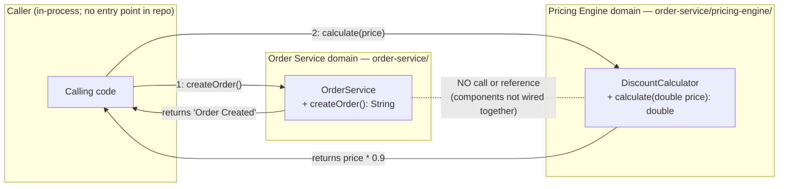
```mermaid
flowchart LR
    subgraph Client["Caller (in-process; no entry point in repo)"]
        C["Calling code"]
    end

    subgraph OrderDomain["Order Service domain — order-service/"]
        OS["OrderService<br/>+ createOrder(): String"]
    end

    subgraph PricingDomain["Pricing Engine domain — order-service/pricing-engine/"]
        DC["DiscountCalculator<br/>+ calculate(double price): double"]
    end

    C -->|"1: createOrder()"| OS
    OS -->|"returns 'Order Created'"| C
    C -->|"2: calculate(price)"| DC
    DC -->|"returns price * 0.9"| C
    OS -. "NO call or reference<br/>(components not wired together)" .- DC
```

### 5.2.4 State Transition Diagram

Both components are **stateless**, so there is no domain state machine in the running code (Section 4.3.1). The diagram models the transient invocation lifecycle a stateless component passes through during a single call, including the fault path in which an uncaught JVM runtime exception propagates to the caller (there is no `try`/`catch` or recovery anywhere — Section 4.3.2). It applies identically to `OrderService` and `DiscountCalculator`. The documented-but-unimplemented order lifecycle (Created → Updated → Cancelled) is a roadmap modeled separately in Section 4.4.1 and is intentionally not repeated here.

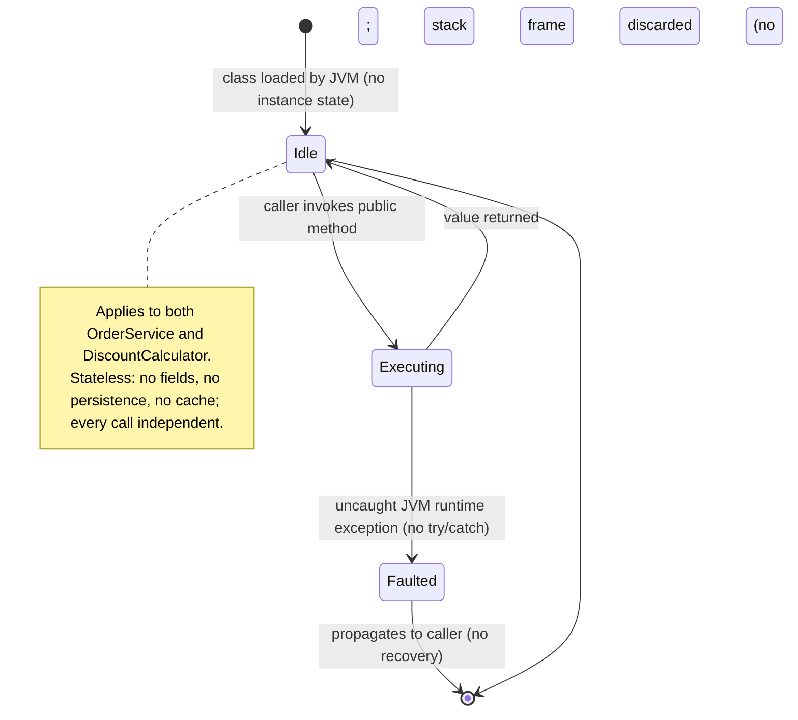
```mermaid
stateDiagram-v2
    [*] --> Idle: class loaded by JVM (no instance state)
    Idle --> Executing: caller invokes public method
    Executing --> Idle: value returned; stack frame discarded (no state retained)
    Executing --> Faulted: uncaught JVM runtime exception (no try/catch)
    Faulted --> [*]: propagates to caller (no recovery)
    Idle --> [*]
    note right of Idle
        Applies to both OrderService and DiscountCalculator.
        Stateless: no fields, no persistence, no cache; every call independent.
    end note
```

### 5.2.5 Sequence Diagrams for Key Flows

The sequence diagram depicts the two key flows — F-001 Order Creation and F-002 Discount Calculation — as independent synchronous exchanges between the caller and each component. The only internal step is the arithmetic self-message inside `DiscountCalculator`. The closing note reiterates that no messages ever flow between the two components.

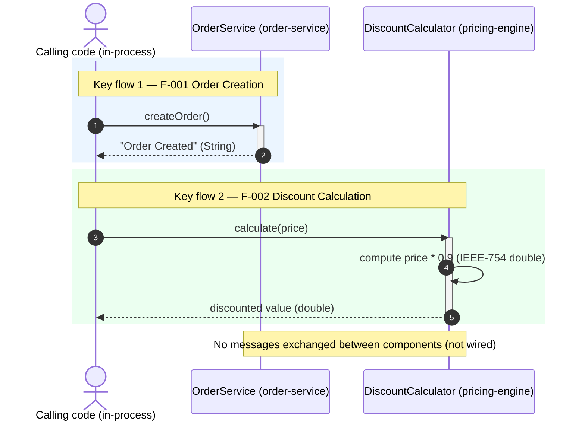
```mermaid
sequenceDiagram
    autonumber
    actor Caller as Calling code (in-process)
    participant OS as OrderService (order-service)
    participant DC as DiscountCalculator (pricing-engine)

    rect rgb(235, 245, 255)
    Note over Caller,OS: Key flow 1 — F-001 Order Creation
    Caller->>OS: createOrder()
    activate OS
    OS-->>Caller: "Order Created" (String)
    deactivate OS
    end

    rect rgb(235, 255, 240)
    Note over Caller,DC: Key flow 2 — F-002 Discount Calculation
    Caller->>DC: calculate(price)
    activate DC
    DC->>DC: compute price * 0.9 (IEEE-754 double)
    DC-->>Caller: discounted value (double)
    deactivate DC
    end

    Note over OS,DC: No messages exchanged between components (not wired)
```


## 5.3 Technical Decisions

The repository contains **no written architecture rationale, ADR files, or design notes** of any kind — only source and README files. The decisions documented below are therefore **reverse-engineered from the observed code** and are labeled as inferred; each is grounded in a concrete, verifiable property of the repository (an absence is itself a decision at this scaffold stage). The five decision areas requested by the prompt — architecture style, communication pattern, data storage, caching, and security — are covered here with prose, tradeoff tables, a decision tree, and a set of Architecture Decision Records.

### 5.3.1 Decision Overview and Tradeoffs

The table below states each decision as evidenced by the repository alongside its inferred rationale.

| Decision Area | Decision (as evidenced in repo) | Inferred Rationale |
| --- | --- | --- |
| Architecture style | Flat, framework-free, single-module Java partitioned into two domains by directory; no runtime host | Minimal scaffold: smallest expression of two behaviors avoids framework/build overhead |
| Communication pattern | Synchronous, in-process Java method invocation; components not wired to each other | No network boundary needed for a source-only scaffold; simplest and deterministic |
| Data storage | None — stateless classes; all data transient on the call stack | No stateful feature is implemented yet; nothing to persist |
| Caching strategy | None — no cache library or layer | Implemented operations are O(1) (a constant and a pure multiply); nothing worth caching |
| Security mechanism | None — no authentication, authorization, input validation, or encryption | No external/untrusted surface exists in-process, so no controls were added |

The corresponding benefits and costs make the tradeoffs explicit:

| Decision Area | Benefit | Cost / Risk |
| --- | --- | --- |
| Framework-free style | Zero dependencies, no supply-chain surface, trivial to read and compile (Section 3.2.4) | No framework-provided services (DI, routing, validation, security); must be re-architected to become a deployable service |
| In-process communication | No serialization/network latency; fully deterministic and simple to test | No remote access, no independent deployment/decoupling of the two domains |
| No persistence | No database infrastructure, no consistency/durability concerns | Nothing is durable; F-003 Update and F-004 Cancel cannot be built until storage is introduced (Section 4.4.1) |
| No caching | No cache infrastructure or invalidation complexity | None foregone at current scale (pure/constant operations); a real pricing path may later need memoization |
| No security controls | No secrets, credentials, or external attack surface to defend (Section 3.4.3) | No input validation (`double price` accepts negative/`NaN` unguarded); controls must be added before any external exposure |

### 5.3.2 Decision Tree

The decision tree traces the reasoning path — inferred from the code — that yields the current minimal architecture. Each decision node shows the branch actually taken ("No") given the present scope, and the branch that a future, more capable version would take.

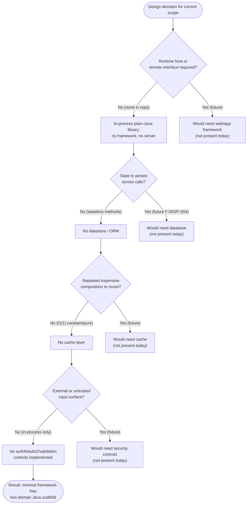
```mermaid
flowchart TD
    Start([Design decision for current scope]) --> Q1{"Runtime host or<br/>remote interface required?"}
    Q1 -->|"No (none in repo)"| A1["In-process plain-Java library;<br/>no framework, no server"]
    Q1 -->|"Yes (future)"| A1b["Would need web/app framework<br/>(not present today)"]
    A1 --> Q2{"State to persist<br/>across calls?"}
    Q2 -->|"No (stateless methods)"| A2["No datastore / ORM"]
    Q2 -->|"Yes (future F-003/F-004)"| A2b["Would need database<br/>(not present today)"]
    A2 --> Q3{"Repeated expensive<br/>computation to reuse?"}
    Q3 -->|"No (O(1) constant/pure)"| A3["No cache layer"]
    Q3 -->|"Yes (future)"| A3b["Would need cache<br/>(not present today)"]
    A3 --> Q4{"External or untrusted<br/>input surface?"}
    Q4 -->|"No (in-process only)"| A4["No authN/authZ/validation<br/>controls implemented"]
    Q4 -->|"Yes (future)"| A4b["Would need security controls<br/>(not present today)"]
    A4 --> Result([Result: minimal framework-free<br/>two-domain Java scaffold])
```

### 5.3.3 Architecture Decision Records (ADRs)

No ADR documents exist in the repository; the records below are reconstructed from observed code to capture the effective decisions and their consequences. All are marked **Accepted** because they are the decisions the current codebase reflects; ADR-006 is "Accepted by omission" because it records the deliberate-or-incidental absence of security controls.

| ADR | Decision | Status | Key Consequence |
| --- | --- | --- | --- |
| ADR-001 | Framework-free plain Java, standard library only | Accepted | No dependency/vuln surface, but no framework services; adding a runtime later is a larger change |
| ADR-002 | Domain-by-directory layout (`pricing-engine/` nested under `order-service/`) | Accepted | Clear domain grouping with zero code coupling; boundaries are organizational, not enforced |
| ADR-003 | Synchronous in-process method communication | Accepted | Simple and deterministic; no remote interface or independent deployment |
| ADR-004 | No persistence — stateless, transient in-memory data | Accepted | No infra or durability concerns; stateful features (F-003/F-004) blocked until revisited |
| ADR-005 | No caching layer | Accepted | No invalidation complexity; nothing is cached (operations are O(1)) |
| ADR-006 | No security controls (authN/authZ/validation/encryption) | Accepted by omission | No attack surface today; controls are a prerequisite for any external interface |

The relationships between these records show how the foundational framework-free decision (ADR-001) propagates into the communication, persistence, caching, and security postures:

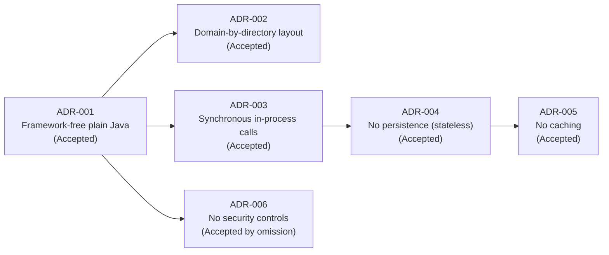
```mermaid
flowchart LR
    ADR1["ADR-001<br/>Framework-free plain Java<br/>(Accepted)"]
    ADR2["ADR-002<br/>Domain-by-directory layout<br/>(Accepted)"]
    ADR3["ADR-003<br/>Synchronous in-process calls<br/>(Accepted)"]
    ADR4["ADR-004<br/>No persistence (stateless)<br/>(Accepted)"]
    ADR5["ADR-005<br/>No caching<br/>(Accepted)"]
    ADR6["ADR-006<br/>No security controls<br/>(Accepted by omission)"]

    ADR1 --> ADR2
    ADR1 --> ADR3
    ADR3 --> ADR4
    ADR4 --> ADR5
    ADR1 --> ADR6
```


## 5.4 Cross-Cutting Concerns

Cross-cutting concerns are the aspects that a production service typically threads through every component: observability, logging/tracing, error handling, security, performance guarantees, and disaster recovery. In this repository, **every one of these concerns is currently unimplemented** — there is no framework, configuration, or infrastructure to host them (Sections 3.2, 3.4, 3.5, 4.3). This subsection documents each concern honestly against the evidence, describes the single error-handling behavior that does exist (uncaught propagation), and states what would be required to introduce each concern as the documented-but-unimplemented features are built out. The summary table orients the detail that follows.

| Cross-Cutting Concern | Status in Repository | Evidence / Reference |
| --- | --- | --- |
| Monitoring & observability | Absent | No agents, metrics, or health checks (Section 3.4.1) |
| Logging & tracing | Absent | No logging framework; no `System.out`; nothing emitted (Section 3.2.1) |
| Error handling | Minimal — uncaught propagation only | No `try`/`catch`, retries, or fallbacks (Section 4.3.2) |
| Authentication & authorization | Absent | No identity provider or auth code (Section 3.4.3) |
| Performance requirements & SLAs | None declared | No SLA/KPI anywhere; operations are O(1) (Sections 1.2.3, 4.1.1) |
| Disaster recovery | Not applicable | Nothing deployed or persisted; source is version-controlled in Git |

### 5.4.1 Monitoring and Observability

There is **no monitoring or observability** in the repository. No application performance monitoring (APM) agent, metrics exporter (for example Micrometer/Prometheus), health-check endpoint, or dashboard exists, and nothing is instrumented (consistent with Section 3.4.1). Because there is no runtime host, there is also nothing to observe operationally. A future runtime would begin with **no external operational visibility**; introducing observability would require adding an instrumentation library and a metrics/telemetry backend alongside a deployable process.

### 5.4.2 Logging and Tracing

There is **no logging and no distributed tracing**. Neither class imports or invokes a logging facility (SLF4J, Log4j, Logback are all absent per Section 3.2.1), and there is not even a `System.out.println` statement; the two methods return values silently. Consequently there are **no log records, correlation IDs, or trace spans** — a failure or a call is neither recorded nor traceable. Any logging/tracing strategy would need to be added from scratch (a logging API plus, for cross-service tracing, a propagation standard such as W3C Trace Context) once a runtime and, ideally, remote interfaces exist.

### 5.4.3 Error Handling

The error-handling posture is **minimal by construction** and is the only cross-cutting behavior that manifests at all. Neither method declares a checked exception, defines a custom exception type, or contains a `try`/`catch` block (Section 4.3.2). In the normal case each method returns deterministically. Should the JVM raise a runtime error during execution (for example a virtual-machine or arithmetic error), nothing in the component intercepts it — the exception **propagates uncaught up the caller's stack**, leaving the caller solely responsible for handling it. There is no input validation, so `calculate(double price)` will happily process negative, zero, or `NaN` inputs rather than rejecting them.

The following resilience mechanisms are **not implemented anywhere**: retry/backoff, fallback or degraded-mode responses, error notification/alerting, and recovery/compensation. The flow below models the runtime behavior and places the missing cross-cutting hooks in a dedicated "none implemented" group.

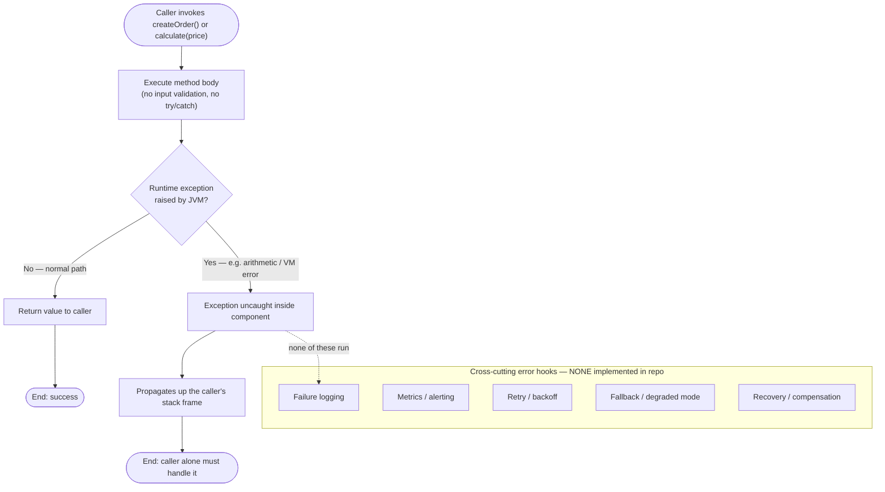
```mermaid
flowchart TB
    In(["Caller invokes createOrder() or calculate(price)"]) --> Run["Execute method body<br/>(no input validation, no try/catch)"]
    Run --> Cond{"Runtime exception<br/>raised by JVM?"}
    Cond -->|"No — normal path"| Ret["Return value to caller"]
    Ret --> EndOk(["End: success"])
    Cond -->|"Yes — e.g. arithmetic / VM error"| Uncaught["Exception uncaught inside component"]
    Uncaught --> Prop["Propagates up the caller's stack frame"]
    Prop --> EndErr(["End: caller alone must handle it"])

    subgraph Missing["Cross-cutting error hooks — NONE implemented in repo"]
        direction TB
        L["Failure logging"]
        M["Metrics / alerting"]
        Rt["Retry / backoff"]
        Fb["Fallback / degraded mode"]
        Rc["Recovery / compensation"]
    end

    Uncaught -. "none of these run" .-> L
```

### 5.4.4 Authentication and Authorization

There is **no authentication or authorization framework**. The repository contains no identity provider integration, no tokens or credentials, no OAuth2/OIDC/JWT handling, and no access-control logic (consistent with Sections 3.4.1 and 3.4.3). Because both methods are invoked only as in-process Java calls, there is no request principal to authenticate and no protected resource boundary to authorize against. Any authentication/authorization scheme would have to be introduced together with an external interface (for example an API gateway or a framework's security module), none of which exists today.

### 5.4.5 Performance Requirements and SLAs

**No performance requirements, service-level agreements, latency budgets, throughput targets, or KPIs are declared anywhere in the repository** (Sections 1.2.3 and 2.2). As an observation about the code rather than a committed guarantee, both implemented operations are deterministic, in-memory, and constant-time (O(1)) with no I/O, concurrency, or allocation beyond the returned value, so their execution cost is negligible (Section 4.1.1). This should be read strictly as a property of the current trivial implementation; establishing real SLAs would require product and quality goals and a measurable runtime, neither of which the repository contains.

### 5.4.6 Disaster Recovery

There are **no disaster-recovery procedures**, and at the current stage they are **not applicable**. Nothing is deployed and nothing is persisted (Sections 3.5 and 4.3.1), so there is no running system to fail over, no data to back up or replicate, and no recovery point/time objective (RPO/RTO) to meet. The only recovery-relevant asset is the **source code itself, which is under Git version control** (branch `main`, six commits), meaning the code can be restored or rolled back from history; this is source-control hygiene, not operational disaster recovery. Genuine DR (backups, replication, failover, runbooks) would become relevant only once a runtime, persistence, and deployment target are introduced to support the documented-but-unimplemented features.


## 5.5 References

The following repository files, folders, and previously written specification sections were examined and cited as evidence for Section 5. No web sources were used; every architectural claim is grounded in direct repository inspection.

**Repository files examined**

- `README.md` — root "Pricing Engine" specification; established the Pricing Engine responsibilities (price, discount, tax calculation) referenced as documented intent.
- `order-service/OrderService.java` — established the `OrderService` component and feature F-001 (`createOrder()` returning the constant `"Order Created"`); source of the component's interface, statelessness, and absence of persistence/validation.
- `order-service/README.md` — "Order Service" specification; established the documented-only Create/Update/Cancel responsibilities (F-001, F-003, F-004).
- `order-service/pricing-engine/DiscountCalculator.java` — established the `DiscountCalculator` component and feature F-002 (`calculate(double price)` returning `price * 0.9`); source of the single data-transformation point and the `double`/rounding consideration.
- `order-service/pricing-engine/README.md` — "Pricing Engine" specification; established the documented-only Price/Discount/Tax responsibilities (F-002, F-005, F-006).

**Repository folders examined**

- `` (repository root) — confirmed the top-level structure (root `README.md` plus the `order-service/` domain) and the absence of any build files, manifests, configuration, tests, or CI/CD.
- `order-service/` — the Order Service domain directory; confirmed it contains only `OrderService.java`, `README.md`, and the nested `pricing-engine/` directory.
- `order-service/pricing-engine/` — the nested Pricing Engine domain directory; confirmed it contains only `DiscountCalculator.java` and `README.md`, establishing the domain-by-directory layout with no build/config artifacts.

**Repository metadata examined**

- Git repository (branch `main`, 6 commits) — confirmed the scaffold history and established version control as the only recovery-relevant asset (Section 5.4.6). Verified the complete on-disk file inventory and the absence of any hidden build/config files.

**Cross-referenced Technical Specification sections**

- `1.2 System Overview` — shared terminology ("minimal, two-domain Java scaffold"), the structural containment model, and the framework-free technical approach.
- `1.3 Scope` — confirmed the absence of external integration points and runtime/build requirements.
- `2.2 Functional Requirements` — feature/requirement IDs and the absence of performance/security/compliance requirements.
- `2.3 Feature Relationships` — confirmed the components are not wired together (only directory nesting) and the documented-only conceptual dependencies.
- `2.4 Implementation Considerations` — the hardcoded-rate and `double` monetary-rounding considerations, and the recompile constraint.
- `3.2 Frameworks & Libraries` — the framework-free posture and its justification/security implications.
- `3.4 Third-Party Services` — confirmed no external/third-party services, no identity provider, and no monitoring backend.
- `3.5 Databases & Storage` — confirmed no persistence, no caching, and no durability/transactional integrity.
- `4.1 System Workflows` — the two in-process synchronous flows and the absence of integration/event/batch workflows.
- `4.3 Technical Implementation Flows` — the state-management (stateless) and error-handling (uncaught propagation) findings.
- `4.4 State Transition Diagrams` — the documented-intent order lifecycle (roadmap) and the component invocation-state model.


# 6. SYSTEM COMPONENTS DESIGN

## 6.1 Core Services Architecture

### 6.1.1 Architecture Style Determination

**Core Services Architecture is not applicable for this system.**

The repository does not implement a microservices, distributed, or otherwise service-oriented runtime architecture. It is a minimal, framework-free Java source scaffold consisting of exactly five tracked files across three directories (repository root, `order-service/`, and `order-service/pricing-engine/`), totaling 18 lines of Java across two classes. This determination is consistent with the architecture style already established in Section 5.1 High-Level Architecture, which characterizes the system as a "minimal, two-domain Java scaffold" with "no layered, hexagonal, microservice, event-driven, or client-server runtime architecture present," and with Section 3.6 Development & Deployment, which confirms the absence of any build, packaging, containerization, or deployment tooling.

The directory names `order-service/` and `order-service/pricing-engine/` imply a *nominal* service decomposition, but no attribute of an actual service-based system is present. The two Java types — `OrderService` (in `order-service/OrderService.java`) and `DiscountCalculator` (in `order-service/pricing-engine/DiscountCalculator.java`) — are package-less, dependency-free classes, each exposing a single stateless method, and they are not connected to one another. There is no runnable process, no network interface, no independently deployable unit, and no inter-service coordination machinery of any kind.

#### 6.1.1.1 Determination Criteria and Evidence

The following table maps each defining characteristic of a Core Services Architecture to the evidence required to demonstrate it and the corresponding observation in the repository.

| Defining Characteristic | Evidence That Would Confirm It | Observation in Repository |
|---|---|---|
| Independently deployable services | Per-service build/packaging artifacts | Absent — no `pom.xml`, `build.gradle`, `Makefile`, or manifest |
| Runnable service processes | A `main()` / server bootstrap per service | Absent — no entry point; per-class `javac` only |
| Inter-service communication | HTTP/REST, gRPC, or messaging clients | Absent — no imports, no networking, classes not wired |
| Service discovery | Eureka/Consul/DNS-SD registration/config | Absent — no discovery libraries or configuration |
| Load balancing | Reverse proxy / client-side LB configuration | Absent — no proxy, gateway, or LB definition |
| Circuit breaking / retry | Resilience4j, Hystrix, or equivalent | Absent — no resilience libraries present |
| Distributed runtime | Orchestration (Kubernetes, Compose) | Absent — no `Dockerfile`, compose, or manifests |

#### 6.1.1.2 Scope of the Remaining Sub-Sections

Because the section prompt enumerates specific service-architecture concerns (service components, scalability design, and resilience patterns), the sub-sections that follow — 6.1.2, 6.1.3, and 6.1.4 — document each mandated concern explicitly, recording the actual (predominantly absent) state as direct evidence for the "not applicable" determination above. Each includes a labeled diagram contrasting the repository's real, single-process reality against the reference topology that a true services architecture would require. These sub-sections describe what the codebase actually contains; they do not prescribe or assume behavior, service-level agreements, or infrastructure that is not present in the code.

### 6.1.2 Service Components

The repository defines two *nominal* components by directory partitioning: an Order Service (`order-service/`) and a Pricing Engine (`order-service/pricing-engine/`, nested inside the former). Each is a single package-less Java class with one stateless method. As established in Section 5.2 Component Details, both are "stateless and constant-time (O(1))" and are not invoked by one another; there is no orchestrating process, network boundary, or shared runtime that would make them services in the architectural sense.

#### 6.1.2.1 Service Boundaries and Responsibilities

The boundary between the two nominal components is purely organizational (directory nesting). Each `README.md` documents a broader set of intended responsibilities than the code implements — the implemented surface is limited to one method per class.

| Nominal Service | Directory / Class | Implemented Behavior | Documented but Unimplemented |
|---|---|---|---|
| Order Service | `order-service/` — `OrderService` | `createOrder()` returns the literal `"Order Created"` | Update order, Cancel order (`order-service/README.md`) |
| Pricing Engine | `order-service/pricing-engine/` — `DiscountCalculator` | `calculate(double price)` returns `price * 0.9` | Price calculation, Tax calculation (`README.md`, `pricing-engine/README.md`) |

Neither class declares a package, imports any type, holds state, or exposes a constructor beyond the implicit default. There is no aggregate root, façade, or domain service that composes the two; the only relationship between them is the containment of the `pricing-engine/` directory within `order-service/`.

#### 6.1.2.2 Communication, Discovery, Load Balancing, and Resilience Controls

Every inter-service mechanism required by a Core Services Architecture is absent. The sole invocation model available is an in-process Java method call issued by a hypothetical caller compiled onto the same classpath; the two classes exchange no data with each other (see also Section 5.2.3, which shows no inter-component interaction).

| Service-Level Concern | Mechanism a Services Architecture Would Use | Status in Repository |
|---|---|---|
| Inter-service communication | In-process call, HTTP/REST, gRPC, or messaging | Not present — classes invoked directly; not wired to each other |
| Service discovery | Registry (Eureka/Consul) or DNS-based lookup | Not present — no discovery library or configuration |
| Load balancing | Reverse proxy or client-side load balancer | Not present — no proxy, gateway, or LB definition |
| Circuit breaker | Resilience4j / Hystrix or equivalent | Not present — no resilience dependency |
| Retry & fallback | Retry policy with a fallback handler | Not present — uncaught exceptions propagate (see 5.4.3) |

**Figure 6.1.2-1: Service Interaction — Actual In-Process Calls vs. Absent Microservices Connective Tissue**

```mermaid
flowchart TB
    Caller["Calling code (same JVM)<br/>no entry point, API, or UI in repo"]

    subgraph Present["Implemented today — one JVM process, in-process calls only"]
        direction TB
        subgraph OrderSvc["order-service/ — nominal Order Service"]
            OS["OrderService<br/>createOrder(): String"]
        end
        subgraph PriceSvc["order-service/pricing-engine/ — nominal Pricing Engine"]
            DC["DiscountCalculator<br/>calculate(double): double"]
        end
    end

    subgraph Absent["Reference microservices connective tissue — NONE present in repository"]
        direction LR
        AClient["Client"] -->|"HTTP"| AGW["API gateway / edge router"]
        AGW --> ALB["Load balancer"]
        ALB --> AREG["Service registry / discovery"]
        AREG --> ASvc["Service replicas"]
        ASvc -. "async events" .-> ABroker["Message broker / event bus"]
    end

    Caller -->|"1: createOrder() (in-process)"| OS
    OS -->|"returns 'Order Created'"| Caller
    Caller -->|"2: calculate(price) (in-process)"| DC
    DC -->|"returns price * 0.9"| Caller
    OS -. "no call or reference (not wired together)" .- DC
```

The left cluster reflects the repository's real behavior: a caller on the same JVM invokes each class independently, and the dashed link records that `OrderService` and `DiscountCalculator` neither reference nor call each other. The right cluster is a reference microservices topology (gateway, load balancer, registry, replicas, message broker) shown solely to enumerate the connective tissue that would be required but is entirely absent here.

### 6.1.3 Scalability Design

No scalability design is implemented. Scaling a services architecture presupposes a deployable, running process that receives load; as documented in Section 3.6 Development & Deployment, this repository has no build system, no packaged artifact, no `main()` entry point, and "cannot be launched as a standalone program." Without a runtime host there is nothing to scale horizontally or vertically, no metrics to trigger auto-scaling, and no resources to allocate.

Section 5.2 Component Details notes a *latent* property worth recording: because both `OrderService.createOrder()` and `DiscountCalculator.calculate(double)` are stateless and constant-time (O(1)), they are "embarrassingly parallel in principle." However, that same section is explicit that "no runtime host exists, so scaling remains theoretical." The property is therefore an attribute of the source code, not an implemented scaling capability.

#### 6.1.3.1 Scalability Dimensions Assessment

| Scalability Dimension | Reference Mechanism | Status in Repository |
|---|---|---|
| Horizontal scaling | Multiple replicas behind a load balancer | Not present — no runtime, replicas, or LB |
| Vertical scaling | Per-instance JVM heap / CPU tuning | Not applicable — no deployed process; per-class `javac` only |
| Auto-scaling triggers & rules | Metrics-driven autoscaler (CPU %, RPS, queue depth) | Not present — no metrics pipeline or orchestrator |
| Resource allocation | CPU / memory requests and limits | Not present — no runtime isolation or resource limits |
| Performance optimization | Caching, pooling, async I/O, batching | Not present — methods already O(1); no I/O to optimize |
| Capacity planning | Load models and headroom targets | Not present — no SLA, KPI, or throughput target defined |

Consistent with Section 5.4 Cross-Cutting Concerns and Section 3.6, no monitoring, metrics, resource limits, or network policy exist anywhere in the repository, so none of the inputs an auto-scaler or capacity-planning process would consume are produced by the system.

**Figure 6.1.3-1: Scalability Architecture — Source-Only Scaffold vs. Absent Scaling Stack**

```mermaid
flowchart TB
    subgraph Current["Current state — source-only scaffold (evidence-based)"]
        direction TB
        Src[".java sources (2 stateless classes)"]
        Javac["javac — manual, per-class compile"]
        Cls[".class bytecode on the classpath"]
        NoRt["No main(), no server, no build artifact<br/>= no deployable runtime to scale"]
        Src --> Javac --> Cls --> NoRt
    end

    subgraph AbsentScale["Reference scaling stack — NONE present in repository"]
        direction TB
        Trig["Scaling trigger<br/>(CPU %, requests/sec, queue depth)"]
        AS["Autoscaler"]
        Orch["Container orchestrator<br/>(schedules replicas, resource limits)"]
        LBx["Load balancer"]
        R1["Service replica 1"]
        R2["Service replica 2"]
        RN["Service replica N"]
        Trig --> AS --> Orch
        Orch --> R1
        Orch --> R2
        Orch --> RN
        LBx --> R1
        LBx --> R2
        LBx --> RN
    end
```

The upper cluster is the repository's real build path — source compiled per class with `javac`, terminating in bytecode that has no process to run. The lower cluster enumerates the trigger → autoscaler → orchestrator → replica/load-balancer stack a scalable service would require; none of it exists in the codebase.

### 6.1.4 Resilience Patterns

No resilience patterns are implemented. Section 5.4 Cross-Cutting Concerns establishes that error handling consists solely of uncaught exception propagation — there is "no retry/backoff/fallback/notification/recovery" — and that Disaster Recovery is "Not applicable" because nothing is deployed or persisted, with only Git version control of the source (branch `main`, six commits). Neither `OrderService.createOrder()` nor `DiscountCalculator.calculate(double)` contains input validation, a `try`/`catch` block, a timeout, or any guard; the only failure behavior available is a runtime exception bubbling up to whatever code invoked the method.

#### 6.1.4.1 Resilience Pattern Assessment

| Resilience Pattern | Reference Mechanism | Status in Repository |
|---|---|---|
| Fault tolerance | `try`/`catch`, bulkheads, timeouts | Not present — no exception handling; uncaught propagation only |
| Disaster recovery | Backups, restore runbooks, RPO/RTO | Not applicable — nothing deployed or persisted; Git source history only |
| Data redundancy | Replication across data stores | Not applicable — no datastore or persisted state exists |
| Failover configuration | Standby instances, health-based routing | Not present — no runtime, replicas, or health checks |
| Service degradation policy | Fallback responses, feature toggles | Not present — no fallback or degraded path defined |

Because there is no persisted data (Section 3.5 confirms no databases or storage), the data-redundancy and disaster-recovery dimensions have no subject matter; the only artifact that benefits from redundancy is the source code itself, preserved in Git version control as noted in Section 5.4.6.

**Figure 6.1.4-1: Resilience Pattern Implementation — Actual Behavior vs. Unimplemented Pattern Catalog**

```mermaid
flowchart TB
    subgraph Actual["Actual resilience behavior in the repository"]
        direction TB
        Call["Caller invokes createOrder() or calculate(price)"]
        Exec["Execute method body<br/>(no input validation, no try/catch)"]
        Dec{"Runtime exception<br/>raised by JVM?"}
        OK["Return value to caller (normal path)"]
        Prop["Uncaught exception propagates to caller<br/>(the only behavior present)"]
        Call --> Exec --> Dec
        Dec -->|"No"| OK
        Dec -->|"Yes"| Prop
    end

    subgraph Patterns["Standard resilience patterns — status: NOT IMPLEMENTED"]
        direction TB
        CB["Circuit breaker"]
        RT["Retry / backoff"]
        BH["Bulkhead / isolation"]
        FO["Failover / redundancy"]
        DRp["Backup / disaster recovery"]
        HC["Health check / self-healing"]
        DEG["Graceful degradation / fallback"]
    end
```

The upper cluster traces the single failure path that actually exists: a method either returns its value or, on an unhandled runtime exception, propagates that exception to the caller with no interception. The lower cluster catalogs the standard resilience patterns a services architecture would provide — every one is unimplemented in this repository.

### 6.1.5 References

**Repository files and folders examined for this section**

- `README.md` — root readme titled "# Pricing Engine"; documents intended Price/Discount/Tax responsibilities (only discount implemented).
- `order-service/` — directory establishing the nominal Order Service boundary; parent of the nested pricing engine.
- `order-service/README.md` — readme titled "# Order Service"; documents intended Create/Update/Cancel responsibilities (only create implemented).
- `order-service/OrderService.java` — package-less `OrderService` class; sole method `createOrder()` returns the literal `"Order Created"`; no imports, state, or entry point.
- `order-service/pricing-engine/` — directory nested inside `order-service/`, establishing the nominal Pricing Engine boundary (organizational relationship only).
- `order-service/pricing-engine/DiscountCalculator.java` — package-less `DiscountCalculator` class; sole method `calculate(double price)` returns `price * 0.9` (fixed 10% discount); no imports or state.
- `order-service/pricing-engine/README.md` — readme duplicating the root "# Pricing Engine" content.

Repository-wide inspection (branch `main`, six commits) confirmed the absence of any build manifest, dependency declaration, framework, `main()` entry point, network/API layer, persistence, configuration, containerization, orchestration, and inter-class wiring — the evidence base for the "not applicable" determination.

**Cross-referenced Technical Specification sections**

- Section 1.2 System Overview / Section 1.3 Scope — nature and boundaries of the system.
- Section 3.5 Databases & Storage — confirmation that no persistence or data store exists (data-redundancy/DR basis).
- Section 3.6 Development & Deployment — absence of build, packaging, `main()`, containerization, CI/CD, and IaC; per-class `javac`; six commits on `main`.
- Section 5.1 High-Level Architecture — architecture style ("minimal, two-domain Java scaffold"; no microservice/event-driven/client-server runtime); single JVM process boundary.
- Section 5.2 Component Details — stateless O(1) components, "embarrassingly parallel in principle" but scaling "theoretical"; no inter-component interaction.
- Section 5.4 Cross-Cutting Concerns — error handling as uncaught propagation only; Disaster Recovery "Not applicable"; no monitoring, logging, auth, or SLA.

## 6.2 Database Design

### 6.2.1 Database Design Applicability Determination

**Database Design is not applicable to this system.**

The repository implements no database, persistent store, cache, or file-based storage of any kind, and it defines no data model to persist. The entire codebase is five tracked files across three directories — two package-less, field-free Java classes (`order-service/OrderService.java` and `order-service/pricing-engine/DiscountCalculator.java`) and three `README.md` documents. Neither class reads from or writes to any store: `OrderService.createOrder()` returns the constant string `"Order Created"`, and `DiscountCalculator.calculate(double price)` returns `price * 0.9`. The only data that exists at runtime is a single `double` input and two deterministic outputs, all held in memory for the duration of a method call.

This determination is consistent with the rest of the specification. Section 3.5 (Databases & Storage) records "no database or storage technology of any kind" and a data-persistence strategy of "none — all data is transient." Section 6.1.4 (Resilience Patterns) finds data redundancy and disaster recovery "not applicable — no datastore or persisted state exists." Section 1.3 (Scope) places persistence, databases, and message queues out of scope, stating that "any scenario requiring persisted or validated order data … is unsupported."

A repository-wide sweep found none of the artifacts a database design presupposes:

| Data-Tier Artifact | Present? | Evidence |
| --- | --- | --- |
| Database driver / connection (JDBC, R2DBC) | Absent | No imports, no connection string, no `jdbc:` URL |
| ORM / data-access layer (JPA, Hibernate, MyBatis) | Absent | No annotations, no `EntityManager`, no `*Repository` |
| Schema / migration files (DDL, Flyway, Liquibase) | Absent | No `.sql` files, no migration tool, no schema definition |
| Cache (Redis, Memcached, Caffeine, Ehcache) | Absent | No cache library; no state or query result to cache |
| Object / file / blob storage (S3, GCS, file I/O) | Absent | No storage SDK, no streams, no `File`/`*OutputStream` |
| Persisted state in code | Absent | Both classes declare no fields; all data is transient |

Because there is no datastore, there is nothing to model, query, index, partition, replicate, back up, retain, archive, or cache. The remaining sub-sections nonetheless walk through every database-design concern enumerated by the section prompt — schema design (6.2.3), data management (6.2.4), compliance considerations (6.2.5), and performance optimization (6.2.6) — recording the actual (uniformly absent) state as direct evidence for this determination rather than prescribing behavior that the code does not contain. Sub-section 6.2.7 records, strictly as forward-looking analysis, the conditions under which a database design would become necessary if the documented-but-unimplemented features were built.

#### 6.2.1.1 Determination Criteria and Evidence

The following table maps each capability that a database design would provide to the evidence that would confirm it and the corresponding observation in the repository. Every capability is absent, which is the evidentiary basis for the "not applicable" determination above.

| Database-Design Capability | Evidence That Would Confirm It | Observation in Repository |
| --- | --- | --- |
| Persistent entities / tables | Entity classes, DDL, or schema files | Absent — no data model; classes hold no fields |
| Data access (reads / writes) | Driver, ORM, or DAO issuing queries | Absent — no imports; no query, read, or write of any kind |
| Datastore configuration | Connection URL, credentials, pool settings | Absent — no `.properties`, `.yml`, `.xml`, or `.env` files |
| Indexes and constraints | Index/constraint DDL or ORM key mappings | Absent — there is no schema in which to define them |
| Replication / backup | Replica configuration, snapshot/backup jobs | Absent — no datastore to replicate or back up |
| Migration / versioning | Flyway/Liquibase scripts or ORM auto-DDL | Absent — no migration tooling and no schema to version |

#### 6.2.1.2 Scope of the Remaining Sub-Sections

Because the section prompt enumerates specific persistence concerns, sub-sections 6.2.2 through 6.2.7 document each mandated concern explicitly, recording the repository's actual state as evidence rather than assuming a data tier that does not exist. Each retains the concern's heading so the section maps one-to-one onto the prompt, and the diagrams contrast the repository's real, in-memory reality against the reference topology a persistent system would require. These sub-sections describe what the codebase actually contains; they do not prescribe schemas, indexes, service-level agreements, or infrastructure that is not present in the code.

### 6.2.2 Data Handling Model and Data Flow

Although no database exists, the system does *handle* a small amount of data at runtime, and documenting that flow makes the absence of persistence concrete. The data-handling model is **transient and in-memory only**: every value is created inside a single method invocation, returned to the caller, and then eligible for garbage collection. No value crosses a persistence boundary, is written to disk, is cached, or survives the call.

Three data elements exist across the two implemented operations. None is persisted:

| Data Element | Origin & Type | Persisted? |
| --- | --- | --- |
| `price` argument | Supplied by caller; primitive `double` (feature F-002) | No — in-memory parameter; exists only during the call |
| Discounted amount | Computed as `price * 0.9`; primitive `double` (F-002) | No — returned to caller, then eligible for GC |
| Create-order acknowledgement | Literal `"Order Created"`; `String` (feature F-001) | No — constant return value; no order record is created |

Two properties of this model are worth recording as evidence. First, `OrderService.createOrder()` accepts **no input and creates no record** — it returns a fixed acknowledgement string, so even the conceptual "order" that the Order Service README describes is never materialized as data. Second, `OrderService` and `DiscountCalculator` are **not wired together** (verified by source inspection and corroborated by Section 6.1.2), so there is not even an in-memory hand-off of data between the two components; each is invoked independently by a hypothetical caller on the same JVM.

The diagram below traces the actual data flow and places the database, cache, and object-storage tiers a persistent system would use in an explicitly empty "NONE present" group, with dashed "no read / no write" edges recording that no data ever reaches them.

**Figure 6.2.2-1: Data Flow — Transient In-Memory Values vs. the Absent Persistence Tier**

```mermaid
flowchart TB
    Caller["Calling code (same JVM)<br/>no API, UI, or entry point in repository"]

    subgraph InMem["In-memory execution scope — one method call, nothing persisted"]
        direction TB
        OSflow["OrderService.createOrder()<br/>input: none"]
        OSout["Produce literal 'Order Created' (String)<br/>exists only for the call"]
        DCin["DiscountCalculator.calculate(double price)<br/>input: price (double) from caller"]
        DCout["Produce price * 0.9 (double)<br/>exists only for the call"]
        OSflow --> OSout
        DCin --> DCout
    end

    subgraph NoStore["Persistence tier — NONE present in repository"]
        direction LR
        DB[("Relational / NoSQL<br/>database")]
        Cache[("Cache<br/>Redis / in-process")]
        Blob[("Object / file<br/>storage")]
    end

    Caller -->|"1: invoke in-process"| OSflow
    OSout -->|"return value"| Caller
    Caller -->|"2: invoke with price in-process"| DCin
    DCout -->|"return value"| Caller
    OSout -. "no read / no write" .-> DB
    DCout -. "no read / no write" .-> Cache
    Caller -. "no read / no write" .-> Blob
```

The upper cluster reflects the repository's real behavior: a caller invokes each stateless method independently and receives a return value that lives only for the call. The lower cluster enumerates the persistence tiers (relational/NoSQL database, cache, object storage) that a data-driven system would read from and write to; every one is absent, and the dashed edges confirm that no data is ever read from or written to them.

### 6.2.3 Schema Design Assessment

There is **no schema to design**. Schema design presupposes persistent entities, tables or collections, and the relationships, keys, indexes, and constraints that bind them — none of which exist in the repository. As Section 2.1 states, "there is no order, customer, catalog, or tax data model anywhere in the repository," and the only data structures present are a primitive `double` and a `String` literal that live entirely in memory.

The table below records each schema-design concern enumerated by the section prompt against its actual state:

| Schema-Design Concern | Status | Basis |
| --- | --- | --- |
| Entity relationships | None | No entities defined; the two classes hold no data and are not associated |
| Data models / structures | None | Only a primitive `double` and a `String` literal; no domain data model (Section 2.1) |
| Indexing strategy | None | No tables or columns to index (see 6.2.3.1) |
| Partitioning approach | None | No dataset to partition — sharding, range, and hash partitioning are all inapplicable |
| Replication configuration | None | No datastore to replicate (see 6.2.3.2) |
| Backup architecture | None | No persisted data to back up; only source is version-controlled in Git (see 6.2.3.2) |

An entity-relationship diagram (ERD) of the current system would be empty, because there are zero entities and zero relationships. For completeness, sub-section 6.2.7 provides a clearly-labeled *conceptual* ERD derived from the documented-but-unimplemented features; it depicts entities that would need to be introduced, not any structure that exists today.

#### 6.2.3.1 Indexes and Constraints Inventory

The section prompt requires that all indexes and constraints be documented. Because no schema exists, the complete and exhaustive inventory is **zero of every category**. This is stated explicitly rather than omitted, so the absence is unambiguous:

| Schema Object | Count in Repository | Notes |
| --- | --- | --- |
| Tables / collections | 0 | No datastore or schema is defined |
| Primary keys | 0 | No tables in which to define a key |
| Foreign keys | 0 | No inter-entity relationships to enforce |
| Unique / check / not-null constraints | 0 | No columns to constrain; no validation exists in code either |
| Indexes (clustered, secondary, composite) | 0 | No tables or query patterns to index |

It is worth noting that the absence extends into the code itself: `DiscountCalculator.calculate(double price)` performs no validation (Section 5.4.3 records that negative, zero, or `NaN` inputs are accepted), so there is not even an application-level constraint that a database `CHECK` constraint might later formalize.

#### 6.2.3.2 Replication and Backup Architecture

There is **no replication configuration and no backup architecture**, because both presuppose a datastore holding state, and none exists. Section 5.4.6 (Disaster Recovery) and Section 6.1.4 (Resilience Patterns) both classify these concerns as not applicable: "nothing is deployed and nothing is persisted, so there is no running system to fail over, no data to back up or replicate, and no recovery point/time objective (RPO/RTO) to meet." The single recovery-relevant asset is the **source code, preserved in Git** (branch `main`, six commits) — which is source-control hygiene, not operational data replication or backup.

The diagram contrasts the repository's actual data-tier topology (no datastore; source in version control only) against the reference primary/replica/backup topology a persistent system would deploy.

**Figure 6.2.3-1: Replication & Backup — Actual (No Datastore) vs. Reference Topology (Absent)**

```mermaid
flowchart TB
    subgraph Actual["Actual data-tier topology in the repository"]
        direction TB
        App["OrderService / DiscountCalculator<br/>stateless in-process methods"]
        None["No datastore, no primary, no replica<br/>nothing to replicate or fail over"]
        Git["Source code in Git (branch main, 6 commits)<br/>only recovery asset = source-control hygiene"]
        App --> None
        App --> Git
    end

    subgraph Reference["Reference replication architecture — NONE present in repository"]
        direction TB
        Writer["Application writes"]
        Primary[("Primary database")]
        R1[("Read replica 1")]
        R2[("Read replica 2")]
        Backup[["Backup / snapshot store"]]
        Writer -->|"writes"| Primary
        Primary -->|"replication"| R1
        Primary -->|"replication"| R2
        Primary -->|"snapshots / WAL"| Backup
    end
```

The left cluster is the repository's reality: stateless methods with no datastore behind them, and source code in Git as the only asset that benefits from redundancy. The right cluster enumerates the primary-to-replica replication path and the snapshot/backup store that a durable system would require; none of it exists in the codebase.

### 6.2.4 Data Management Assessment

No data-management processes exist, because there is no managed data. Migration, versioning, archival, storage/retrieval, and caching all operate on a persistent dataset, and this system holds none. The table below records each data-management concern from the section prompt against its actual state:

| Data-Management Concern | Status | Basis |
| --- | --- | --- |
| Migration procedures | None | No schema exists; no Flyway/Liquibase, no ORM auto-DDL, no `.sql` scripts |
| Versioning strategy | None (schema/data) | No schema or data to version; only source code is versioned (Git, branch `main`) |
| Archival policies | None | No stored data to retain, tier to cold storage, or purge |
| Data storage & retrieval | None — transient only | No store to write to or read from; values live in memory for one call (see 6.2.2) |
| Caching policies | None | No cache library; no query result or state to cache (confirmed in Section 3.5.1) |

Two distinctions are important to state precisely. First, the **only versioning present is source-control versioning** of the code in Git; there is no *schema* migration or *data* versioning, and Section 2.1 notes that the two implemented behaviors have never been revised (requirement baseline "version 1.0"). Second, the system's **storage-and-retrieval mechanism is effectively "compute and return"** — `DiscountCalculator.calculate(double price)` recomputes `price * 0.9` on every call rather than retrieving a stored value, and `OrderService.createOrder()` returns a constant without loading or saving anything. Because each call is independent and cheap (constant-time, in-memory), there is no repeated read to cache and no write path to migrate or archive.

Introducing any of these processes would require first introducing a datastore and a data model, at which point migration tooling, a schema-versioning convention, archival/retention rules, and a caching layer would each become relevant (see 6.2.7).

### 6.2.5 Compliance Considerations Assessment

No data-tier compliance controls exist, and — importantly — none are currently *required at the storage layer*, because the system persists nothing. Section 3.5.3 records that "because nothing is persisted, there are currently no encryption-at-rest, key-management, backup, or data-retention obligations, and no stored personally identifiable information (PII) to protect," and "there is no durability, no transactional integrity, and no audit trail." The table below records each compliance concern from the section prompt against its actual state:

| Compliance Concern | Status | Basis |
| --- | --- | --- |
| Data retention rules | Not applicable | No stored data exists to retain, expire, or purge (Section 3.5.3) |
| Backup & fault tolerance | Not applicable | No datastore to back up; disaster recovery not applicable (Sections 5.4.6, 6.1.4) |
| Privacy controls (PII / PHI) | Not applicable | No personal data collected or stored; no data at rest to protect (Section 3.5.3) |
| Audit mechanisms | None | No logging or audit trail; no data event is recorded (Sections 5.4.2, 3.5.3) |
| Access controls | None | No authentication/authorization; in-process calls only, no protected data (Section 5.4.4) |

A naming caveat deserves explicit mention for compliance readers. As Section 2.1 records, the repository and remote are named **`Healthcare-platform`, but every artifact describes an Order Service and Pricing Engine domain, and no healthcare feature exists**. There is therefore no protected health information (PHI), no patient data, and no personal data of any kind flowing through or stored by the system. Consequently, storage-layer obligations that a healthcare or personal-data system would trigger — for example encryption at rest, access auditing, consent/retention management, and breach-relevant logging — have **no subject matter here**, precisely because there is neither a datastore nor any personal data.

This is a statement about the current codebase, not a compliance clearance: the moment persistence and real order or personal data are introduced (see 6.2.7), retention rules, privacy controls, audit logging, and access controls would all become mandatory and would need to be designed in deliberately, as Section 3.5.3 anticipates ("data-protection controls would become necessary").

### 6.2.6 Performance Optimization Assessment

No database performance-optimization techniques are present, because every technique in this category optimizes access to a datastore that does not exist. The table below records each optimization concern from the section prompt against its actual state:

| Optimization Technique | Status | Basis |
| --- | --- | --- |
| Query optimization patterns | Not applicable | No datastore and no queries to plan, index, or tune |
| Caching strategy | None | No cache library; each call recomputes in memory (Section 3.5.1) |
| Connection pooling | Not applicable | No database connections to pool; no driver or datasource is configured |
| Read/write splitting | Not applicable | No primary/replica pair; no reads or writes to route (see 6.2.3.2) |
| Batch processing approach | None | No bulk/batch data path; each call handles one value (Section 4.1.2) |

The relevant performance observation is not about the data tier at all. As Section 5.4.5 records, "no performance requirements, service-level agreements, latency budgets, throughput targets, or KPIs are declared anywhere in the repository," and both implemented operations are "deterministic, in-memory, and constant-time (O(1)) with no I/O, concurrency, or allocation beyond the returned value." Because the operations perform **no data access**, there is no query latency to reduce, no repeated read to cache, no connection setup cost to amortize with a pool, and no large result set to stream or batch — the very costs these techniques target are absent by construction.

This should be read strictly as a property of the current trivial implementation, not as a committed performance guarantee. Should a datastore be introduced (see 6.2.7), the full catalog of optimizations above — query tuning and indexing, a caching layer, a connection pool, read/write splitting across replicas, and batch/bulk operations — would become the appropriate levers, but none of them are implemented today.

### 6.2.7 Conditions for Future Applicability

This sub-section is **forward-looking analysis, not a description of anything that exists.** It records the conditions under which a database design would become necessary, so that the "not applicable" determination is understood as a property of the current stage rather than a permanent architectural stance. Every statement below is conditional; no schema, entity, key, index, constraint, or datastore is present in the repository today.

A persistence tier would become necessary the moment the documented-but-unimplemented features are built. Section 2.1 already articulates, for each such feature, the data model it would require:

| Feature (Proposed) | Documented Data Need | Source |
| --- | --- | --- |
| F-003 Order Update | An order data model with mutable order state | Section 2.1 (F-003) |
| F-004 Order Cancellation | An order data model with a status/lifecycle representation | Section 2.1 (F-004) |
| F-005 Price Calculation | A catalog / line-item data model | Section 2.1 (F-005) |
| F-006 Tax Calculation | Tax-rate / jurisdiction configuration | Section 2.1 (F-006) |

The logic is that the implemented `createOrder()` operation (F-001) currently creates no record; update (F-003) and cancel (F-004) are impossible without a stored, identifiable order that can be retrieved and mutated, and price/tax calculation (F-005/F-006) presuppose catalog and tax reference data. Section 3.5.3 draws the same conclusion: the documented order-lifecycle features "cannot be realized without introducing a persistence tier, at which point data-protection controls would become necessary."

The diagram below is a **conceptual, illustrative ERD** derived solely from those documented needs. It is explicitly **not implemented**: the repository contains none of these entities, and no attribute types, primary/foreign keys, indexes, or constraints are defined anywhere. It is included only to show the entities and relationships a future implementation would likely introduce, with each attribute annotated by the feature that motivates it.

**Figure 6.2.7-1: Conceptual ERD — Illustrative Only, NOT Implemented in the Repository**

```mermaid
erDiagram
    ORDER ||--o{ ORDER_LINE_ITEM : "would contain"
    ORDER_LINE_ITEM }o--|| CATALOG_ITEM : "would be priced from"
    ORDER_LINE_ITEM }o--o{ TAX_RULE : "would be taxed by"
    ORDER {
        string order_id PK "conceptual identity (F-001)"
        string lifecycle_status "supports F-003 update / F-004 cancel"
    }
    ORDER_LINE_ITEM {
        decimal base_price "F-005 price input"
        decimal discounted_price "F-002 = price * 0.9"
    }
    CATALOG_ITEM {
        string item_id PK "F-005 catalog / line-item model"
    }
    TAX_RULE {
        decimal tax_rate "F-006 jurisdiction rate"
    }
```

If such a model were adopted, the concerns documented as absent throughout 6.2.3–6.2.6 would each become live design tasks: defining entities, keys, indexes, and constraints (6.2.3); establishing migration and versioning tooling, archival rules, and a caching policy (6.2.4); implementing retention, privacy, audit, and access controls (6.2.5); and applying query optimization, connection pooling, read/write splitting, and batch processing where warranted (6.2.6). One code-level caution carries forward from Section 5.2: the discount computation uses a primitive `double` (`price * 0.9`), which is subject to IEEE-754 rounding error, so a monetary type or fixed-point representation would be the appropriate choice for any persisted price or tax column. Until these features are implemented, however, Database Design remains not applicable to this system.

### 6.2.8 References

**Repository files and folders examined for this section**

- `README.md` — root readme ("# Pricing Engine"); confirmed no datastore, configuration, or dependency declarations at the repository root.
- `order-service/` — directory forming the nominal Order Service boundary; contains no persistence adapter, configuration, or build/manifest file.
- `order-service/OrderService.java` — package-less `OrderService` class; `createOrder()` returns the literal `"Order Created"`; no fields, imports, I/O, or persistence — evidence of the stateless, no-store model.
- `order-service/README.md` — readme ("# Order Service"); documents the Create/Update/Cancel responsibilities used to derive the conceptual future data needs (F-001, F-003, F-004).
- `order-service/pricing-engine/` — directory forming the nominal Pricing Engine boundary; contains no persistence, cache, or storage artifact.
- `order-service/pricing-engine/DiscountCalculator.java` — package-less `DiscountCalculator` class; `calculate(double price)` returns `price * 0.9`; no state, validation, or storage — evidence for the transient in-memory data flow and the `double`/IEEE-754 caution.
- `order-service/pricing-engine/README.md` — readme ("# Pricing Engine"); documents Price/Discount/Tax responsibilities used to derive future data needs (F-005, F-006).

Repository-wide inspection (branch `main`, six commits) confirmed the absence of any database driver, ORM, `.sql`/migration script, cache library, object/file storage, connection pool, schema, index, constraint, and configuration file — the evidence base for the "not applicable" determination. No `.blitzyignore` files are present.

**Cross-referenced Technical Specification sections**

- Section 1.3 Scope — persistence, databases, and message queues are out of scope; scenarios requiring persisted data are unsupported.
- Section 2.1 Feature Catalog — feature IDs F-001–F-006 and the documented future data needs (order model with status/lifecycle; catalog/line-item model; tax-rate/jurisdiction configuration); confirmation that no order/customer/catalog/tax data model exists.
- Section 3.5 Databases & Storage — "no database or storage technology of any kind"; data-persistence strategy "none — all data is transient"; no data at rest, no PII, no durability or audit trail.
- Section 4.1 System Workflows — absence of any batch/bulk or integration data path (4.1.2).
- Section 5.2 Component Details — stateless O(1) components; the `double` (IEEE-754) rounding caution relevant to any future monetary column.
- Section 5.4 Cross-Cutting Concerns — no logging/audit (5.4.2); no authentication/authorization (5.4.4); no SLA/KPI (5.4.5); disaster recovery not applicable, source in Git as the only recovery asset (5.4.6).
- Section 6.1 Core Services Architecture — data redundancy and disaster recovery "not applicable — no datastore or persisted state exists" (6.1.4); the actual-vs-reference documentation pattern followed here.

No external (web) sources were used; all findings are grounded in direct repository inspection and the cross-referenced sections above.

## 6.3 Integration Architecture

### 6.3.1 Integration Architecture Applicability Determination

**Integration Architecture is not applicable for this system.**

The repository neither integrates with any external system or service nor exposes a remote interface of its own. It is the minimal, two-domain Java scaffold established in Section 5.1 High-Level Architecture and Section 1.2 System Overview: exactly five tracked files across three directories (repository root, `order-service/`, and `order-service/pricing-engine/`), of which only two are executable Java classes. Each class is package-less, imports nothing, holds no state, and exposes a single synchronous method — `OrderService.createOrder()` returns the string literal `"Order Created"`, and `DiscountCalculator.calculate(double price)` returns `price * 0.9`. Neither method performs input/output, opens a socket, serializes data, reads configuration, or calls another component.

This determination is consistent with the conclusions already recorded elsewhere in this specification: Section 5.1.4 External Integration Points states that "the system has no external integration points," Section 3.4 Third-Party Services states that "the system integrates with no external or third-party services," and Section 1.2 System Overview states that "the repository defines no integrations." The sole communication pattern present anywhere in the codebase is a **synchronous, in-process Java method invocation over the JVM call stack** (Section 5.1.3); there is no network protocol, no serialization/deserialization, and no request/response contract beyond the two Java method signatures themselves.

An integration architecture describes how a system exchanges data across a process, network, or trust boundary — through APIs, message brokers, streams, batch feeds, or connectors to third-party and legacy systems. Because this repository crosses no such boundary, there is nothing to specify for API protocols, authentication, authorization, rate limiting, versioning, message processing, or external service contracts. The directory names `order-service/` and `order-service/pricing-engine/` imply a *nominal* service decomposition, but — as established for the equivalent determination in Section 6.1 Core Services Architecture — no attribute of an integrated, service-based system is actually present.

#### 6.3.1.1 Determination Criteria and Evidence

The following table maps each defining characteristic of an integration architecture to the evidence that would confirm it and the corresponding observation in the repository. Every characteristic is absent, and the observations are drawn from direct inspection of the five tracked files.

| Integration Characteristic | Evidence That Would Confirm It | Observation in Repository |
|---|---|---|
| Inbound API surface | REST/gRPC/GraphQL/SOAP endpoint, CLI, or message consumer | Absent — no controller, route, handler, or `main()`; only two in-process Java methods |
| Outbound integration client | HTTP client, JDBC driver, SDK, or socket | Absent — no imports of any kind in either class |
| Message/event transport | Broker/queue/topic producer or consumer | Absent — no Kafka/RabbitMQ/JMS/AMQP client or configuration |
| Data serialization | JSON/XML/Avro/Protobuf mapping | Absent — values live only on the JVM call stack |
| Authentication / authorization | Identity provider, token, or credential handling | Absent — no auth code, tokens, secrets, or config |
| Third-party / legacy connectors | SDK, adapter, connection string, or endpoint URL | Absent — no external endpoint referenced anywhere |
| Integration configuration | Manifests declaring hosts, ports, or credentials | Absent — no build file, `.yml`/`.properties`/`.env`, or manifest |

A repository-wide, case-insensitive search for integration signals (`http`, `rest`, `grpc`, `kafka`, `rabbit`, `jms`, `amqp`, `queue`, `api`, `endpoint`, `import`, `jdbc`, `sql`, `client`, `server`, `url`, `webhook`, `oauth`, `token`, `auth`) returned **zero matches** across all `.java` and `.md` files, and a targeted sweep for integration descriptors (`*.proto`, `*.wsdl`, `*.avsc`, `*.graphql`, `openapi*`, `swagger*`, `*.raml`, `*gateway*`, `docker-compose*`) found **no files**. This is the direct evidence base for the determination above.

#### 6.3.1.2 Scope of the Remaining Sub-Sections

Because the section prompt enumerates specific integration concerns — API design, message processing, and external systems — the sub-sections that follow (6.3.2, 6.3.3, and 6.3.4) document each mandated concern explicitly, recording the actual (uniformly absent) state as direct evidence supporting the "not applicable" determination above. Each includes an assessment table and, where the prompt requires a diagram, a labeled figure contrasting the repository's real, single-process reality against the reference topology that a true integration architecture would require. These sub-sections describe what the codebase actually contains; they do not prescribe, assume, or invent protocols, authentication schemes, service-level agreements, brokers, or external contracts that are not present in the code. Section 6.3.5 lists every source of evidence.

**Figure 6.3.1-1: Integration Flow — Actual In-Process Surface vs. Absent Integration Topology**

```mermaid
flowchart TB
    Caller["Calling code (same JVM)<br/>no entry point, API, or UI in repo"]

    subgraph Present["Actual integration surface - in-process only"]
        direction TB
        OS["OrderService<br/>createOrder(): String"]
        DC["DiscountCalculator<br/>calculate(double): double"]
    end

    Boundary{{"Any process / network /<br/>integration boundary crossed?"}}

    subgraph Absent["Reference integration topology - NONE present in repository"]
        direction TB
        Client["External client / partner"]
        GW["API gateway (routing + TLS)"]
        Sec["AuthN / AuthZ + rate limiting"]
        Svc["Integration service"]
        Broker[("Message broker / event bus")]
        TP["Third-party APIs<br/>payment / tax / catalog"]
        Legacy["Legacy system adapter"]
        Client --> GW --> Sec --> Svc
        Svc -. "publish / consume events" .-> Broker
        Svc -->|"outbound HTTPS"| TP
        Svc -->|"protocol adapter"| Legacy
    end

    Caller -->|"in-process call"| OS
    Caller -->|"in-process call"| DC
    OS -. "not wired to each other" .- DC
    OS --> Boundary
    DC --> Boundary
    Boundary -->|"No - none of the following exists"| Client
```

The left/upper cluster reflects the repository's real behavior: a caller on the same JVM invokes each class independently, and the dashed link records that `OrderService` and `DiscountCalculator` neither reference nor call one another. The decision node confirms that no process, network, or integration boundary is ever crossed. The right/lower cluster enumerates the connective tissue an integration architecture would require — external client, API gateway, authentication/authorization with rate limiting, message broker, third-party APIs, and a legacy adapter — none of which exists in the codebase.

### 6.3.2 API Design

**No remotely accessible API is designed or implemented in this system.** There is no REST, gRPC, GraphQL, SOAP, or command-line interface, and no web/application framework that could publish one (consistent with Section 3.2 Frameworks & Libraries and Section 5.1.3). The only callable surface the repository exposes is two **public Java method signatures** invoked in-process on the JVM call stack. This sub-section documents that surface and records the state of every API-design concern named in the section prompt — protocol specifications, authentication methods, authorization framework, rate-limiting strategy, versioning approach, and documentation standards — each of which is absent.

#### 6.3.2.1 API Surface Inventory

The complete "API" is the two public methods below. Because they are plain Java methods with no annotations, no HTTP verbs, and no media types, the "specification" is simply the method signature, its input, and its return value. Each operation is synchronous, stateless, and constant-time (O(1)), and neither method declares checked exceptions or validates its input.

| Operation | Method Signature | Input | Output |
|---|---|---|---|
| Order creation (F-001) | `OrderService.createOrder()` | None (no parameters) | `String` literal `"Order Created"` |
| Discount calculation (F-002) | `DiscountCalculator.calculate(double price)` | One primitive `double` (`price`) | `double` equal to `price * 0.9` |

These signatures are defined in `order-service/OrderService.java` and `order-service/pricing-engine/DiscountCalculator.java` respectively. They are not exposed through any transport; a caller must be compiled onto the same classpath and invoke the method directly. The two methods are independent — `OrderService` does not call `DiscountCalculator` — so there is no internal API contract between them either.

**Figure 6.3.2-1: API Architecture — Actual In-Process Method Surface vs. Absent Reference API Stack**

```mermaid
flowchart TB
    subgraph Actual["Actual callable surface - Java method signatures (in-process)"]
        direction TB
        CallerA["In-process caller on the classpath"]
        M1["OrderService.createOrder(): String<br/>no args, returns 'Order Created'"]
        M2["DiscountCalculator.calculate(double): double<br/>returns price * 0.9"]
        CallerA -->|"direct method call"| M1
        CallerA -->|"direct method call"| M2
    end

    subgraph Reference["Reference API architecture - NOT present in repository"]
        direction TB
        ExtClient["API consumer"]
        Edge["API gateway / load balancer"]
        AuthZ["AuthN (OAuth2/JWT) + AuthZ (RBAC)"]
        RL["Rate limiter / throttling"]
        Ver["Versioned routing (/v1, /v2)"]
        Ctrl["Controller / handler layer"]
        Doc["OpenAPI / Swagger contract"]
        ExtClient --> Edge --> AuthZ --> RL --> Ver --> Ctrl
        Ctrl -. "described by" .-> Doc
    end
```

The upper cluster is the repository's real API surface: a caller on the same JVM invokes each method directly. The lower cluster is the reference API stack (gateway, authentication/authorization, rate limiter, versioned routing, controller layer, and an OpenAPI contract) that a networked API would require — none of these layers exists in the codebase.

#### 6.3.2.2 Protocol, Authentication, Authorization, Rate Limiting, and Versioning

Every cross-cutting API-design concern is unimplemented. The table below records each concern, its status, and the evidence.

| API Design Concern | Status in Repository | Basis / Evidence |
|---|---|---|
| Protocol specifications | Not present | Only transport is in-process Java method dispatch; no HTTP/gRPC/GraphQL/SOAP (Section 5.1.3) |
| Authentication methods | Not present | No credentials, tokens, sessions, or identity code (Section 3.4.3) |
| Authorization framework | Not present | No roles, scopes, policies, or access checks anywhere |
| Rate limiting strategy | Not present | No gateway, throttle, quota, or middleware; nothing meters calls |
| Versioning approach | Not present | No API version path/header/scheme; classes are unversioned source |
| Documentation standards | READMEs only | No OpenAPI/Swagger/Javadoc; see 6.3.2.3 |

The sequence diagram below traces the only invocation flow that exists and annotates the API-mediation steps (gateway, authentication, serialization) that a networked API would insert but that are absent here.

**Figure 6.3.2-2: Sequence — Key In-Process Invocation Flow (No API Mediation Present)**

```mermaid
sequenceDiagram
    autonumber
    participant C as Caller (same JVM)
    participant O as OrderService
    participant D as DiscountCalculator
    Note over C,D: No network hop, no gateway, no auth, no serialization - direct JVM calls
    C->>O: createOrder()
    O-->>C: "Order Created" (String literal)
    C->>D: calculate(price)
    D-->>C: price * 0.9 (double)
    Note over O,D: OrderService does not call DiscountCalculator (not wired)
```

#### 6.3.2.3 Documentation Standards

There is no API documentation standard in force. No OpenAPI/Swagger definition, WSDL, GraphQL schema, or generated Javadoc exists (confirmed by the artifact sweep in 6.3.1.1). The only documentation artifacts are three Markdown `README.md` files — the root `README.md` and `order-service/pricing-engine/README.md` (both titled "Pricing Engine") and `order-service/README.md` (titled "Order Service"). These files enumerate intended domain responsibilities (Create/Update/Cancel order; Price/Discount/Tax calculation) as prose bullet lists; they contain no method contracts, request/response schemas, status codes, or endpoint descriptions, and they document responsibilities broader than the code implements. As such they are roadmap notes rather than an API specification, and they must not be read as a description of a callable interface.

### 6.3.3 Message Processing

**No message-based or asynchronous processing exists in this system.** There is no message broker, queue, topic, event bus, stream processor, or batch/scheduled job anywhere in the repository (confirmed by the integration-signal search and artifact sweep in 6.3.1.1, and consistent with Section 3.4 Third-Party Services and Section 4.1.2 Integration Workflows). The only form of "message" the system exchanges is a **synchronous method call and its return value on the JVM call stack** — arguments are pushed as a stack frame, the O(1) method body executes with no I/O, and the result is returned before the frame is discarded. Nothing is enqueued, published, subscribed to, streamed, or scheduled.

The table below records each message-processing concern named in the section prompt, its status, and the supporting evidence.

| Message Processing Concern | Status in Repository | Basis / Evidence |
|---|---|---|
| Event processing patterns | Not present | No events emitted/consumed; no publish/subscribe or event-sourcing code |
| Message queue architecture | Not present | No Kafka/RabbitMQ/JMS/AMQP/SQS client, broker, or queue configuration |
| Stream processing design | Not present | No stream/windowing/aggregation framework; no continuous data source |
| Batch processing flows | Not present | No scheduler, cron, batch job, or bulk file feed; no `main()` entry point |
| Error handling strategy | Not present | No `try`/`catch`, retry, backoff, dead-letter, or notification (Section 5.4.3) |

On error handling specifically: because there is no message pipeline, there is no delivery guarantee to manage, no retry/backoff policy, no dead-letter queue, and no poison-message handling. Within the two methods themselves, neither `OrderService.createOrder()` nor `DiscountCalculator.calculate(double)` contains any exception handling; as established in Section 5.4.3 and Section 6.1.4, the only failure behavior available is an uncaught runtime exception propagating to the calling code. `calculate(double)` performs no validation of its input, so a negative or `NaN` price is computed without objection rather than rejected or routed to an error channel.

**Figure 6.3.3-1: Message Flow — Actual Synchronous Call Stack vs. Absent Asynchronous Messaging**

```mermaid
flowchart TB
    subgraph Sync["Actual message flow - synchronous JVM call stack"]
        direction TB
        C1["Caller"]
        Push["Push stack frame with arguments<br/>(price for calculate; none for createOrder)"]
        Exec["Execute method body (O(1), no I/O)"]
        Ret["Return value on the stack, frame discarded"]
        C1 --> Push --> Exec --> Ret --> C1
    end

    subgraph Async["Reference message processing - NONE present in repository"]
        direction TB
        Prod["Producer"]
        Q[("Message queue / topic")]
        Cons["Consumer / event handler"]
        Stream["Stream processor (windowing)"]
        Batch["Batch / scheduled job"]
        DLQ[("Dead-letter queue")]
        Prod -->|"publish"| Q --> Cons
        Cons -. "on failure" .-> DLQ
        Q --> Stream
        Batch -->|"periodic pull"| Q
    end
```

The upper cluster is the repository's actual "message" path — a synchronous push/execute/return cycle entirely contained within a single JVM. The lower cluster shows the producer → queue → consumer pipeline, stream processor, batch job, and dead-letter queue that a message-processing architecture would provide; none of these components exists in the codebase.

### 6.3.4 External Systems

**The system connects to no external systems.** There are no third-party service integrations, no legacy-system interfaces, no API gateway, and no external service contracts (consistent with Section 5.1.4 External Integration Points and Section 3.4 Third-Party Services). Neither Java class imports a library, opens a connection, or references an endpoint, credential, or host name, so there is no outbound or inbound dependency on any system beyond the JVM that runs the compiled classes.

The table below records each external-systems concern named in the section prompt, its status, and the supporting evidence.

| External-Systems Concern | Status in Repository | Basis / Evidence |
|---|---|---|
| Third-party integration patterns | Not present | No SDK, HTTP/RPC client, adapter, or connection code (Section 3.4.1) |
| Legacy system interfaces | Not present | No file/FTP/queue bridge, database link, or protocol adapter |
| API gateway configuration | Not present | No gateway, reverse proxy, or edge-routing definition of any kind |
| External service contracts | Not present | No OpenAPI/WSDL/schema, SLA, or partner interface agreement |

As noted in Section 3.4.2, among the documented-but-unimplemented features, Tax Calculation (F-006) would plausibly require an external tax-rate provider in a future phase; however, no such provider — and no other external system — is referenced anywhere in the code today, so it remains outside the current system. Because nothing is integrated, there are no API keys, client secrets, connection strings, or credentials to store or rotate, and no external endpoints to secure or monitor (Section 3.4.3).

#### 6.3.4.1 External Dependencies Inventory

The section's output requirements call for documenting all external dependencies. The repository declares **no external dependencies**: there is no build manifest (no `pom.xml`, `build.gradle`, or `settings.gradle`) and no dependency lockfile, and both classes are package-less with zero `import` statements (consistent with Section 3.3 Open Source Dependencies). The only thing the two classes rely on is the Java standard library, which is part of the language runtime rather than an external integration.

| Dependency | Type | Integration Relevance |
|---|---|---|
| Java standard library (`java.lang`) | Implicit language runtime | Not an external integration; supplies `String` and the `double` primitive used by the two methods |
| Third-party libraries | (none declared) | No dependency manifest or lockfile exists; nothing to integrate |
| External services / APIs | (none) | No client, endpoint, or credential referenced anywhere |

Consequently there is nothing to enumerate under third-party services, message brokers, identity providers, data stores, or monitoring backends — each was independently confirmed absent in Sections 3.4, 3.5, and 5.1.4. The complete, closed dependency footprint of this system is the JDK required to compile and run the two classes.

### 6.3.5 References

**Repository files and folders examined for this section**

- `README.md` — root readme titled "Pricing Engine"; contains only prose responsibility bullets (Price/Discount/Tax calculation) with no API contract, endpoint, or integration reference.
- `order-service/` — directory establishing the nominal Order Service boundary; contains no build, configuration, or integration artifacts.
- `order-service/README.md` — readme titled "Order Service" (Create/Update/Cancel order); roadmap prose only, no interface specification.
- `order-service/OrderService.java` — package-less `OrderService` class; sole method `createOrder()` returns the literal `"Order Created"`; no imports, networking, serialization, or external calls — the entirety of the order-creation "API" surface.
- `order-service/pricing-engine/` — directory nested inside `order-service/`, establishing the nominal Pricing Engine boundary (organizational relationship only).
- `order-service/pricing-engine/DiscountCalculator.java` — package-less `DiscountCalculator` class; sole method `calculate(double price)` returns `price * 0.9`; no imports, networking, or external calls — the entirety of the discount "API" surface.
- `order-service/pricing-engine/README.md` — readme duplicating the root "Pricing Engine" content; no API/integration documentation.

Repository-wide inspection (branch `main`, six commits) confirmed the absence of any inbound API layer, outbound client, message broker/queue/stream, batch/scheduler, API gateway, authentication/authorization, rate limiting, versioning scheme, external service contract, and third-party or declared dependency — the evidence base for the "not applicable" determination. A case-insensitive keyword search for integration signals and a targeted sweep for integration descriptor files (`*.proto`, `*.wsdl`, `*.avsc`, `*.graphql`, `openapi*`, `swagger*`, `*.raml`, `*gateway*`, `docker-compose*`) both returned no results.

**Cross-referenced Technical Specification sections**

- Section 1.2 System Overview — "the repository defines no integrations"; terminology "minimal, two-domain Java scaffold"; feature identifiers F-001 through F-006.
- Section 3.2 Frameworks & Libraries — framework-free plain Java; no web/API framework that could publish an interface.
- Section 3.3 Open Source Dependencies — no dependency manifest or lockfile; zero third-party libraries.
- Section 3.4 Third-Party Services — "the system integrates with no external or third-party services"; no secrets/credentials; F-006 as a plausible future external tax-rate provider (not present today).
- Section 3.5 Databases & Storage — no data store, cache, or persistence tier.
- Section 4.1 System Workflows — Integration Workflows (4.1.2) showing only in-process invocation and no integration flow.
- Section 5.1 High-Level Architecture — "the system has no external integration points"; single-JVM boundary; synchronous in-process Java method invocation as the sole communication pattern (5.1.3, 5.1.4).
- Section 5.4 Cross-Cutting Concerns — error handling as uncaught exception propagation only (5.4.3); no authentication/authorization, monitoring, or SLA.
- Section 6.1 Core Services Architecture — sibling "not applicable" determination; no inter-service communication, discovery, gateway, or broker.

No external or web sources were required or used; all findings are grounded in direct inspection of the repository.

## 6.4 Security Architecture

### 6.4.1 Security Architecture Applicability Determination

**Detailed Security Architecture is not applicable for this system.**

The repository implements no authentication, authorization, or data-protection mechanism of any kind. It is the minimal, two-domain Java scaffold established in Section 1.2 System Overview and Section 5.1 High-Level Architecture: exactly five tracked files across three directories (repository root, `order-service/`, and `order-service/pricing-engine/`), of which only two are executable Java classes. `OrderService.createOrder()` returns the string literal `"Order Created"` and `DiscountCalculator.calculate(double price)` returns `price * 0.9`; both classes are package-less, import nothing, hold no state, open no socket, read no configuration, and touch no persistent store. Consequently there is no request principal to authenticate, no protected resource boundary to authorize, and no data at rest or in transit to protect.

This determination is consistent with conclusions already recorded elsewhere in this specification. Section 5.4.4 Authentication and Authorization states that "there is no authentication or authorization framework"; Section 3.4.3 Security Implications states that with no integrations there are "no API keys, client secrets, connection strings, or credentials to store, rotate, or leak, and no external endpoints to defend"; and Section 6.3 Integration Architecture confirms the system crosses no process, network, or trust boundary. A direct, case-insensitive sweep of every tracked file for security signals (for example `password`, `token`, `jwt`, `oauth`, `auth`, `session`, `credential`, `encrypt`, `tls`, `https`, `role`, `permission`, `rbac`, `policy`, `audit`, `hipaa`, `pci`, `gdpr`) returned **zero matches**, and a search for secret or certificate artifacts (`*.pem`, `*.key`, `*.jks`, `*.keystore`, `.env*`) found **no files**.

In line with the section prompt's guidance — the system does not require specific security considerations beyond standard practices — this section records the "not applicable" determination explicitly and then documents two things: (a) the standard security practices that apply to a source-only scaffold today (6.4.1.2), and (b) for each mandated area — Authentication Framework (6.4.2), Authorization System (6.4.3), and Data Protection (6.4.4) — the actual, uniformly absent state as direct evidence, together with the industry-standard practices that would be introduced as the documented-but-unimplemented features (F-003 through F-006) gain a runtime. These sub-sections describe what the codebase actually contains; they do not prescribe, assume, or invent controls, credentials, service-level agreements, or compliance certifications that are not present in the code.

#### 6.4.1.1 Determination Criteria and Evidence

The following table maps each defining characteristic of a dedicated security architecture to the evidence that would confirm it and the corresponding observation in the repository. Every characteristic is absent, and each observation is drawn from direct inspection of the five tracked files.

| Security Characteristic | Evidence That Would Confirm It | Observation in Repository |
|---|---|---|
| Authentication subsystem | Identity provider, login/credential handling, token issuance | Absent — no credential, token, session, or identity code in any file |
| Authorization subsystem | Roles, permissions, policies, access-control checks | Absent — both methods execute unconditionally; no role/permission/policy |
| Data protection | Encryption libraries, key stores, TLS configuration, masking | Absent — no crypto, keystore, certificate, or transport security |
| Secret management | Secrets manager, vault, `.env`, or credential files | Absent — no secret/credential artifact; nothing to store or rotate |
| Security perimeter | Network listener, gateway, firewall, trust boundary | Absent — single JVM; no socket, port, or boundary crossed |
| Audit logging | Logging framework emitting security/audit events | Absent — no logging facility, not even `System.out` (Section 5.4.2) |
| Regulated data handling | PHI/PII/cardholder data models triggering compliance | Absent — no personal, health, or payment data is processed |

#### 6.4.1.2 Standard Security Practices in the Absence of a Security Architecture

Because the system has no runtime, no network interface, no persistence, no secrets, and no external attack surface, its present-day security exposure is limited to source-code and supply-chain concerns rather than runtime threats. The table below records the standard baseline practices that apply and their applicability today. These are widely recognized baseline practices (aligned with guidance such as the OWASP Top 10 and OWASP ASVS, and NIST secure-development principles), not controls observed in the code — the repository currently exercises only the source-control item.

| Security Domain | Standard Baseline Practice | Applicability Today |
|---|---|---|
| Source-code integrity | Git version control with reviewable history | In effect — branch `main`, six commits (the only active practice) |
| Secret hygiene | No credentials committed to source control | Satisfied by absence — no secret/credential artifact exists |
| Dependency / supply chain | Vet and pin third-party dependencies; scan for CVEs | Trivially satisfied — zero declared dependencies (Section 3.3) |
| Transport security | TLS 1.2+/1.3 for all network communication | Not yet applicable — no network interface exists |
| Authentication | OAuth2 / OIDC with short-lived tokens; strong password hashing | Not yet applicable — no user-facing entry point exists |
| Authorization | Least-privilege RBAC enforced at a policy enforcement point | Not yet applicable — no protected resource exists |
| Data protection | Encrypt sensitive data at rest and in transit; keys held in a KMS | Not yet applicable — no data is stored or transmitted |

The single practice materially in force is source-control hygiene: as noted in Section 5.4.6, the source code is preserved under Git version control (branch `main`, six commits), which is the only recovery-relevant and integrity-relevant asset the system currently possesses.

#### 6.4.1.3 Security Zone Model

A security-zone (trust-boundary) model partitions a system into zones of differing trust — typically an untrusted external zone, a perimeter/DMZ, a trusted application zone, and a restricted data zone — separated by enforced boundaries. This repository has exactly **one implicit zone**: the single JVM process in which a caller invokes the two classes directly on the same classpath. No network listener, gateway, firewall, or data tier exists, so no trust boundary is ever crossed and there is nothing to segment. The figure below contrasts that single-zone reality with the multi-zone reference model a networked deployment would require; the reference zones are shown solely to enumerate what is absent.

**Figure 6.4.1-1: Security Zones — Actual Single In-Process Trust Zone vs. Absent Zoned Architecture**

```mermaid
flowchart TB
    subgraph Actual["Actual security zones - the whole system is ONE in-process trust zone"]
        direction TB
        JVM["Single JVM process<br/>(no network listener, no perimeter)"]
        OS["OrderService.createOrder(): String"]
        DC["DiscountCalculator.calculate(double): double"]
        JVM --> OS
        JVM --> DC
        OS -. "not wired together" .- DC
    end

    Note1["No DMZ, no data zone, no trust boundary is ever crossed<br/>Only in-process Java calls on the same classpath"]

    subgraph Reference["Reference security-zone model - NONE present in repository"]
        direction TB
        Client["Untrusted zone:<br/>external clients / Internet"]
        subgraph DMZ["DMZ / perimeter zone"]
            direction TB
            WAF["WAF + reverse proxy"]
            GW["API gateway (TLS termination)"]
            WAF --> GW
        end
        subgraph AppZone["Trusted application zone"]
            direction TB
            AuthSvc["AuthN / AuthZ services"]
            App["Application services"]
            AuthSvc --> App
        end
        subgraph DataZone["Restricted data zone"]
            direction TB
            DB[("Encrypted datastore")]
            KMS["Secrets manager / KMS"]
        end
        Client -->|"HTTPS"| WAF
        GW -->|"trust boundary"| AuthSvc
        App -->|"trust boundary"| DB
        App --> KMS
    end
```

The upper cluster reflects the repository's reality: one JVM process containing two unwired classes, with no perimeter and no data zone. The lower cluster enumerates the untrusted → DMZ → trusted-application → restricted-data zones (WAF, API gateway with TLS termination, authentication/authorization services, an encrypted datastore, and a secrets manager/KMS) that a zoned security architecture would require — none of which exists in the codebase.

#### 6.4.1.4 Scope of the Remaining Sub-Sections

Because the section prompt enumerates specific security concerns, the sub-sections that follow document each mandated area explicitly, recording the actual (uniformly absent) state as direct evidence for the determination above and naming the industry-standard practice that would apply once a runtime exists:

- **6.4.2 Authentication Framework** — identity management, multi-factor authentication, session management, token handling, and password policies, with an authentication flow diagram.
- **6.4.3 Authorization System** — role-based access control, permission management, resource authorization, policy enforcement points, and audit logging, with an authorization flow diagram.
- **6.4.4 Data Protection** — encryption standards, key management, data masking, secure communication, and compliance controls, with a security control matrix and compliance requirements.

Each sub-section presents a security control matrix (status tables of four columns or fewer) grounded strictly in observed evidence, and Section 6.4.5 lists every source consulted.

### 6.4.2 Authentication Framework

**No authentication framework exists in this system.** As established in Section 5.4.4 and confirmed by the keyword sweep in Section 6.4.1, the repository contains no identity provider, no login or credential handling, no session state, no tokens, and no password storage or verification. Both `OrderService.createOrder()` and `DiscountCalculator.calculate(double price)` are invoked as synchronous, in-process Java method calls on the JVM call stack (Section 6.3.2); there is no request, header, or principal from which an identity could be derived, and therefore no authentication step to perform. This sub-section records the status of each authentication concern named in the section prompt and, in 6.4.2.3, the standard practices that would apply once a user-facing entry point exists.

#### 6.4.2.1 Authentication Control Matrix

Each authentication concern enumerated in the section prompt is unimplemented. The control matrix below records each concern, its status, and the supporting evidence drawn from direct inspection of the five tracked files.

| Authentication Concern | Status in Repository | Basis / Evidence |
|---|---|---|
| Identity management | Not present | No user store, directory, or identity provider; no user/account entity in any file |
| Multi-factor authentication (MFA) | Not present | No OTP, TOTP, WebAuthn, or second-factor code or dependency |
| Session management | Not present | No session store, cookie, session ID, or timeout; both methods are stateless |
| Token handling | Not present | No JWT or opaque-token issuance, parsing, signing, or validation anywhere |
| Password policies | Not present | No password field, hashing (bcrypt/Argon2/PBKDF2), or complexity/rotation rule |

Because there is no caller identity anywhere in the system, none of these controls has a subject to act upon; the matrix documents their absence rather than a configuration.

#### 6.4.2.2 Authentication Flow

The only invocation flow that exists is a direct in-process method call with no authentication mediation. The figure below contrasts that actual flow with the reference authentication flow — credential submission, identity-provider validation, a multi-factor challenge, and token/session issuance — that a secured, user-facing system would require. The reference path is shown solely to enumerate the stages that are absent here.

**Figure 6.4.2-1: Authentication Flow — Actual Unauthenticated Invocation vs. Absent Reference Authentication**

```mermaid
flowchart TB
    subgraph Actual["Actual authentication - NONE (direct in-process invocation)"]
        direction TB
        Caller["Caller on the same JVM classpath"]
        Invoke["Invoke createOrder() or calculate(price)"]
        Exec["Method executes immediately<br/>no identity, no credential, no token, no session"]
        Return["Return value to caller"]
        Caller --> Invoke --> Exec --> Return
    end

    subgraph Reference["Reference authentication flow - NONE present in repository"]
        direction TB
        U["User / client"]
        Cred["Submit credentials (username + password)"]
        IdP{"Identity provider<br/>validates credentials"}
        Fail["Reject: 401 Unauthorized"]
        MFA{"MFA challenge<br/>(OTP / authenticator app)"}
        Token["Issue signed token (JWT) + session"]
        Access["Authenticated request proceeds"]
        U --> Cred --> IdP
        IdP -->|"invalid"| Fail
        IdP -->|"valid"| MFA
        MFA -->|"fail"| Fail
        MFA -->|"pass"| Token
        Token --> Access
    end
```

The upper cluster is the repository's reality: a caller on the same classpath invokes a method and immediately receives its return value, with no identity, credential, token, or session involved at any point. The lower cluster traces the reference credential → identity-provider → MFA → token/session-issuance sequence that authentication would require; none of these stages exists in the codebase.

#### 6.4.2.3 Standard Authentication Practices for a Future Runtime

Should the documented-but-unimplemented order operations (F-003 Order Update, F-004 Order Cancellation) be exposed through a network interface, the following industry-standard authentication practices would apply as a baseline. These are recommended reference standards, not controls present in the code today.

| Authentication Aspect | Standard Reference Practice | Introduced When |
|---|---|---|
| Identity management | Centralized identity provider using OAuth2 / OIDC | A user-facing API or UI is added |
| Multi-factor authentication | TOTP or WebAuthn as a second factor for privileged actions | User accounts and sensitive operations exist |
| Session management | Short-lived sessions with idle and absolute timeouts | Stateful client sessions are introduced |
| Token handling | Signed, short-lived JWTs with refresh-token rotation | A token-based API is introduced |
| Password policies | Salted hashing (bcrypt/Argon2/PBKDF2) with length and breach checks | Local password credentials are stored |

Introducing any of these would require an external interface and a security framework (for example, a servlet/filter chain or a framework security module), none of which exists today — consistent with Section 5.4.4, which notes that authentication "would have to be introduced together with an external interface."

### 6.4.3 Authorization System

**No authorization system exists in this system.** Neither Java class contains a role, permission, scope, policy, or access-control check of any kind; as shown in Section 6.4.1, a keyword sweep for `role`, `permission`, `rbac`, `acl`, and `policy` returned zero matches. `OrderService.createOrder()` and `DiscountCalculator.calculate(double price)` execute their bodies unconditionally for any caller that can reach them on the classpath — there is no protected resource, no privilege model, and no decision point at which access could be granted or denied. This is consistent with Section 5.4.4 ("no ... authorization framework") and Section 6.3.2.2 ("no roles, scopes, policies, or access checks anywhere"). This sub-section records each authorization concern named in the prompt and, in 6.4.3.4, the standard practices that would apply once protected resources exist.

#### 6.4.3.1 Authorization Control Matrix

Each authorization concern enumerated in the section prompt is unimplemented. The control matrix below records each concern, its status, and the supporting evidence.

| Authorization Concern | Status in Repository | Basis / Evidence |
|---|---|---|
| Role-based access control (RBAC) | Not present | No roles, groups, or role assignments; no RBAC library or model |
| Permission management | Not present | No permissions, scopes, grants, or entitlement store |
| Resource authorization | Not present | No protected resource; both methods run unconditionally for any caller |
| Policy enforcement points (PEP) | Not present | No interceptor, filter, guard, or middleware evaluating access |
| Audit logging | Not present | No logging facility at all, so no authorization events are recorded (Section 5.4.2) |

#### 6.4.3.2 Authorization Flow

The actual flow performs no access decision: a call reaches the method body and runs to completion regardless of the caller. The figure below contrasts that with the reference authorization flow — a policy enforcement point (PEP) intercepting the request, a policy decision point (PDP) evaluating roles/permissions/policy, and a permit/deny outcome recorded to an audit log. The reference path is shown solely to enumerate what is absent.

**Figure 6.4.3-1: Authorization Flow — Actual Unconditional Execution vs. Absent Reference Authorization**

```mermaid
flowchart TB
    subgraph Actual["Actual authorization - NONE (unconditional execution)"]
        direction TB
        Caller["Caller on the same JVM classpath"]
        Call["Call createOrder() or calculate(price)"]
        Run["Method body runs unconditionally<br/>no role, permission, or policy check"]
        Ret["Return value: every caller has full access"]
        Caller --> Call --> Run --> Ret
    end

    subgraph Reference["Reference authorization flow - NONE present in repository"]
        direction TB
        Req["Authenticated request<br/>(carries token / principal)"]
        PEP["Policy Enforcement Point (PEP)"]
        PDP{"Policy Decision Point (PDP)<br/>evaluate role / permission / policy"}
        Permit["Permit: access protected resource"]
        Deny["Deny: 403 Forbidden"]
        Audit[("Audit log")]
        Req --> PEP --> PDP
        PDP -->|"permit"| Permit
        PDP -->|"deny"| Deny
        Permit --> Audit
        Deny --> Audit
    end
```

The upper cluster is the repository's reality: the method body runs unconditionally and returns its value, so every caller effectively has full access. The lower cluster traces the reference PEP → PDP → permit/deny sequence, with both outcomes written to an audit log, that a protected system would require; none of these components exists in the codebase.

#### 6.4.3.3 Audit Logging

There is **no audit logging**, and none is currently possible. As established in Section 5.4.2, neither class imports or invokes a logging facility (SLF4J, Log4j, and Logback are all absent) and there is not even a `System.out` statement, so no authorization decision, access attempt, or administrative action is — or can be — recorded. There are consequently no audit records, correlation IDs, retention rules, or tamper-evidence controls. Any audit trail would have to be added from scratch, together with a logging framework, once authenticated and authorized operations exist.

#### 6.4.3.4 Standard Authorization Practices for a Future Runtime

Should protected order operations (F-003 Order Update, F-004 Order Cancellation) be exposed, the following industry-standard authorization practices would apply as a baseline. These are recommended reference standards, not controls present in the code today.

| Authorization Aspect | Standard Reference Practice | Introduced When |
|---|---|---|
| Access control model | Least-privilege RBAC (optionally ABAC for fine-grained rules) | Multiple user roles and protected operations exist |
| Permission management | Centrally defined permissions mapped to roles | An entitlement model is introduced |
| Policy enforcement point | Authorization enforced at an API gateway or framework filter | A network interface is added |
| Resource authorization | Per-resource ownership and scope checks | Persisted, owner-scoped resources exist |
| Audit logging | Append-only, timestamped log of access decisions | Regulated or sensitive operations exist |

### 6.4.4 Data Protection

**No data-protection controls exist in this system.** The two methods process only transient, in-memory values — a single `double price` input and two deterministic outputs (`"Order Created"` and `price * 0.9`) — that live on the JVM call stack for the duration of a call and are never persisted, serialized, or transmitted (Section 6.2 Database Design; Section 6.3.3). There is no encryption, no key material, no data masking, no transport security, and no compliance control anywhere in the repository; a keyword sweep for `encrypt`, `cipher`, `aes`, `rsa`, `tls`, `ssl`, `https`, `certificate`, `keystore`, `mask`, `hipaa`, `pci`, and `gdpr` returned zero matches (Section 6.4.1). Because nothing is stored or sent across a boundary, there is currently no data at rest or in transit to protect. This sub-section records each data-protection concern named in the prompt, documents the (non-)applicability of common compliance regimes, and names the standard practices that would apply once real data is handled.

#### 6.4.4.1 Data Protection Control Matrix

Each data-protection concern enumerated in the section prompt is unimplemented. The control matrix below records each concern, its status, and the supporting evidence.

| Data Protection Concern | Status in Repository | Basis / Evidence |
|---|---|---|
| Encryption standards | Not present | No cryptographic library, algorithm, or `javax.crypto` usage; no data to encrypt |
| Key management | Not present | No keys, keystore, truststore, or KMS/secrets manager; nothing to manage |
| Data masking rules | Not present | No sensitive field exists, so no masking, redaction, or tokenization is defined |
| Secure communication | Not present | No network I/O; no TLS/SSL, HTTPS, or certificate (in-process calls only) |
| Compliance controls | Not present | No retention, consent, or audit control; no regulated data is processed |

#### 6.4.4.2 Compliance Requirements

The repository is named **Healthcare-platform** (Section 1.2), yet the tracked code implements a commerce order/pricing domain and collects, stores, or transmits **no personal, health, or payment data whatsoever**. No compliance regime is therefore triggered by the current implementation. The table below records the common regimes, the data that would trigger each, and their status for the current code.

| Compliance Regime | Triggering Data | Status for Current Code |
|---|---|---|
| HIPAA | Protected health information (PHI) | Not triggered — no PHI collected, stored, or transmitted |
| PCI-DSS | Cardholder / payment data | Not triggered — no payment data; `price` is an unattributed number |
| GDPR / CCPA | Personal data of identifiable individuals | Not triggered — no personal data or user records exist |

If the platform later handles the data its name implies — for example patient or health data — HIPAA would become the governing regime and would mandate the encryption, access-control, and audit controls documented as absent above. Any such obligation applies only once regulated data is actually introduced; it is not applicable to the trivial, data-free implementation present today. This is consistent with Section 6.2.5 Compliance Considerations, which records that no PHI/PII is persisted because nothing is persisted.

#### 6.4.4.3 Standard Data-Protection Practices for a Future Runtime

Should persistence, networking, or regulated data be introduced (for example, to realize F-003 through F-006), the following industry-standard data-protection practices would apply as a baseline. These are recommended reference standards, not controls present in the code today.

| Data Protection Aspect | Standard Reference Practice | Introduced When |
|---|---|---|
| Encryption in transit | TLS 1.2+/1.3 for all network communication | A network interface is added |
| Encryption at rest | AES-256 for stored sensitive data | A persistence tier is added |
| Key management | Keys held in a managed KMS/vault with scheduled rotation | Cryptographic keys are used |
| Data masking | Mask/tokenize sensitive fields in logs and non-production data | Sensitive fields are stored |
| Compliance controls | Retention, consent, and audit per the governing regime | Regulated data is processed |

### 6.4.5 References

**Repository files and folders examined for this section**

- `README.md` — root readme titled "Pricing Engine"; prose responsibility bullets only, with no security, authentication, authorization, or data-protection reference.
- `order-service/` — directory establishing the nominal Order Service boundary; contains no security, configuration, or secret artifacts.
- `order-service/README.md` — readme titled "Order Service" (Create/Update/Cancel order); roadmap prose only, no security controls.
- `order-service/OrderService.java` — package-less `OrderService` class; sole method `createOrder()` returns the literal `"Order Created"`; no credentials, tokens, access checks, cryptography, or logging — evidence for the absent authentication/authorization state.
- `order-service/pricing-engine/` — directory nested inside `order-service/`, establishing the nominal Pricing Engine boundary (organizational relationship only).
- `order-service/pricing-engine/DiscountCalculator.java` — package-less `DiscountCalculator` class; sole method `calculate(double price)` returns `price * 0.9`; processes a single transient in-memory value with no protection, persistence, or transmission — evidence for the absent data-protection state.
- `order-service/pricing-engine/README.md` — readme duplicating the root "Pricing Engine" content; no security documentation.

Repository-wide inspection (branch `main`, six commits) confirmed the absence of any identity provider, credential/token/session handling, role/permission/policy model, access-control check, cryptographic library, key material, TLS/certificate configuration, data masking, audit logging, secret/credential artifact, and compliance control — the evidence base for the "not applicable" determination. A case-insensitive keyword sweep for security signals (`password`, `token`, `jwt`, `oauth`, `auth`, `session`, `credential`, `encrypt`, `tls`, `https`, `role`, `permission`, `rbac`, `policy`, `audit`, `hipaa`, `pci`, `gdpr`) returned zero matches, and a targeted sweep for secret/certificate artifacts (`*.pem`, `*.key`, `*.crt`, `*.p12`, `*.jks`, `*.keystore`, `.env*`) found no files.

**Cross-referenced Technical Specification sections**

- Section 1.2 System Overview — "minimal, two-domain Java scaffold"; single JVM process; no integrations; repository named "Healthcare-platform" while the content is an order/pricing commerce domain.
- Section 1.3 Scope — security is explicitly out of scope for the current system.
- Section 3.3 Open Source Dependencies — zero declared dependencies (supply-chain baseline).
- Section 3.4 Third-Party Services — no identity provider, no secrets/credentials, no external attack surface (3.4.3).
- Section 5.1 High-Level Architecture — single-JVM system boundary; no network interface.
- Section 5.4 Cross-Cutting Concerns — 5.4.4 "no authentication or authorization framework"; 5.4.2 no logging facility (hence no audit trail); 5.4.6 source-control-only recovery asset.
- Section 6.2 Database Design — no persistence; 6.2.5 records that no PHI/PII is persisted (compliance basis).
- Section 6.3 Integration Architecture — no process/network/trust boundary crossed; 6.3.2.2 no authentication/authorization on the callable surface.

No external or web sources were required or used; all findings are grounded in direct inspection of the repository.

## 6.5 Monitoring and Observability

### 6.5.1 Monitoring Architecture Applicability Determination

**Detailed Monitoring Architecture is not applicable for this system.**

The repository is a minimal, two-domain Java scaffold consisting of exactly five files — three `README.md` documents and two package-less, dependency-free Java classes (`order-service/OrderService.java` and `order-service/pricing-engine/DiscountCalculator.java`). Neither class declares a `package`, imports any library, or defines a `main()` method, so there is no runnable process, no network listener, and no deployable service artifact to observe. `OrderService.createOrder()` deterministically returns the literal string `"Order Created"`, and `DiscountCalculator.calculate(double price)` returns `price * 0.9`; both execute synchronously, in-memory, in constant time, and emit nothing — not even a `System.out.println`.

Because there is no runtime host, there is nothing to monitor operationally: no metrics are produced, no logs are written, no traces are generated, and no health endpoint is exposed. A repository-wide scan for the full range of monitoring and observability technologies — including Prometheus, Grafana, Micrometer, Spring Boot Actuator, OpenTelemetry, Jaeger, Zipkin, StatsD, Datadog, New Relic, SLF4J/Log4j/Logback, the ELK stack/Kibana, Fluentd, Splunk, CloudWatch, PagerDuty, and Sentry — returned zero matches, and there are no build, configuration, container, or CI/CD files that could introduce such capabilities (Section 3.6). This determination is consistent with Section 5.4.1, which records that there is no monitoring or observability in the repository and that, absent a runtime host, there is nothing to observe operationally.

Accordingly, the only monitoring-adjacent activities that meaningfully apply at this stage are build-time and development-time verification practices (documented in Section 6.5.1.2). The remaining sub-sections catalog each infrastructure, observability, and incident-response concern named in the section prompt, record its status against repository evidence, and describe — as clearly labeled, illustrative reference material, not existing behavior — what would be introduced if and when the documented-but-unimplemented features (Section 2.1) are built into a deployable runtime.

#### 6.5.1.1 Determination Criteria and Evidence

The table below lists the defining characteristics of a system that warrants a monitoring architecture, the evidence that would confirm each characteristic, and the corresponding observation in this repository.

| Defining Characteristic | Evidence That Would Confirm It | Observation in Repository |
| --- | --- | --- |
| A running / deployable process to observe | A `main()` entry point, server bootstrap, or packaged artifact | None — no `main()`, no JAR/WAR; classes are compile-only (Section 3.6.2) |
| Metrics instrumentation | A Micrometer / Prometheus / StatsD / OpenTelemetry client and registry | None — no metrics libraries; no counters, gauges, or timers |
| Log output | A logging framework or `System.out` statements | None — no SLF4J/Log4j/Logback and not even `System.out` (Section 5.4.2) |
| Distributed tracing | Span creation and trace-context propagation | None — no tracer, no spans, no correlation IDs (Section 5.4.2) |
| Health-check surface | A liveness / readiness endpoint or probe | None — no HTTP layer or actuator; nothing to probe |
| Alerting and dashboards | Alert rules, routing config, or dashboard definitions | None — no alert rules, routes, or dashboards of any kind |
| Declared SLAs / KPIs | Latency, availability, or throughput targets in code or config | None — no SLA or KPI declared anywhere (Section 5.4.5) |

Every defining characteristic is absent, which is the basis for the "not applicable" determination.

#### 6.5.1.2 Basic Monitoring Practices in Effect

In place of an operational monitoring stack, the practices that apply to a compile-only source scaffold are limited to build-time and development-time verification. These are the "basic monitoring practices" followed for the system in its current form.

| Practice | What It Verifies | Basis in Repository |
| --- | --- | --- |
| Compilation check (`javac`) | Both classes compile without error | Manual, per-class `javac` is the only build path (Section 3.6.2) |
| Deterministic-output verification | `createOrder()` returns `"Order Created"`; `calculate(p)` returns `p * 0.9` | Both methods are pure and deterministic (Sections 4.1.1, 5.4.5) |
| Source-change tracking | History, review, and rollback of source | Git version control, branch `main`, 6 commits (Sections 3.6.1, 5.4.6) |
| README-versus-code review | Divergence between documented intent and implementation | READMEs list responsibilities not yet implemented (Section 2.1) |

These checks are performed manually: there is no automated test suite, no continuous-integration pipeline, and therefore no automated quality or security gate that could execute them on a schedule or on every change (Section 3.6.4). They provide correctness assurance for the source, not runtime observability of a service.

#### 6.5.1.3 Current-State Monitoring Topology

Figure 6.5.1-1 contrasts the actual state of the system — source compiled with `javac` and invoked in-process, emitting no telemetry — with the reference monitoring stack that a production service would require. None of the reference components exists in the repository; the topology is included only to make the gap explicit.

```mermaid
flowchart TB
    subgraph Actual["ACTUAL - present in repository"]
        direction TB
        Src["Java sources<br/>OrderService.java, DiscountCalculator.java"]
        Jc["javac - manual per-class compile"]
        Cls[".class bytecode on JVM classpath"]
        Inv["In-process method calls<br/>createOrder():String, calculate(double):double"]
        NoTel["No telemetry emitted<br/>(no metrics, logs, traces, or health endpoint)"]
        Src --> Jc --> Cls --> Inv --> NoTel
    end
    subgraph Ref["REFERENCE monitoring stack - NONE present in repository"]
        direction TB
        Inst["Application instrumentation<br/>(metrics SDK, log appender, tracer)"]
        Coll["Collectors / agents<br/>(scraper, log shipper, OTel collector)"]
        TSDB[("Metrics store<br/>time-series DB")]
        LogStore[("Log aggregation store")]
        TraceStore[("Trace store")]
        Dash["Dashboards (visualization)"]
        Alert["Alerting engine"]
        Notify["Notification channels<br/>(email, chat, pager)"]
        Inst --> Coll
        Coll --> TSDB
        Coll --> LogStore
        Coll --> TraceStore
        TSDB --> Dash
        LogStore --> Dash
        TraceStore --> Dash
        TSDB --> Alert
        Alert --> Notify
    end
    NoTel -. "no instrumentation exists to feed any backend" .-> Inst
```

#### 6.5.1.4 Scope of the Remaining Sub-Sections

Because the determination is "not applicable," the remaining sub-sections do not document a live monitoring deployment. Instead:

- **Section 6.5.2 (Monitoring Infrastructure)** records the status of metrics collection, log aggregation, distributed tracing, alert management, and dashboard design, and presents the alert-flow, threshold-matrix, and dashboard-layout material required by the section prompt as clearly labeled reference targets.
- **Section 6.5.3 (Observability Patterns)** records the status of health checks, performance metrics, business metrics, SLA monitoring, and capacity tracking, and documents SLA requirements.
- **Section 6.5.4 (Incident Response)** records the status of alert routing, escalation procedures, runbooks, post-mortem processes, and improvement tracking.

All reference topologies, threshold matrices, and SLA tables that follow are illustrative descriptions of what a future deployable service would require; they are labeled as such and do not describe any behavior, telemetry, or commitment that currently exists in the repository.

### 6.5.2 Monitoring Infrastructure Assessment

Monitoring infrastructure comprises the pipelines that collect, store, visualize, and alert on telemetry. None of these pipelines exists in the repository because there is no instrumented, running process to feed them. The table below records the status of each infrastructure capability named in the section prompt; the sub-sections that follow provide metric definitions, the alert flow and threshold matrix, and the dashboard-layout reference required by the prompt.

| Infrastructure Capability | Status in Repository | Basis / Evidence |
| --- | --- | --- |
| Metrics collection | Absent | No metrics client or registry; nothing is instrumented (Sections 5.4.1, 3.4.1) |
| Log aggregation | Absent | No logging framework and no log output — not even `System.out` (Section 5.4.2) |
| Distributed tracing | Absent | No tracer, spans, or correlation IDs (Section 5.4.2) |
| Alert management | Absent | No alert rules, routing, or notification channels; nothing to alert on (Section 5.4.3) |
| Dashboard design | Absent | No dashboard definitions; there is no metrics source to visualize (Section 5.4.1) |

Every capability is absent. A future runtime would begin with no operational visibility; introducing any of these would require adding an instrumentation library and a metrics/telemetry backend alongside a deployable process, as noted in Section 5.4.1.

#### 6.5.2.1 Metrics Definitions

No metric is defined, registered, or emitted anywhere in the repository. To satisfy the metrics-definition format required by the section prompt without asserting behavior that does not exist, the table below lists the **candidate** metrics a future deployable version of the two operations would most plausibly define, their intended meaning, and their current status. Every entry is *Not instrumented* today.

| Candidate Metric (future) | Definition | Status in Repository |
| --- | --- | --- |
| `order_create_total` | Count of `createOrder()` invocations | Not instrumented |
| `order_create_latency` | Execution time of `createOrder()` | Not instrumented |
| `discount_calculate_total` | Count of `calculate(price)` invocations | Not instrumented |
| `discount_calculate_latency` | Execution time of `calculate(price)` | Not instrumented |
| `process_up` | Whether a hosting process is running | Not instrumented — no runtime exists |
| `error_total` | Count of uncaught exceptions propagated | Not instrumented (Section 5.4.3) |

Because both implemented operations are deterministic, in-memory, and constant-time (O(1)) with no I/O or concurrency (Section 5.4.5), their execution cost is negligible; this is a property of the current trivial implementation, not a measured or committed metric.

#### 6.5.2.2 Alert Flow and Threshold Matrix

Alert management requires three elements that are all absent: a signal source (a metric, log, or health probe), an evaluation rule (a threshold), and a routing/notification path. Section 5.4.3 records that error notification and alerting are not implemented anywhere. Figure 6.5.2-1 contrasts the actual behavior — a method returns its value silently, or an exception propagates uncaught to the caller, with no detector to raise an alert — against a reference alert flow that does not exist in the repository.

```mermaid
flowchart TB
    subgraph Actual["ACTUAL alerting behavior - present in repository"]
        direction TB
        Call["Caller invokes createOrder() or calculate(price)"]
        Exec["Method executes in-process (O(1))"]
        Dec{"Runtime exception raised?"}
        Ret["Return value silently"]
        Prop["Exception propagates uncaught to caller"]
        NoAlert["No detector, no alert rule, no route, no notification<br/>(nothing emitted, nothing to alert on)"]
        Call --> Exec --> Dec
        Dec -->|"No"| Ret
        Dec -->|"Yes"| Prop
        Ret --> NoAlert
        Prop --> NoAlert
    end
    subgraph Ref["REFERENCE alert flow - NONE present in repository"]
        direction TB
        Sig["Signal source<br/>(metric / log / health probe)"]
        Eval{"Threshold breached?"}
        Clear["No alert - within bounds"]
        Fire["Alert fired with severity"]
        Route["Alert routing (by severity / service)"]
        OnCall["On-call notification + escalation"]
        AckDec{"Acknowledged in time?"}
        Esc["Escalate to next tier"]
        Res["Investigate, mitigate, resolve"]
        Sig --> Eval
        Eval -->|"No"| Clear
        Eval -->|"Yes"| Fire
        Fire --> Route --> OnCall --> AckDec
        AckDec -->|"No"| Esc --> OnCall
        AckDec -->|"Yes"| Res
    end
    NoAlert -. "no signal exists to enter an alert pipeline" .-> Sig
```

The following alert threshold matrix is provided to satisfy the section prompt. **The Warning and Critical columns are illustrative examples for a future deployable service; no threshold is defined, configured, or enforced anywhere in the repository, and there is no telemetry against which any threshold could be evaluated.**

| Candidate Signal | Illustrative Warning (example only) | Illustrative Critical (example only) | Current Status |
| --- | --- | --- | --- |
| Process availability | Below availability target | Sustained outage | Not defined — no runtime |
| Error rate | Elevated vs. baseline | Sharp, sustained increase | Not defined — nothing emitted |
| Request latency (p99) | Above baseline | Sustained breach of budget | Not defined — no measurement |
| Uncaught exceptions | Recurring occurrence | Rapid increase | Not defined — no detector (Section 5.4.3) |

#### 6.5.2.3 Dashboard Design

No dashboards are defined in the repository, and none can be rendered because there is no metrics source to query. Figure 6.5.2-2 presents a reference operational dashboard layout — organized into a service-health row (the RED method: rate, errors, duration), a resource-utilization row (the USE method: utilization, saturation, errors), and a business/SLA row — that a future runtime would populate. It is a layout reference only and is explicitly **not implemented**; every panel would require instrumentation that does not exist today.

```mermaid
flowchart TB
    subgraph Dash["REFERENCE operational dashboard layout - NOT implemented (no metrics source exists)"]
        direction TB
        subgraph Row1["Row 1 - Service Health (RED method)"]
            direction LR
            P1["Request rate<br/>(req/s)"]
            P2["Error rate<br/>(percent 5xx)"]
            P3["Latency p50/p95/p99<br/>(ms)"]
        end
        subgraph Row2["Row 2 - Resource Utilization (USE method)"]
            direction LR
            P4["CPU utilization<br/>(percent)"]
            P5["Heap / memory<br/>(MB)"]
            P6["Throughput / saturation"]
        end
        subgraph Row3["Row 3 - Business and SLA"]
            direction LR
            P7["Orders created<br/>(count)"]
            P8["Discounts applied<br/>(count)"]
            P9["SLO / error budget<br/>(percent remaining)"]
        end
        Row1 --> Row2
        Row2 --> Row3
    end
```

### 6.5.3 Observability Patterns Assessment

Observability patterns describe how a running system exposes its internal state — through health checks, performance and business metrics, SLA monitoring, and capacity tracking. Because the repository contains no runtime process and emits no telemetry, none of these patterns is realized. The table summarizes each pattern's status; the sub-sections then document the details, including the SLA requirements called for by the section prompt.

| Observability Pattern | Status in Repository | Basis / Evidence |
| --- | --- | --- |
| Health checks | Absent | No liveness/readiness endpoint; no HTTP layer or actuator; health check catalogued as not implemented (Section 6.1.4) |
| Performance metrics | Absent | Nothing measured or emitted; operations are O(1) in-memory (Section 5.4.5) |
| Business metrics | Absent | No counters for orders or discounts; no metric emission (Section 5.4.1) |
| SLA monitoring | Not applicable | No SLA/KPI declared; nothing to measure against (Section 5.4.5) |
| Capacity tracking | Not applicable | Single process, no runtime host; scaling is theoretical (Section 5.2) |

#### 6.5.3.1 Health Checks

A health check is an endpoint or probe that a monitoring system or orchestrator polls to determine a service's liveness and readiness. The repository exposes no such surface: there is no HTTP server, no controller, no Spring Boot Actuator, and no `main()` method to host one. The nearest current analog to a health signal is the build-time and deterministic-output verification described in Section 6.5.1.2 — a developer can confirm that both classes compile and that `createOrder()` returns `"Order Created"` and `calculate(price)` returns `price * 0.9`. Section 6.1.4 explicitly catalogs health-check/self-healing among the resilience patterns that are not implemented. A genuine health check would become possible only once a runtime process and an interface (for example an HTTP `/health` endpoint or an actuator) exist to be probed.

#### 6.5.3.2 Performance and Business Metrics

**Performance metrics.** No latency, throughput, or resource-utilization metrics are captured. As an observation about the current trivial implementation rather than a committed guarantee, both operations are deterministic, in-memory, and constant-time (O(1)) with no I/O, concurrency, or allocation beyond the returned value (Section 5.4.5). No timer, histogram, or counter records these executions, so there is no performance signal to observe.

**Business metrics.** No business-level metric — such as orders created, discounts applied, or revenue affected — is emitted or aggregated. There is no metrics pipeline to carry such counts and no persistence tier to source them (Section 6.2). The README documents intended responsibilities (price, discount, and tax calculation; order create, update, and cancel per Section 2.1), but no business key performance indicator is defined or measured for any of them.

#### 6.5.3.3 SLA Monitoring and Capacity Tracking

**SLA monitoring.** No service-level agreements, latency budgets, throughput targets, availability objectives, or KPIs are declared anywhere in the repository (Section 5.4.5). Consequently there is no service-level indicator (SLI) to measure and no service-level objective (SLO) or agreement (SLA) to monitor against. Establishing real SLAs would require product and quality goals together with a measurable runtime, neither of which the repository contains. The table documents the SLA dimensions a future deployable service would need to define; all are currently undefined.

| SLA Dimension | What It Would Govern | Current Status in Repository |
| --- | --- | --- |
| Availability | Uptime of the hosting process or endpoint | Not defined (Section 5.4.5) |
| Latency | Response-time budget per operation | Not defined |
| Error rate | Acceptable proportion of failed calls | Not defined |
| Throughput | Sustained request-handling capacity | Not defined |
| Durability (RPO/RTO) | Data-loss and recovery objectives | Not applicable — nothing is persisted (Sections 6.2, 5.4.6) |

**Capacity tracking.** There is no capacity to track: the system is not hosted, so there are no CPU, memory, connection-pool, or queue-depth signals to monitor. Section 5.2 observes that both components are stateless and constant-time and are "embarrassingly parallel in principle," but because no runtime host exists, scaling and capacity remain theoretical. Capacity planning and tracking would become meaningful only once a deployable runtime and a real load profile exist.

### 6.5.4 Incident Response Assessment

Incident response presupposes a running service that can experience incidents and an alerting pipeline that can detect and route them. As established in Sections 6.5.1 and 6.5.2, neither exists in this repository: there is no deployable runtime, no telemetry, and no alerting. There is therefore no incident to route, escalate, or review. The table records the status of each incident-response element named in the section prompt.

| Incident-Response Element | Status in Repository | Basis / Evidence |
| --- | --- | --- |
| Alert routing | Absent | No alerts are generated, so there is nothing to route (Sections 5.4.3, 6.5.2) |
| Escalation procedures | Absent | No on-call rotation, paging integration, or escalation policy defined |
| Runbooks | Absent | No operational runbooks or troubleshooting guides; READMEs list responsibilities only (Section 2.1) |
| Post-mortem processes | Absent | No incident records or post-mortem templates; no running service to incur incidents |
| Improvement tracking | Minimal | No in-repository issue tracker; change history is the Git commit log (branch `main`, 6 commits) (Section 3.6.1) |

#### 6.5.4.1 Basis for the Assessment and Basic Practices in Effect

Because there is no running service, no alerting, and no on-call function, the incident-response lifecycle — detection, routing, escalation, mitigation, and review — cannot be exercised. The reference alert flow in Figure 6.5.2-1 depicts the routing and escalation path (alert firing, routing by severity, on-call notification, time-boxed acknowledgement, and escalation to the next tier) that a future service would follow; that path is not present in the repository today. No runbooks, post-mortem templates, or improvement-tracking artifacts exist anywhere in the codebase.

The only change-management and quality practices that apply at the current stage are:

- **Git version control**, which records and allows rollback of every source change (branch `main`, 6 commits; Section 3.6.1). This is the sole recovery-relevant asset, consistent with Section 5.4.6.
- **Manual code review** of the source and of the divergence between the README-documented responsibilities and the implemented behavior (Section 6.5.1.2).

There is no automated CI/CD gate to enforce either practice, and no automated test execution, static analysis, or dependency scanning is configured (Section 3.6.4). A functioning incident-response capability — severity-based alert routing, an on-call escalation policy, service runbooks, blameless post-mortems, and tracked corrective actions with follow-through — would need to be established alongside a deployable runtime and a telemetry/alerting backend, none of which the repository currently contains.

### 6.5.5 References

The following repository files, folders, and technical-specification sections were examined as evidence for this section.

**Repository files and folders**

- `README.md` — Root "Pricing Engine" README; established the documented (price/discount/tax) responsibilities and the absence of any monitoring, build, or configuration content.
- `order-service/` — Order Service module folder; confirmed it contains only a README and one Java class, with no configuration, build, or telemetry files.
- `order-service/OrderService.java` — Confirmed the `createOrder()` stub returns the literal `"Order Created"` with no `main()`, imports, logging, `System.out`, or instrumentation.
- `order-service/README.md` — "Order Service" README; established the create/update/cancel responsibilities documented but not implemented.
- `order-service/pricing-engine/` — Pricing Engine module folder; confirmed it contains only a README and one Java class, with no monitoring or configuration artifacts.
- `order-service/pricing-engine/DiscountCalculator.java` — Confirmed `calculate(double price)` returns `price * 0.9` with no `main()`, imports, logging, or instrumentation.
- `order-service/pricing-engine/README.md` — "Pricing Engine" README; established the price/discount/tax responsibilities documented but not implemented.

**Cross-referenced technical specification sections**

- Section 2.1 Feature Catalog — Documented (unimplemented) responsibilities and future data/feature needs referenced in the observability and incident-response assessments.
- Section 3.4 Third-Party Services — Confirmed monitoring and external services are absent.
- Section 3.6 Development & Deployment — Established no build system, containerization, CI/CD, or IaC; manual `javac`; no `main()`; no automated quality/security gate; Git on `main` with 6 commits.
- Section 4.1 System Workflows — Basis for the O(1), in-memory nature of the two operations.
- Section 5.2 Component Details — Established the stateless, constant-time components and that scaling/capacity remain theoretical absent a runtime host.
- Section 5.4 Cross-Cutting Concerns — Primary anchor for monitoring/observability, logging/tracing, error handling, performance/SLAs, and disaster-recovery status.
- Section 6.1 Core Services Architecture — Confirmed the "not applicable" determination pattern and that health-check/self-healing is not implemented (Section 6.1.4).
- Section 6.2 Database Design — Confirmed nothing is persisted, informing the durability/RPO/RTO and business-metrics assessments.

**Web sources**

- None. All findings were derived directly from repository inspection and cross-referenced technical-specification sections.

## 6.6 Testing Strategy

### 6.6.1 Testing Strategy Applicability Determination

**Detailed Testing Strategy is not applicable for this system.**

The repository contains no tests, no test framework, no build system to execute tests, and no continuous-integration pipeline to automate them. It is the minimal, two-domain Java scaffold established in Section 1.2 System Overview and Section 3.6 Development & Deployment: exactly five tracked files across three directories (the repository root, `order-service/`, and `order-service/pricing-engine/`), of which only two are executable Java classes. `OrderService.createOrder()` returns the string literal `"Order Created"` and `DiscountCalculator.calculate(double price)` returns `price * 0.9`; both classes are package-less, import nothing, hold no state, and are never wired to one another. There is no `main()` entry point, no dependency manifest, and no runtime, so there is presently no assembled system to exercise with integration, end-to-end, performance, or security test suites.

This determination is consistent with conclusions already recorded elsewhere in this specification. Section 3.2.1 records that the Java testing stack (JUnit, TestNG, Mockito) is "Absent — No test files or test directories exist"; Section 3.6.4 records that with no CI/CD there is "no automated test execution (there are no tests to run in any case), no static application security testing (SAST), no dependency/vulnerability scanning"; and Section 2.4 records that "the absence of any test suite means no feature has a regression safety net; every change must be verified manually." A direct, case-insensitive sweep of every tracked file for testing signals — `@Test`, `junit`, `testng`, `mockito`, `assert`, `jacoco`, `coverage`, `cypress`, `playwright`, `selenium`, and a `src/test` directory — returned **zero matches**, as did a search for any build manifest that could declare a test dependency.

In line with the section prompt's fallback guidance — a simple system that does not require comprehensive testing should state non-applicability, explain why, and then document only the basic unit-testing approach that will be used — this section records the "not applicable" determination explicitly (6.6.1) and then documents two things: (a) the basic unit-testing approach appropriate to the observed plain-Java stack, with example test patterns for the two implemented methods (6.6.2); and (b) for each remaining mandated area — Integration Testing (6.6.3), End-to-End Testing (6.6.4), Test Automation (6.6.5), and Quality Metrics (6.6.6) — the actual, uniformly absent state as direct evidence, together with the industry-standard practices that would be introduced once the documented-but-unimplemented features (F-003 through F-006) gain a build tool and a runtime. Every recommendation is explicitly labeled as a proposed baseline; no test, tool, threshold, coverage target, or quality gate documented here is claimed to exist in the repository today.

#### 6.6.1.1 Determination Criteria and Evidence

The following table maps each defining characteristic of a comprehensive testing strategy to the evidence that would confirm it and the corresponding observation in the repository. Every characteristic is absent, and each observation is drawn from direct inspection of the five tracked files.

| Testing Characteristic | Evidence That Would Confirm It | Observation in Repository |
|---|---|---|
| Automated test suite | Test classes/files or a `src/test` tree | Absent — no test file exists anywhere; no `src/test` directory |
| Test framework | JUnit / TestNG / Mockito dependency | Absent — no dependency manifest; Section 3.2.1 confirms "Absent" |
| Build tool to run tests | Maven / Gradle / Ant configuration | Absent — compilation is manual per-class `javac` (Section 3.6.2) |
| Coverage measurement | JaCoCo / Cobertura config or report | Absent — no coverage tooling or report artifacts |
| Continuous integration | `.github/workflows`, Jenkinsfile, GitLab CI | Absent — no pipeline of any kind (Section 3.6.3) |
| Assembled runtime to test | `main()` entry point / deployable service | Absent — no entry point; classes only compile and are invoked directly |
| Integration surface | Wired components, API, database, message bus | Absent — classes not wired; no API/DB/broker (Sections 6.2, 6.3) |

#### 6.6.1.2 Current Verification Approach

Because there is no test suite, correctness is presently established only by **manual verification** against the two deterministic method outputs. `createOrder()` always returns the constant string `"Order Created"`, and `calculate(price)` always returns `price * 0.9`; both are pure, O(1), side-effect-free methods (Section 2.4), so a developer can confirm behavior by inspection or by invoking each method from an ad-hoc harness after a manual `javac` compile. The only quality-relevant practice materially in force is source-control hygiene: the code is preserved under Git version control (branch `main`, six commits, per Section 3.6.1), which provides history and revert capability but performs no verification of behavior.

The table summarizes the present verification posture.

| Verification Concern | Current State | Basis / Evidence |
|---|---|---|
| Automated regression safety net | None | Section 2.4 — "every change must be verified manually" |
| Manual verification | Possible by inspection/invocation | Deterministic O(1) outputs; requires a manual `javac` compile |
| Change tracking | Git history only | Branch `main`, six file-creation commits (Section 3.6.1) |

#### 6.6.1.3 Scope of the Remaining Sub-Sections

Because the section prompt enumerates specific testing concerns, the sub-sections that follow address each explicitly — documenting the basic unit-testing approach in depth and recording the actual (absent) state of the higher testing tiers, each paired with the standard practice that would apply once a build tool and runtime exist:

- **6.6.2 Unit Testing Approach** — testing frameworks and tools, test organization structure, mocking strategy, code-coverage requirements, test naming conventions, test data management, and example test patterns for the two implemented methods (includes the test data flow diagram).
- **6.6.3 Integration Testing** — service-integration approach, API testing, database integration testing, external-service mocking, and test-environment management (all not yet applicable).
- **6.6.4 End-to-End Testing** — E2E scenarios, UI automation, test data setup/teardown, performance testing, and cross-browser strategy (all not yet applicable).
- **6.6.5 Test Automation** — CI/CD integration, automated triggers, parallel execution, test reporting, failed-test handling, and flaky-test management (includes the test execution flow and test environment architecture diagrams).
- **6.6.6 Quality Metrics** — coverage targets, success-rate requirements, performance thresholds, quality gates, security-testing requirements, and documentation requirements.

Each sub-section presents test strategy matrices (four columns or fewer) grounded strictly in observed evidence, and Section 6.6.7 lists every source consulted.

### 6.6.2 Unit Testing Approach

Unit testing is the one tier of the test pyramid that is meaningful for the current codebase: the two implemented methods are pure, stateless, O(1) functions with no collaborators, so each can be verified in isolation without any infrastructure. **No unit tests exist today** (Section 6.6.1); the approach below is therefore the recommended baseline that would be used once tests are introduced, framed to match the observed plain-Java stack (Section 3.1). A single prerequisite gates all of it: because there is no dependency manifest or build tool (Section 3.6.2), a build tool (Maven or Gradle) must be introduced first to resolve the test-framework dependency and run the tests — plain `javac` alone cannot place JUnit on the classpath.

#### 6.6.2.1 Recommended Frameworks and Tools

The repository declares no testing dependency of any kind (Section 3.2.1). For a JVM project of this shape, the following widely adopted tools form the recommended baseline. They are proposals, not observed dependencies.

| Tool | Role | Rationale for This Stack |
|---|---|---|
| JUnit 5 (Jupiter) | Unit test framework / runner | De-facto standard for plain Java; annotation-driven; no application framework required |
| AssertJ (optional) | Fluent assertions | Readable equality and `double`-delta assertions; complements JUnit |
| Mockito | Mocking (only when collaborators exist) | Not needed today — the two methods have no dependencies (see 6.6.2.3) |
| JaCoCo | Coverage instrumentation | Standard JVM coverage agent; binds to the Maven/Gradle test task (see 6.6.2.4) |
| Maven or Gradle | Build tool that runs the tests | Prerequisite — resolves the JUnit dependency and orchestrates the test task |

#### 6.6.2.2 Test Organization Structure

There is no `src/test` tree today (Section 6.6.1); adopting one is the first structural change. The recommended layout follows the standard Maven/Gradle convention, mirroring production packages under a parallel test source root:

- `src/main/java/...` — production classes (`OrderService`, `DiscountCalculator`), which would first be moved out of the default package into named packages (both classes are currently package-less, per Section 3.1.4, which "constrains growth").
- `src/test/java/...` — one test class per production class, placed in the mirroring package so any package-private members remain reachable.

| Production Class | Proposed Test Class | Location |
|---|---|---|
| `OrderService` | `OrderServiceTest` | `src/test/java/<pkg>/OrderServiceTest.java` |
| `DiscountCalculator` | `DiscountCalculatorTest` | `src/test/java/<pkg>/DiscountCalculatorTest.java` |

#### 6.6.2.3 Mocking Strategy

**No mocking is required for the current code, and none is proposed for it.** Mocking isolates a unit from its collaborators, but neither implemented class has a collaborator: `OrderService.createOrder()` takes no arguments and calls nothing, and `DiscountCalculator.calculate(double)` performs a single arithmetic operation on its primitive input (Sections 1.2.2, 3.1.2). `OrderService` does not reference `DiscountCalculator` (Section 2.3), so there is no seam to stub. A mocking library (Mockito) would become relevant only when the documented-but-unimplemented features introduce real dependencies — for example a persistence/repository port for F-003 Order Update and F-004 Order Cancellation, or a tax-rate lookup for F-006 Tax Calculation — at which point those collaborators would be injected and replaced with test doubles at the unit boundary.

#### 6.6.2.4 Code Coverage Instrumentation

No coverage tooling or report exists in the repository (Section 6.6.1). The recommended mechanism is the JaCoCo agent bound to the build tool's test task, producing per-class line and branch coverage. For the two trivial methods, meaningful coverage is trivially achievable — a single test per method exercises 100% of its (branch-free) body. Numeric coverage **targets** and quality gates are defined in Section 6.6.6 Quality Metrics rather than here, so that all threshold values are stated in one place.

#### 6.6.2.5 Test Naming Conventions

With no tests present, no naming convention is in force; the recommended convention is a behavior-describing pattern that reads as an executable specification:

| Element | Recommended Pattern | Example |
|---|---|---|
| Test class name | `<ClassUnderTest>Test` | `OrderServiceTest` |
| Test method name | `method_condition_expectedResult` | `createOrder_always_returnsFixedAcknowledgement` |
| Display name (optional) | Human-readable `@DisplayName` | "calculate applies a 10% discount" |

#### 6.6.2.6 Test Data Management

The current methods need **no external test data**: their inputs and expected outputs are trivial literals that can be declared inline in each test. `createOrder()` requires no input and always yields the constant `"Order Created"`; `calculate(price)` requires only a single `double` literal (for example `100.0`) whose expected result is `price * 0.9`. No fixtures, factories, seed databases, or data files are needed now, and none exist. As real entities appear (an order model for F-003/F-004, catalog or line-item inputs for F-005), test data would migrate to in-code builders/factories and, for integration tests, to ephemeral fixtures (see Section 6.6.3).

One data-specific caution carries over from Sections 2.4 and 3.1.4: because `calculate` returns a binary floating-point `double`, equality assertions must use a tolerance (delta) rather than exact `==`, to avoid false failures from floating-point rounding.

#### 6.6.2.7 Example Test Patterns

The following JUnit 5 patterns illustrate how the two implemented methods would be verified. They are illustrative examples, not files present in the repository.

Order creation returns the fixed acknowledgement string (exact-match assertion):

```java
@Test
void createOrder_always_returnsFixedAcknowledgement() {
    assertEquals("Order Created", new OrderService().createOrder());
}
```

Discount applies a fixed 10% (numeric assertion with a delta, per 6.6.2.6):

```java
@Test
void calculate_withPositivePrice_appliesTenPercentDiscount() {
    assertEquals(90.0, new DiscountCalculator().calculate(100.0), 1e-9);
}
```

The table records a minimal, high-value test matrix for the implemented behaviors, including an edge case the code does **not** currently guard (negative input), which a test would document as present behavior:

| Method Under Test | Input | Expected Output | Note |
|---|---|---|---|
| `createOrder()` | (none) | `"Order Created"` | Deterministic constant |
| `calculate(double)` | `100.0` | `90.0` (±delta) | Nominal 10% discount |
| `calculate(double)` | `0.0` | `0.0` | Boundary value |
| `calculate(double)` | `-50.0` | `-45.0` | No input validation exists (Section 2.4) |

#### 6.6.2.8 Unit Test Data Flow

The diagram contrasts today's manual, unrecorded verification path with the proposed JUnit-driven data flow, in which inline literal data is arranged, the system under test is invoked, and the return value is asserted against an expected value (using a delta for the `double` case) before coverage is recorded. The reference path is the recommended baseline; it does not exist in the repository today.

**Figure 6.6.2-1: Unit Test Data Flow — Actual Manual Path vs. Proposed JUnit-Driven Flow**

```mermaid
flowchart LR
    subgraph Actual["Actual unit-test data flow - NONE today (manual only)"]
        direction TB
        A1["Developer picks an input<br/>e.g. price = 100.0"]
        A2["Manual javac compile<br/>(no build tool)"]
        A3["Invoke method in an<br/>ad-hoc harness / REPL"]
        A4["Eyeball the returned value<br/>no assertion recorded"]
        A1 --> A2 --> A3 --> A4
    end
    subgraph Reference["Reference JUnit data flow - PROPOSED baseline (not present)"]
        direction TB
        R1["Arrange: in-line literal test data<br/>(no fixtures, DB, or files needed)"]
        R2["Act: instantiate SUT and invoke<br/>createOrder() / calculate(price)"]
        R3{"Assert: return equals expected?<br/>(delta tolerance for double)"}
        RP["Pass -> record green result"]
        RF["Fail -> report + block merge"]
        RC[("JaCoCo coverage report")]
        R1 --> R2 --> R3
        R3 -->|"yes"| RP
        R3 -->|"no"| RF
        RP --> RC
    end
```

### 6.6.3 Integration Testing

**Integration testing is not applicable to the current system.** Integration tests verify the collaboration between wired components and across process, network, or storage boundaries, but this repository has no such collaboration to exercise. As established in Section 6.3 Integration Architecture, the system crosses no process, network, or trust boundary; `OrderService` and `DiscountCalculator` are not wired to one another (Section 2.3); there is no API layer; and Section 6.2 Database Design confirms there is no persistence tier. There is consequently no service-to-service call, HTTP endpoint, database, message broker, or external dependency to integrate against. This sub-section records each integration concern named in the prompt as absent, then names the standard practice that would apply once an integration surface exists.

#### 6.6.3.1 Integration Concern Status Matrix

Each integration concern enumerated in the section prompt is unimplemented; the matrix records each concern, its status, and the supporting evidence drawn from direct inspection of the five tracked files and the cross-referenced sections.

| Integration Concern | Status in Repository | Basis / Evidence |
|---|---|---|
| Service integration testing | Not applicable | Classes are not wired; no inter-component call (Section 2.3) |
| API testing | Not applicable | No REST/gRPC/HTTP endpoint exists (Sections 3.4, 6.3) |
| Database integration testing | Not applicable | No datastore, driver, or ORM (Section 6.2) |
| External service mocking | Not applicable | No third-party service or client (Section 3.4) |
| Test environment management | Not applicable | No runtime or deployable service to host (Section 3.6) |

#### 6.6.3.2 Standard Integration Practices for a Future Runtime

Should the documented-but-unimplemented features gain wiring and a runtime, the following industry-standard practices would apply as a baseline. These are recommended reference standards, not controls present in the code today.

| Integration Aspect | Standard Reference Practice | Introduced When |
|---|---|---|
| Service integration | Wire real collaborators and assert behavior across the seam | `OrderService` invokes discount/pricing logic |
| API testing | Contract/endpoint tests (e.g., REST-assured, MockMvc) against a booted app | A network API is added (F-003, F-004) |
| Database integration | Ephemeral DB via Testcontainers or an in-memory database | A persistence tier is added |
| External service mocking | Stub HTTP dependencies (e.g., WireMock); test doubles at the port | An external provider such as a tax service is added (F-006) |
| Test environment | Isolated, disposable environment provisioned per test run | Any of the above is introduced |

Because no integration surface exists, there are **no integration-test environment needs and no associated resource requirements today**; the environment topology that would be required once a runtime exists is depicted in Section 6.6.5 (Figure 6.6.5-2).

### 6.6.4 End-to-End Testing

**End-to-end (E2E) and UI testing are not applicable to the current system.** E2E tests drive a fully assembled, deployed application through its user-facing entry points; this repository has none. There is no UI, no API, no `main()` entry point, and no deployable service (Sections 3.6.2, 5.1), so there is no application to launch, no browser surface to automate, and no user journey to script. Performance testing is likewise moot: the two methods are constant-time, in-memory operations, and no throughput, latency, or capacity target is defined anywhere in the repository (Sections 1.2.3, 2.4). This sub-section records each E2E concern named in the prompt as absent, then names the standard practice that would apply once a deployed, user-facing runtime exists.

#### 6.6.4.1 End-to-End Concern Status Matrix

Each end-to-end and performance concern enumerated in the section prompt is unimplemented; the matrix records each concern, its status, and the supporting evidence.

| E2E / Performance Concern | Status in Repository | Basis / Evidence |
|---|---|---|
| E2E test scenarios | Not applicable | No assembled or deployable application; no user journey (Section 5.1) |
| UI automation | Not applicable | No UI of any kind (no web, mobile, or desktop front-end) |
| Test data setup / teardown | Not applicable | No persistence or runtime state to seed or reset (Section 6.2) |
| Performance testing | Not applicable | No throughput/latency/SLA target; methods are O(1) in-memory (Sections 1.2.3, 2.4) |
| Cross-browser testing | Not applicable | No browser-rendered surface exists |

#### 6.6.4.2 Standard E2E and Performance Practices for a Future Runtime

Should a deployed, user-facing runtime be introduced, the following industry-standard practices would apply as a baseline. These are recommended reference standards, not capabilities present in the code today.

| E2E / Performance Aspect | Standard Reference Practice | Introduced When |
|---|---|---|
| E2E scenarios | Script critical order journeys (create, update, cancel) against a deployed build | A full order workflow (F-001, F-003, F-004) is deployed |
| UI automation | Playwright or Cypress driving the front-end | A web UI is added |
| Data setup / teardown | Provision and reset fixtures per scenario in an ephemeral environment | A persistence tier is added |
| Performance testing | Load and latency tests (e.g., JMeter, k6) against defined SLOs | Measurable throughput/latency targets are set |
| Cross-browser testing | Run the E2E suite across a browser matrix (Chromium, Firefox, WebKit) | A browser-rendered UI is added |

Because no user-facing runtime exists, there are **no E2E resource requirements today** (no browser grid, load generators, or deployed environment); such resources would be sized only once a deployable build and performance targets are established.

### 6.6.5 Test Automation

**Test automation is not applicable to the current system.** Automation requires both something to automate (a test suite) and a mechanism to run it (a build tool and a CI/CD pipeline); the repository has neither. Section 3.6.3 records that there are "no pipeline definitions of any kind — no `.github/workflows/` (despite the GitHub remote), no `Jenkinsfile`, and no GitLab/CircleCI/Travis configuration," and Section 3.6.4 records that consequently "no build, test, scan, or deploy step is automated." Because there are no tests and no build tool, there is nothing to trigger, parallelize, report, or quarantine. This sub-section records each automation concern named in the prompt as absent, illustrates the actual-versus-proposed execution flow and environment topology, and names the standard practice that would apply once tests and a pipeline exist.

#### 6.6.5.1 Test Automation Status Matrix

Each automation concern enumerated in the section prompt is unimplemented; the matrix records each concern, its status, and the supporting evidence.

| Automation Concern | Status in Repository | Basis / Evidence |
|---|---|---|
| CI/CD integration | Not present | No pipeline files of any kind (Section 3.6.3) |
| Automated test triggers | Not present | No CI to trigger on push/PR/schedule; no tests to trigger |
| Parallel test execution | Not present | No test runner or build tool to parallelize |
| Test reporting | Not present | No test or coverage report is produced (Section 3.6.4) |
| Failed-test handling | Not present | No gate to fail; correctness is verified manually (Section 2.4) |
| Flaky-test management | Not present | No test suite exists, so there is no flakiness to detect or quarantine |

#### 6.6.5.2 Test Execution Flow

The diagram contrasts the repository's actual execution reality — a developer manually compiling with `javac` and inspecting results, with no automated tests or gate — against the proposed CI-driven flow in which a push or pull request triggers dependency resolution, compilation, parallelized unit-test execution, coverage reporting, and a quality gate that either permits the merge or blocks it and publishes a failure report. The reference path is a recommended baseline; it does not exist today.

**Figure 6.6.5-1: Test Execution Flow — Actual Manual Path vs. Proposed CI-Driven Automation**

```mermaid
flowchart TB
    subgraph Actual["Actual test execution - NONE automated"]
        direction TB
        AE["Developer edits .java source"]
        AC["Manual javac (per class)"]
        AI["Manual invocation / inspection"]
        AN["No tests, no gate, no report"]
        AE --> AC --> AI --> AN
    end
    subgraph Reference["Reference automated execution - PROPOSED (not present)"]
        direction TB
        RP["git push / open pull request"]
        RT["CI triggers the pipeline"]
        RB["Build tool resolves deps + compiles"]
        RU["Run JUnit unit tests (parallelized)"]
        RJ["Generate JaCoCo coverage report"]
        RG{"Quality gate met?"}
        RM["Merge allowed"]
        RF["Block merge + publish failure report"]
        RP --> RT --> RB --> RU --> RJ --> RG
        RG -->|"yes"| RM
        RG -->|"no"| RF
    end
```

#### 6.6.5.3 Test Environment Architecture

The current "test environment" is nothing more than a developer workstation with a JDK and a Git working copy; there is no build server, test runner, coverage agent, or ephemeral integration environment. The diagram contrasts that single-workstation reality with the proposed environment: a VCS remote feeding a CI runner that provisions a pinned JDK toolchain, a build tool, the JUnit runner, and the JaCoCo agent, emitting reports and coverage artifacts — with an ephemeral integration environment (e.g., Testcontainers) added only if a database or API is later introduced.

**Figure 6.6.5-2: Test Environment Architecture — Actual Single Workstation vs. Proposed CI Environment**

```mermaid
flowchart TB
    subgraph Actual["Actual test environment - single workstation, no test infra"]
        direction TB
        Dev["Developer workstation"]
        JDK["JDK: javac + java only"]
        Git["Git working copy (branch main)"]
        Dev --> JDK
        Dev --> Git
    end
    subgraph Reference["Reference test environment - PROPOSED (not present)"]
        direction TB
        Repo["VCS remote (GitHub)"]
        subgraph Runner["CI runner"]
            direction TB
            BT["Build tool (Maven/Gradle)"]
            RJDK["Pinned JDK toolchain"]
            JU["JUnit 5 runner"]
            JC["JaCoCo agent"]
            BT --> RJDK --> JU --> JC
        end
        Ephem["Ephemeral integration env<br/>(Testcontainers) - only if a DB/API is added"]
        Store[("Reports + coverage artifacts")]
        Repo --> BT
        JU --> Ephem
        JC --> Store
    end
```

**Resource requirements.** Today the only resource required to verify the code is a single developer workstation with any JDK (Section 3.6.1); there is no CI compute, container host, or browser grid in use. The proposed environment would require a standard CI runner (one general-purpose container or VM with a pinned JDK and the build tool's dependency cache) — modest resources appropriate to a unit-only suite, expanded only if integration or E2E tiers are later added.

#### 6.6.5.4 Standard Automation Practices for a Future Pipeline

Should tests and a build tool be introduced, the following industry-standard automation practices would apply as a baseline. These are recommended reference standards, not controls present in the code today.

| Automation Aspect | Standard Reference Practice | Introduced When |
|---|---|---|
| CI/CD integration | A pipeline (e.g., GitHub Actions) runs build and tests on every change | A build tool and tests exist |
| Automated triggers | Trigger on push and pull request to `main`; scheduled nightly full run | The pipeline is created |
| Parallel execution | Parallelize tests across forks/workers to shorten feedback | The suite grows beyond a trivial size |
| Test reporting | Publish JUnit XML and JaCoCo coverage as build artifacts | Tests run in CI |
| Failed-test handling | Fail the build and block merge on any test failure | A quality gate is enforced (Section 6.6.6) |
| Flaky-test management | Detect, quarantine, and track flaky tests; forbid blind retries | Non-deterministic tests appear |

### 6.6.6 Quality Metrics

**No quality metrics are configured in the repository today.** There is no coverage measurement, no test success-rate history, no performance threshold, and no quality gate, because there are no tests, no build tool, and no CI to compute or enforce them (Sections 3.6.3, 3.6.4). Section 1.2.3 further records that the repository defines "no measurable objectives, critical success factors, service-level agreements, or key performance indicators (KPIs)." The targets below are therefore recommended baselines to adopt alongside the unit-testing approach of Section 6.6.2; none is an observed value.

#### 6.6.6.1 Current State of Quality Metrics

| Quality Metric | Current State | Basis / Evidence |
|---|---|---|
| Code coverage | Not measured | No coverage tool or report (Section 6.6.1) |
| Test success rate | Not tracked | No tests and no CI history (Section 3.6.4) |
| Performance thresholds | None defined | No SLA/latency/throughput target (Sections 1.2.3, 2.4) |
| Quality gates | None enforced | No CI or build gate exists (Section 3.6.3) |
| Test documentation | None | No test suite to document |

#### 6.6.6.2 Recommended Quality Targets and Gates

Once the unit-testing baseline of Section 6.6.2 exists, the following targets are recommended. They are proposals; the repository declares none of them.

| Metric | Recommended Target | Enforcement |
|---|---|---|
| Line/branch coverage (unit) | High coverage of implemented logic (e.g., ≥80% line; 100% is trivially reachable for the two current methods) | JaCoCo check bound to the build; fail under threshold |
| Test success rate | 100% of tests pass on `main` (zero known failures) | CI blocks merge on any failure |
| Performance thresholds | Not applicable until SLOs are defined; then p95 latency and throughput budgets | Dedicated performance job (see Section 6.6.4) |
| Quality gate | Build passes, tests green, and coverage threshold met | Required status check on the pull request |

#### 6.6.6.3 Security Testing Requirements

No security testing is performed today, consistent with Section 3.6.4 ("no static application security testing (SAST), no dependency/vulnerability scanning") and the "not applicable" determination of Section 6.4 Security Architecture. Because the code has zero declared dependencies (Section 3.3) and no runtime, network, or data surface (Section 6.4.1), the present security-testing surface is limited to source and supply-chain concerns. The recommended baseline — to be introduced with a build tool and CI — is summarized below; these are reference practices, not controls in the repository.

| Security Test Type | Standard Reference Practice | Introduced When |
|---|---|---|
| SAST | Static analysis on each build (e.g., SpotBugs, CodeQL) | A build tool and CI exist |
| Dependency (SCA) scanning | Scan and pin third-party libraries for CVEs | A dependency is first declared (Section 3.3) |
| Secret scanning | Pre-commit/CI scan for committed credentials | CI is introduced (no secrets exist today per Section 6.4) |
| DAST | Dynamic scanning of a running endpoint | A network-exposed runtime exists |

#### 6.6.6.4 Documentation Requirements

There is no test documentation because there is no test suite. As tests are introduced, the recommended documentation practice is lightweight and living: the behavior-describing test names of Section 6.6.2.5 serve as the primary executable specification; the JaCoCo coverage report (Section 6.6.2.4) documents which code is exercised; and a short "Testing" section would be added to the relevant README (the repository's only current documentation artifacts, per Section 1.2) describing how to run the suite via the build tool. No separate, heavyweight test-plan document is warranted at the current scale.

### 6.6.7 References

All findings in Section 6.6 are grounded in direct inspection of the repository's five tracked files and in the cross-referenced Technical Specification sections listed below. No test, build, coverage, or CI/CD artifact exists in the repository (verified on branch `main`, six commits); no external or web sources were required or used.

**Repository files and folders examined for this section**

- `README.md` — root readme titled "Pricing Engine"; documentation-only, contains no test, build, or CI reference.
- `order-service/` — directory establishing the Order Service boundary; contains no test directory, build file, or CI configuration.
- `order-service/OrderService.java` — package-less `OrderService`; sole method `createOrder()` returns the literal `"Order Created"` — the deterministic behavior used in the example unit-test pattern (6.6.2.7); no test annotations present.
- `order-service/README.md` — readme titled "Order Service" (Create/Update/Cancel); roadmap prose only; source for feature references F-003/F-004.
- `order-service/pricing-engine/` — directory nested inside `order-service/`, establishing the Pricing Engine boundary; contains no test or build artifact.
- `order-service/pricing-engine/DiscountCalculator.java` — package-less `DiscountCalculator`; sole method `calculate(double price)` returns `price * 0.9` — the deterministic behavior (with the `double`-delta caution) used in the example unit-test pattern (6.6.2.6–6.6.2.7); no test annotations present.
- `order-service/pricing-engine/README.md` — readme duplicating the root "Pricing Engine" content; source for feature references F-005/F-006.

A repository-wide sweep (`find` + `grep`, branch `main`, six commits) confirmed the absence of any test file, `src/test` directory, test framework (JUnit/TestNG/Mockito), coverage tool (JaCoCo), build manifest (Maven/Gradle/Ant), and CI/CD pipeline (`.github/workflows`, Jenkinsfile, GitLab CI) — the evidence base for the "not applicable" determination in Section 6.6.1.

**Cross-referenced Technical Specification sections**

- Section 1.2 System Overview — minimal two-domain Java scaffold; deterministic method outputs; no measurable objectives, SLAs, or KPIs (1.2.3).
- Section 2.3 Feature Relationships — `OrderService` and `DiscountCalculator` are not wired together (no unit collaborators to mock).
- Section 2.4 Implementation Considerations — "No tests ... every change must be verified manually"; `double` rounding risk for monetary values; feature set F-001 through F-006.
- Section 3.1 Programming Languages — Java is the sole language; classes are package-less; no JDK version pinned.
- Section 3.2 Frameworks & Libraries — testing frameworks (JUnit, TestNG, Mockito) recorded as "Absent" (3.2.1).
- Section 3.3 Open Source Dependencies — zero declared dependencies (supply-chain / SCA baseline).
- Section 3.6 Development & Deployment — no build system, no CI/CD, manual per-class `javac`, no `main()` entry point; no automated test/SAST/dependency scanning (3.6.4).
- Section 5.1 High-Level Architecture — single-JVM system boundary; no deployable service or network interface.
- Section 6.2 Database Design — no persistence tier (no database-integration testing surface).
- Section 6.3 Integration Architecture — the system crosses no process, network, or trust boundary (no integration surface).
- Section 6.4 Security Architecture — "Detailed Security Architecture is not applicable"; no SAST/DAST/dependency scanning; basis for the security-testing status in 6.6.6.3.

No external or web sources were consulted; every claim is traceable to the repository or to the cross-referenced sections above.

# 7. User Interface Design

## 7.1 User Interface Applicability

**No user interface required.**

The repository defines no user interface of any kind — there is no web/browser frontend, no server-rendered views, no desktop graphical interface, and no command-line interface. In accordance with the scope of this section, it is therefore intentionally empty of UI design content; the determination and its supporting evidence are recorded below so the conclusion can be independently verified.

The system is a minimal, backend-only Java scaffold. Its entire tracked content is five files across three directories: three `README.md` specification files and two package-less, framework-free Java classes (`order-service/OrderService.java` and `order-service/pricing-engine/DiscountCalculator.java`). The two classes expose behavior only as in-process Java methods invoked programmatically within a single JVM by calling code; there is no human-facing presentation layer, and there is no entry point (no `main()` method) that a user could launch.

```java
// The only interfaces in the repository — invoked in-process by other code, NOT by any UI:
public String createOrder() { return "Order Created"; }        // order-service/OrderService.java
public double calculate(double price) { return price * 0.9; }   // order-service/pricing-engine/DiscountCalculator.java
```

**Absence of presentation-layer artifacts.** A repository-wide inspection confirms that every category of user-interface technology is absent. The table records each category checked against the actual repository contents.

| UI / Presentation Technology | Present? | Evidence from Repository |
| --- | --- | --- |
| Web / browser frontend (HTML, CSS, SPA framework such as React/Angular/Vue/Svelte) | Absent | No `.html`, `.css`, `.scss`, `.js`, `.jsx`, `.ts`, `.tsx`, `.vue`, or `.svelte` files exist; only two `.java` and three `.md` files are tracked |
| Server-side templating (Thymeleaf, JSP, Handlebars, Mustache) | Absent | No template files and no templating dependency; no `.jsp`, `.hbs`, `.ejs`, or `.mustache` files |
| HTTP/REST or GraphQL API backing a UI | Absent | No controllers, endpoints, servers, or routes; a repo-wide search for `controller`/`endpoint`/`http`/`api`/`graphql`/`websocket` returned zero matches (corroborated by Sections 3.2 and 5.1) |
| Desktop GUI toolkit (Swing, JavaFX, SWT) | Absent | Both Java classes declare no imports at all (no `javax.swing`/`javafx`/SWT); no `.fxml` or `.xaml` layout files exist |
| Command-line interface (CLI) | Absent | No `main()` method, no `System.out`/`System.in`/`System.err`, and no `Scanner`/`Console`/argument (`args[]`) handling |
| Frontend build / asset tooling | Absent | No `package.json`, bundler configuration, or asset pipeline; no build tooling of any kind is present |
| Screen / view / mockup artifacts | Absent | No image, wireframe, or design files (`.png`, `.jpg`, `.svg`, `.fig`, `.sketch`) and no view/layout definitions anywhere in the repository |

**Not-applicable UI design dimensions.** Because no user interface exists, the seven dimensions this section is designed to document are all not applicable. Each is recorded below with the basis for that assessment, so the reader can confirm the topic was considered rather than overlooked.

| UI Design Dimension (this section's scope) | Applicability | Basis |
| --- | --- | --- |
| Core UI technologies | Not applicable | No UI technologies are present in the repository |
| UI use cases | Not applicable | No user-facing flows exist; the only behaviors are two in-process method calls |
| UI / backend interaction boundaries | Not applicable | There is no UI tier and no network/API boundary — invocation is in-process only (see Section 5.1.3) |
| UI schemas | Not applicable | No forms, view models, DTOs, or serialization schemas exist; the outputs are a `String` literal and a `double` |
| Screens required | Not applicable | No screens, views, or templates exist anywhere in the repository |
| User interactions | Not applicable | No input controls, events, or navigation; there is no human-facing entry point |
| Visual design considerations | Not applicable | No styling, layout, theming, branding, or accessibility artifacts exist |

**Consistency with the rest of the specification.** This determination aligns with the architecture documented elsewhere in this specification: Section 1.2 records that the system has no `main()`/entry point and no network/API layer; Section 3.2 lists the application/web-framework and HTTP/REST/RPC categories as absent (no controllers, servers, or clients); and Section 5.1 describes the only interfaces as two public Java method signatures invoked in-process within a single JVM, with its architecture diagram explicitly noting there is no entry point, API, or UI in the repository.

**Forward-looking note.** Should the documented-but-unimplemented capabilities (order update and cancellation in `order-service/README.md`; price and tax calculation in `README.md` and `order-service/pricing-engine/README.md`) later be exposed to end users — for example through a web console or a REST-backed frontend — this section should be revisited to document the UI technologies, use cases, interaction boundaries, schemas, screens, user interactions, and visual design introduced at that time. No such capability exists in the repository today.

## 7.2 References

The "No user interface required" determination in Section 7.1 is grounded entirely in direct inspection of the repository. No web sources were consulted, as the conclusion concerns observed repository behavior rather than external facts.

**Files examined:**

- `README.md` - Root "Pricing Engine" specification (price/discount/tax responsibilities); confirmed to contain no UI content
- `order-service/README.md` - "Order Service" specification (create/update/cancel order responsibilities); confirmed to contain no UI content
- `order-service/OrderService.java` - Package-less class whose sole method `createOrder()` returns the literal `"Order Created"`; a programmatic (non-UI) in-process interface
- `order-service/pricing-engine/README.md` - "Pricing Engine" specification (price/discount/tax responsibilities); confirmed to contain no UI content
- `order-service/pricing-engine/DiscountCalculator.java` - Package-less class whose sole method `calculate(double price)` returns `price * 0.9`; a programmatic (non-UI) in-process interface

**Folders inspected:**

- `` (repository root) - Established the complete top-level structure: `README.md` plus the `order-service/` folder; no UI assets or frontend directories
- `order-service/` - Contained `OrderService.java`, `README.md`, and the nested `pricing-engine/` folder; no UI assets
- `order-service/pricing-engine/` - Contained `DiscountCalculator.java` and `README.md`; no UI assets

**Repository-wide verification:**

- Full file inventory (`find` and `git ls-files`) - Established that the repository contains exactly five tracked files (two `.java`, three `.md`) and no hidden, build, or configuration files
- Repository-wide text search - Confirmed zero matches for any UI/web/frontend/template/API/CLI/GUI indicator, no screen/view/layout/image/mockup artifact files, and no `main()`/console-I/O, establishing the complete absence of any presentation layer

**Cross-referenced Technical Specification sections:**

- Section 1.2 System Overview - Confirmed the absence of any `main()`/entry point and network/API layer
- Section 3.2 Frameworks & Libraries - Confirmed the application/web-framework and HTTP/REST/RPC categories are absent
- Section 5.1 High-Level Architecture - Confirmed the only interfaces are two in-process Java method signatures within a single JVM, with no entry point, API, or UI

# 8. Infrastructure

## 8.1 Infrastructure Architecture Applicability Determination

**Detailed Infrastructure Architecture is not applicable for this system.**

The repository is a minimal, two-domain Java source scaffold consisting of exactly five tracked files across three directories — three `README.md` documents and two package-less, dependency-free Java classes (`order-service/OrderService.java` and `order-service/pricing-engine/DiscountCalculator.java`). Neither class declares a `package`, imports any library, holds state, or defines a `main()` method, so there is no runnable process, no deployable artifact, and no service to host, provision, scale, or operate. `OrderService.createOrder()` returns the literal `"Order Created"` and `DiscountCalculator.calculate(double price)` returns `price * 0.9`; both execute synchronously and in-memory within whatever JVM loads them.

Because there is no build system, no packaging, no containerization, no continuous integration/continuous delivery (CI/CD), no infrastructure-as-code (IaC), and no cloud configuration anywhere in the repository — verified by exhaustive inspection and consistent with Section 3.6 Development & Deployment — there is no deployment infrastructure to document. The single tooling element genuinely present is version control (Git). This section therefore records the "not applicable" determination, documents the minimal build and distribution requirements that actually apply to a source-only scaffold, and then — for completeness and to satisfy the section prompt — enumerates each infrastructure concern (deployment environment, cloud services, containerization, orchestration, CI/CD, monitoring) with its status against repository evidence. Any forward-looking topology, sizing, or cost material is presented as clearly labeled reference-only illustration that does not exist in the codebase today.

### 8.1.1 Determination Criteria and Evidence

The table below lists the defining characteristics of a system that warrants a dedicated infrastructure architecture, the evidence that would confirm each, and the corresponding observation in this repository. Every characteristic is absent, which is the basis for the "not applicable" determination.

| Infrastructure Characteristic | Evidence That Would Confirm It | Observation in Repository |
| --- | --- | --- |
| Deployable runtime artifact | A `main()` entry point, packaged JAR/WAR, or server bootstrap | Absent — no `main()`, no artifact; classes are compile-only (Section 3.6.2) |
| Build & dependency automation | A Maven/Gradle build file with a dependency graph | Absent — no `pom.xml`/`build.gradle`; zero declared dependencies |
| Containerization | A `Dockerfile`, `docker-compose.yml`, or OCI image definition | Absent — no container definition of any kind |
| CI/CD automation | Pipeline files (`.github/workflows/`, `Jenkinsfile`, GitLab CI) | Absent — no pipeline despite the GitHub remote |
| Infrastructure as Code | Terraform, CloudFormation, Helm, or Kubernetes manifests | Absent — no IaC; nothing is provisioned |
| Cloud / hosting target | Cloud provider config, credentials, or environment manifest | Absent — no cloud config; no hosting target declared |
| Runtime configuration | `*.properties`/`*.yml`/`*.env` files or environment variables | Absent — no configuration file of any kind |

### 8.1.2 Minimal Build and Distribution Requirements

In place of a deployment pipeline, the only build-and-distribution activity the repository supports is manual compilation of two source files with a Java compiler. There is no artifact packaging or distribution mechanism; source is shared solely through the Git remote. The table records the minimal requirements.

| Build / Distribution Concern | Requirement in Repository | Basis / Evidence |
| --- | --- | --- |
| Toolchain | A Java Development Kit (`javac`/`java`); version undeclared | Needed to compile the two `.java` files (Section 3.6.1) |
| Compilation | Manual, per-class `javac`; no build orchestration | No Maven/Gradle/Ant; the only realizable build path (Section 3.6.2) |
| Artifact packaging | None — no JAR/WAR, no manifest, no `main()` | Nothing to package or launch (Section 3.6.2) |
| Distribution | Source only, via the GitHub Git remote | Branch `main`, 6 commits, no tags/releases (Section 3.6.1) |

**External dependencies.** The system has no runtime or third-party library dependencies — both classes use only the Java standard library (`java.lang.String`, the primitive `double`). The only external elements are the developer-supplied JDK toolchain and GitHub for source hosting. The table documents them.

| External Dependency | Type | Status / Notes |
| --- | --- | --- |
| Java standard library | Runtime (language) | Only dependency; `java.lang` types; no third-party libraries (Section 3.3) |
| JDK (`javac`/`java`) | Build toolchain | Required to compile; version not pinned anywhere in the repository |
| GitHub (Git remote) | Source hosting | Hosts the repository; no CI/CD or release automation configured |

### 8.1.3 Current-State Build and Distribution Topology

Figure 8.1-1 depicts the only realizable path from source to executable bytecode (solid) alongside the packaging, containerization, registry, CI/CD, and deployment-target stages that are absent from the repository (dotted). It is the system's "infrastructure" diagram in its current form: there is no deployed topology, only a local compile-and-invoke flow, with Git/GitHub providing source distribution.

```mermaid
flowchart LR
    Dev["Developer workstation<br/>edits .java sources"]
    Javac["javac<br/>manual per-class compile"]
    Cls[".class bytecode<br/>on the JVM classpath"]
    Inv["In-process invocation<br/>createOrder() / calculate(double)"]
    Git["Git / GitHub remote<br/>source distribution only"]

    subgraph Absent["Absent deployment infrastructure - NONE present in repository"]
        direction LR
        Pkg["Package artifact<br/>(no build tool, no JAR)"]
        Img["Container image<br/>(no Dockerfile)"]
        Reg["Artifact / image registry<br/>(none)"]
        CICD["CI/CD pipeline<br/>(no workflow files)"]
        Env["Deploy target<br/>(no cloud / server / cluster)"]
    end

    Dev --> Javac --> Cls --> Inv
    Dev --> Git
    Cls -.-> Pkg
    Pkg -.-> Img
    Img -.-> Reg
    Reg -.-> CICD
    CICD -.-> Env
```

### 8.1.4 Scope of the Remaining Sub-Sections

Because the determination is "not applicable," the remaining sub-sections do not document a live deployment. Instead, each records the status of the concerns named in the section prompt against repository evidence and, where the prompt requires diagrams, sizing, or cost figures, presents them as clearly labeled reference-only illustration:

- **Section 8.2 (Deployment Environment)** records the (absent) target environment, resource/sizing posture, environment management, and cost estimate.
- **Sections 8.3–8.5 (Cloud Services, Containerization, Orchestration)** each state why the capability is not used and are otherwise skipped, per the section prompt.
- **Section 8.6 (CI/CD Pipeline)** records the absent build and deployment pipelines with a reference deployment workflow.
- **Section 8.7 (Infrastructure Monitoring)** records the absent resource, performance, cost, security, and compliance monitoring, consistent with Section 6.5.

All reference topologies, sizing tables, and cost figures that follow are illustrative descriptions of what a future deployable service would require; they are labeled as such and do not describe any infrastructure, commitment, or cost that currently exists in the repository.

## 8.2 Deployment Environment

The repository defines no deployment environment. There is no target host (on-premises, cloud, hybrid, or multi-cloud), no environment tiers, and no provisioning of any kind. This sub-section assesses the (absent) target environment and its resource posture, records the (absent) environment-management practices, and provides a current and reference-only cost estimate.

### 8.2.1 Target Environment Assessment

**Environment type.** No deployment environment exists. Neither an on-premises, cloud, hybrid, nor multi-cloud target is defined anywhere in the repository — there is no cloud config, server manifest, or infrastructure definition (Sections 3.6.3, 8.1). The only environment the code touches is a developer workstation with a JDK, used to compile the two classes; nothing is deployed to any host.

**Geographic distribution.** None. There is no region, availability zone, CDN, load balancer, or multi-region configuration, and no geographic or market coverage is specified anywhere (consistent with Section 1.3.1). A single compilation host has no distribution requirement.

**Resource requirements and sizing.** The only present-day resource requirement is a workstation capable of running a JDK to compile 222 bytes of Java source — a negligible compute, memory, and storage footprint with no network requirement (both classes perform no I/O). There is no runtime host to size. The table records the current build-time requirement alongside an illustrative, reference-only sizing for a future minimal single-instance deployment. **The future column is an order-of-magnitude example only; it is not derived from repository evidence and is not a commitment.**

| Resource | Build-Time Requirement (current) | Illustrative Future Minimal (reference-only) |
| --- | --- | --- |
| Compute (CPU) | Any JDK-capable workstation (~1 core) | ~1 vCPU for a single small service instance |
| Memory | Nominal (`javac` footprint only) | ~256–512 MB JVM heap for a trivial service |
| Storage | < 1 MB (472 bytes source plus bytecode) | A few GB for OS, JRE, and logs |
| Network | None (no I/O, no listener) | 1 inbound port if an API layer is added |

**Compliance and regulatory requirements.** None are triggered by the current implementation. Although the repository is named `Healthcare-platform`, the tracked code implements a commerce order/pricing domain and processes no personal, health, or payment data; HIPAA, PCI-DSS, and GDPR/CCPA are therefore not triggered (established in Section 6.4.4.2). No data-residency, sovereignty, or audit obligation applies to a data-free, source-only scaffold.

**Network architecture.** There is no network architecture: the system is a single JVM process with no listener, socket, or external boundary (Section 5.1.1). Figure 8.2-1 contrasts that in-process reality with the reference networked topology a deployed service would require; the reference tier is shown only to enumerate what is absent.

```mermaid
flowchart TB
    subgraph Actual["ACTUAL network topology - present in repository"]
        direction TB
        Caller["Caller on the same JVM classpath"]
        Proc["Single JVM process<br/>createOrder() / calculate(double)"]
        Caller -->|"in-process call (no socket)"| Proc
    end
    subgraph Ref["REFERENCE network architecture - NONE present in repository"]
        direction TB
        Client["External client (Internet)"]
        LB["Load balancer / TLS termination"]
        GW["API gateway"]
        Svc["Service instances (private subnet)"]
        DB[("Datastore (isolated subnet)")]
        Client -->|"HTTPS"| LB
        LB --> GW
        GW --> Svc
        Svc --> DB
    end
    Proc -. "no network layer exists to expose the methods" .-> Client
```

### 8.2.2 Environment Management

The repository practices no environment management beyond source version control. The table records the status of each concern named in the section prompt; the detail and figure follow.

| Environment Management Concern | Status in Repository | Basis / Evidence |
| --- | --- | --- |
| Infrastructure as Code (IaC) | Absent | No Terraform/CloudFormation/Helm/K8s manifests (Section 3.6.3) |
| Configuration management | Absent | No config files, env vars, or profiles of any kind (Section 8.1.1) |
| Environment promotion (dev/staging/prod) | Absent | No environments; single `main` branch, 6 commits, no tags (Section 3.6.1) |
| Backup & disaster recovery | Not applicable | Nothing deployed/persisted; only Git preserves source (Section 5.4.6) |

**Infrastructure as Code.** No IaC exists. There is no Terraform, CloudFormation, Pulumi, Ansible, Helm chart, or Kubernetes manifest, so no infrastructure is described or provisioned by the repository (Section 3.6.3). Any environment would have to be provisioned manually or by IaC introduced later.

**Configuration management.** No configuration is managed. There are no `*.properties`, `*.yml`, or `*.env` files, and neither class reads configuration; the discount rate (`0.9`) and the acknowledgement string are hardcoded (Sections 5.1.2, 8.1.1). There is no separation of configuration from code and no per-environment configuration.

**Environment promotion.** No promotion strategy exists. The repository has a single `main` branch with six file-creation commits and no tags or releases (Section 3.6.1); there are no dev/staging/prod environments, no branch-per-environment convention, and no release gates. Figure 8.2-2 contrasts the actual single-branch source flow with a reference dev→staging→prod promotion path that does not exist here.

**Backup and disaster recovery.** DR is not applicable at this stage. Nothing is deployed and nothing is persisted, so there is no running system to fail over, no data to back up or replicate, and no recovery point/time objective (RPO/RTO) to meet (Section 5.4.6). The only recovery-relevant asset is the source code under Git version control, which can be restored or rolled back from history — source-control hygiene rather than operational disaster recovery.

```mermaid
flowchart LR
    subgraph Actual["ACTUAL promotion flow - present in repository"]
        direction LR
        Edit["Edit .java sources"]
        Commit["Commit to main branch"]
        Compile["Manual javac on a workstation"]
        Edit --> Commit --> Compile
    end
    subgraph Ref["REFERENCE environment promotion - NONE present in repository"]
        direction LR
        Dev["Dev environment"]
        DGate{"Tests / quality gate pass?"}
        Stg["Staging environment"]
        SGate{"Approval / validation pass?"}
        Prod["Production environment"]
        Dev --> DGate
        DGate -->|"yes"| Stg
        DGate -->|"no"| Dev
        Stg --> SGate
        SGate -->|"yes"| Prod
        SGate -->|"no"| Stg
    end
    Compile -. "no environments or gates exist to promote through" .-> Dev
```

### 8.2.3 Infrastructure Cost Estimates

The current infrastructure cost is effectively zero. No compute, storage, network, cloud service, container, or CI/CD minute is provisioned or consumed; the only external element is source hosting on GitHub, for which the repository declares no paid plan. The table records the current cost posture alongside illustrative, reference-only cost drivers for a hypothetical future minimal deployment. **The future figures are illustrative order-of-magnitude examples for a single small service instance; they are not derived from repository evidence and are not a commitment.**

| Cost Category | Current Cost | Illustrative Future Driver (reference-only) |
| --- | --- | --- |
| Compute / hosting | $0 — nothing deployed | Single small VM/container (low tens of USD/month) |
| Storage | $0 — under 1 MB of source in Git | Minimal (logs and OS/JRE image) |
| CI/CD | $0 — no pipeline | Free-tier CI minutes typically suffice at this size |
| Source hosting | $0 — Git/GitHub, no paid plan declared | Unchanged unless a private-org tier is adopted |

## 8.3 Cloud Services

**The system does not use any cloud services; this sub-section is therefore not applicable and is skipped beyond the evidence recorded below.**

The repository contains no cloud provider SDK, client library, service configuration, credential, or environment manifest for any cloud platform (Amazon Web Services, Google Cloud, Microsoft Azure, or any other). Because nothing is deployed and there is no runtime host (Section 8.1), there is no cloud footprint for which to select a provider, size resources, design high availability, optimize cost, or apply security controls. This is consistent with Section 5.1.4, which records that the system has no external integration points, and with Section 3.4, which records that no third-party services are used.

| Cloud Services Concern | Status in Repository | Basis / Evidence |
| --- | --- | --- |
| Cloud provider selection | Not applicable | No cloud SDK, config, or credentials for any provider (Section 3.4) |
| Core services & versions | Not applicable | No compute, storage, database, or managed service is used |
| High availability design | Not applicable | Nothing is deployed; no redundancy or failover to design |
| Cost optimization strategy | Not applicable | No cloud spend; current infrastructure cost is $0 (Section 8.2.3) |
| Security & compliance | Not applicable | No cloud resources to secure; no regulated data (Section 6.4.4.2) |

Should a future runtime be introduced, a cloud provider and its managed services (compute, storage, networking) would be selected at that time; none is chosen or implied by the current code.

## 8.4 Containerization

**The system does not use containers; this sub-section is therefore not applicable and is skipped beyond the evidence recorded below.**

There is no `Dockerfile`, `docker-compose.yml`, `.dockerignore`, or any other OCI/container image definition anywhere in the repository (Section 3.6.3). There is also no artifact to containerize: no build produces a JAR/WAR and no `main()` entry point exists to launch (Section 3.6.2). Consequently there is no base image, image tag, build cache, or image-scanning step to describe.

| Containerization Concern | Status in Repository | Basis / Evidence |
| --- | --- | --- |
| Container platform | Not applicable | No Dockerfile/compose or OCI definition (Section 3.6.3) |
| Base image strategy | Not applicable | No image is built; no base image referenced |
| Image versioning | Not applicable | No image or registry; no tags exist |
| Build optimization | Not applicable | No container build; no layers or cache to optimize |
| Security scanning | Not applicable | No image to scan; no scanner configured (Section 3.6.4) |

Containerizing the code would first require a build tool, a packaged artifact, and an application entry point — none of which exists today.

## 8.5 Orchestration

**The system does not require orchestration; this sub-section is therefore not applicable and is skipped beyond the evidence recorded below.**

Orchestration coordinates the scheduling, scaling, and networking of containerized workloads. This repository has no containers (Section 8.4), no deployable artifact, and no runtime process (Section 8.1), so there is nothing to orchestrate. There is no Kubernetes, Helm, Nomad, Docker Swarm, Amazon ECS, or any other orchestration manifest or configuration anywhere in the repository.

| Orchestration Concern | Status in Repository | Basis / Evidence |
| --- | --- | --- |
| Orchestration platform | Not applicable | No Kubernetes/Helm/Nomad/ECS/Swarm config (Section 3.6.3) |
| Cluster architecture | Not applicable | No cluster; single non-runnable scaffold (Section 8.1) |
| Service deployment strategy | Not applicable | No service or workload to deploy |
| Auto-scaling configuration | Not applicable | Nothing runs; no scaling target or metric (Section 6.5.3.3) |
| Resource allocation policies | Not applicable | No workload to which CPU/memory could be allocated |

Orchestration would become relevant only after containerized, deployable workloads exist — a prerequisite the repository does not meet.

## 8.6 CI/CD Pipeline

No CI/CD pipeline exists in the repository. Despite the GitHub remote, there are no pipeline definitions of any kind — no `.github/workflows/`, `Jenkinsfile`, or GitLab/CircleCI/Travis configuration (Section 3.6.3) — so no build, test, scan, or deploy step is automated (Section 3.6.4). This sub-section records the status of the build and deployment pipelines against repository evidence and presents a reference deployment workflow that does not exist today.

### 8.6.1 Build Pipeline

No automated build pipeline exists. There is no source-control trigger, no build-environment definition, no dependency resolution, no artifact generation or storage, and no quality gate; the only build path is a developer manually running `javac` on each class (Section 3.6.2). The table records each stage.

| Build Pipeline Stage | Status in Repository | Basis / Evidence |
| --- | --- | --- |
| Source control triggers | Absent | No `.github/workflows/` or webhook; the GitHub remote drives no pipeline (Section 3.6.3) |
| Build environment | Absent (manual JDK) | No runner/agent defined; compilation is manual `javac` (Section 3.6.2) |
| Dependency management | Absent | No manifest; zero declared dependencies (Sections 3.3, 8.1.2) |
| Artifact generation & storage | Absent | No JAR/WAR built; no registry or artifact store (Section 3.6.2) |
| Quality gates | Absent | No tests, SAST, or dependency scan; no gate runs (Section 3.6.4) |

### 8.6.2 Deployment Pipeline

No deployment pipeline exists. Because there is no artifact and no runtime target (Sections 8.1, 8.2.1), there is no deployment strategy (blue-green, canary, or rolling), no environment promotion workflow, no automated rollback, and no post-deployment validation. Release management is limited to the Git commit history; there are no tags or releases (Section 3.6.1). The table records each stage, followed by a reference deployment workflow.

| Deployment Pipeline Stage | Status in Repository | Basis / Evidence |
| --- | --- | --- |
| Deployment strategy | Absent | Nothing is deployed; no blue-green/canary/rolling config (Section 8.1) |
| Environment promotion workflow | Absent | No dev/staging/prod environments to promote through (Section 8.2.2) |
| Rollback procedures | Source-only via Git | Git revert/reset restores source; no deployed state to roll back (Section 5.4.6) |
| Post-deployment validation | Absent | No smoke test, health check, or probe (Section 6.5.3.1) |
| Release management | Minimal (Git history) | Branch `main`, 6 commits, no tags/releases (Section 3.6.1) |

Figure 8.6-1 contrasts the actual workflow — a commit to `main` with no automation — against the reference CI/CD deployment workflow (trigger, build/test, quality gates, artifact publish, staged deployment with validation and rollback) that a deployable service would require. The reference path is shown solely to enumerate what is absent.

```mermaid
flowchart TB
    subgraph Actual["ACTUAL deployment workflow - present in repository"]
        direction TB
        Push["Push commit to main branch"]
        Manual["Developer manually runs javac (optional)"]
        NoAuto["No automated build, test, scan, or deploy<br/>(no pipeline configured)"]
        Push --> Manual --> NoAuto
    end
    subgraph Ref["REFERENCE CI/CD deployment workflow - NONE present in repository"]
        direction TB
        Trig["Source-control trigger (push / PR)"]
        Build["Build and unit test"]
        Gate{"Quality gates pass?<br/>(tests, SAST, scan)"}
        Artifact["Publish artifact / image to registry"]
        DeployStg["Deploy to staging"]
        Validate{"Post-deploy validation pass?"}
        DeployProd["Deploy to production (rolling)"]
        Rollback["Automated rollback"]
        Trig --> Build --> Gate
        Gate -->|"no"| Rollback
        Gate -->|"yes"| Artifact
        Artifact --> DeployStg --> Validate
        Validate -->|"no"| Rollback
        Validate -->|"yes"| DeployProd
    end
    NoAuto -. "no trigger or pipeline exists to start this flow" .-> Trig
```

## 8.7 Infrastructure Monitoring

There is no infrastructure to monitor. Because the system has no runtime host, no deployed resources, and no cloud spend (Sections 8.1, 8.2, 8.3), there are no resource, performance, cost, or security signals to collect and no compliance posture to audit. This is consistent with Section 6.5, which determines that a detailed monitoring architecture is not applicable and records zero monitoring/observability tooling in the repository. The table records the status of each infrastructure-monitoring concern named in the section prompt.

| Infrastructure Monitoring Concern | Status in Repository | Basis / Evidence |
| --- | --- | --- |
| Resource monitoring | Not applicable | No host/VM/container to monitor for CPU/memory/disk (Sections 8.1, 8.2.1) |
| Performance metrics collection | Absent | No metrics client or registry; nothing is instrumented (Section 6.5.2) |
| Cost monitoring & optimization | Not applicable | No provisioned spend; current infrastructure cost is $0 (Section 8.2.3) |
| Security monitoring | Absent | No logs/audit events; no network attack surface (Sections 6.4.1, 5.4.2) |
| Compliance auditing | Not applicable | No regulated data; HIPAA/PCI/GDPR not triggered (Section 6.4.4.2) |

**Resource monitoring.** There is no server, VM, container, or cluster whose CPU, memory, disk, or network utilization could be monitored — nothing is deployed (Sections 8.1, 8.2.1). The only "resource" involved is a developer workstation during manual compilation, which is outside any operational monitoring scope.

**Performance metrics collection.** No performance metrics are collected. There is no Micrometer/Prometheus/OpenTelemetry client, counter, gauge, or timer anywhere; both operations are deterministic, in-memory, and constant-time and emit nothing (Section 6.5.2.1). A repository-wide scan for monitoring tooling returned zero matches (Section 6.5.1).

**Cost monitoring and optimization.** There is no cost to monitor or optimize: no cloud account, billing integration, or provisioned resource exists, and the current infrastructure cost is $0 (Sections 8.2.3, 8.3). Cost governance would become relevant only once paid resources are provisioned.

**Security monitoring.** No security monitoring exists. There is no logging facility — not even `System.out` — so no audit, access, or intrusion event is (or can be) recorded (Sections 5.4.2, 6.4.3.3), and the single-JVM scaffold exposes no network attack surface to observe (Section 6.4.1).

**Compliance auditing.** No compliance auditing applies. The code processes no personal, health, or payment data, so HIPAA, PCI-DSS, and GDPR/CCPA are not triggered and there is no audit obligation (Section 6.4.4.2). The only audit-relevant artifact is the Git commit history (branch `main`, 6 commits).

Establishing any of these monitoring capabilities would require a deployable runtime, provisioned infrastructure, and an instrumentation/telemetry backend — none of which the repository currently contains (consistent with Section 6.5).

## 8.8 References

The following repository files, folders, and technical-specification sections were examined as evidence for this section.

**Repository files and folders**

- `README.md` — Root "Pricing Engine" README; confirmed the documented (price/discount/tax) responsibilities and the absence of any build, deployment, or configuration content.
- `order-service/` — Order Service module folder; confirmed it contains only a README and one Java class, with no build, container, CI/CD, or infrastructure files.
- `order-service/OrderService.java` — Confirmed the `createOrder()` stub returns `"Order Created"` with no `main()`, no dependencies, and no deployable entry point.
- `order-service/README.md` — "Order Service" README; documented create/update/cancel responsibilities; no infrastructure content.
- `order-service/pricing-engine/` — Pricing Engine module folder; confirmed it contains only a README and one Java class, with no infrastructure artifacts.
- `order-service/pricing-engine/DiscountCalculator.java` — Confirmed `calculate(double price)` returns `price * 0.9` with no `main()`, dependencies, or I/O.
- `order-service/pricing-engine/README.md` — "Pricing Engine" README; documented price/discount/tax responsibilities; no infrastructure content.

Repository-wide inspection (branch `main`, 6 commits, no tags) confirmed the absence of any build file (Maven/Gradle/Ant), `Dockerfile`/`docker-compose`, CI/CD pipeline (`.github/workflows/`, `Jenkinsfile`, GitLab CI), IaC (Terraform/CloudFormation/Helm/Kubernetes), cloud configuration, deployment script, monitoring configuration, and runtime configuration file — the evidence base for the "Detailed Infrastructure Architecture is not applicable" determination.

**Cross-referenced Technical Specification sections**

- Section 1.2 System Overview — Minimal two-domain Java scaffold; no runtime, entry point, or build tooling.
- Section 1.3 Scope — Platform infrastructure (build tooling, CI/CD, persistence, configuration) explicitly out of scope.
- Section 3.3 Open Source Dependencies — Zero declared third-party dependencies.
- Section 3.4 Third-Party Services — No external or cloud services used.
- Section 3.6 Development & Deployment — No build system, containerization, CI/CD, or IaC; manual `javac`; Git-only tooling; no `main()`; no automated quality/security gate.
- Section 5.1 High-Level Architecture — Single-JVM system boundary; no network, persistence, or external integration points.
- Section 5.4 Cross-Cutting Concerns — Disaster recovery not applicable; Git version control is the only recovery-relevant asset.
- Section 6.4 Security Architecture — Security "not applicable"; no PHI/PII/payment data; HIPAA/PCI-DSS/GDPR not triggered.
- Section 6.5 Monitoring and Observability — Monitoring "not applicable"; zero observability tooling; basic build/development-time verification only.

**Web sources**

- None. All findings were derived directly from repository inspection and cross-referenced technical-specification sections.

# 9. Appendices

## 9.1 Additional Technical Information

Sections 1 through 8 already document this repository's architecture, features, technology posture, and its predominantly absent infrastructure in depth. This appendix does not restate those findings; it consolidates a small set of precise, independently verifiable technical facts that support the preceding sections but were not enumerated there in full — exact file-level metrics, the complete version-control history, the verbatim documentation artifacts that constitute the project's documented intent, and a concrete local build-and-invocation reference. One repository-level legal fact — the absence of any declared software license — is recorded here for the first time.

### 9.1.1 Repository File Inventory and Metrics

The repository tracks **exactly five files across three directories** (the root, `order-service/`, and the nested `order-service/pricing-engine/`). The table records each file's type and its exact size in bytes and lines, measured directly from the working tree; these file-level metrics are not enumerated elsewhere in this specification.

| File (repository-relative path) | Type | Size (bytes) | Lines |
| --- | --- | --- | --- |
| `README.md` | Markdown | 89 | 7 |
| `order-service/README.md` | Markdown | 72 | 7 |
| `order-service/OrderService.java` | Java | 105 | 9 |
| `order-service/pricing-engine/README.md` | Markdown | 89 | 7 |
| `order-service/pricing-engine/DiscountCalculator.java` | Java | 117 | 9 |
| **Total (5 files)** | — | **472** | **39** |

Broken down by type, the two Java source files total **222 bytes and 18 lines**, and the three Markdown documents total **250 bytes and 21 lines**. The directory layout is two levels deep:

```text
.
├── README.md                           (root "Pricing Engine" readme)
└── order-service/
    ├── OrderService.java               (createOrder(): String)
    ├── README.md                       ("Order Service" readme)
    └── pricing-engine/
        ├── DiscountCalculator.java     (calculate(double): double)
        └── README.md                   ("Pricing Engine" readme)
```

Beyond these five files, the repository contains no repository-level metadata or configuration artifacts. In particular — and recorded here because the technology and infrastructure sections do not address licensing — **the repository declares no software license**: there is no `LICENSE`, `COPYING`, or `NOTICE` file, and no SPDX identifier or license header appears in any source file, so the code carries no explicit grant of reuse rights. There is likewise no `.gitignore`, no `.editorconfig`, and no build, dependency, or configuration manifest of any kind, consistent with Sections 3.3, 3.6, and 8.1.

### 9.1.2 Version Control History

The system is tracked in Git on a single branch, `main`, with a linear history of **six commits and no tags or releases**. Every commit is dated 2026-07-22 — the entire history was created on a single day, consistent with the early-stage scaffold characterization used throughout this specification. Several sections refer to this history in aggregate as "six commits on `main`"; the complete enumerated history is recorded here. The commit subjects are exclusively file *Create*/*Update* operations with no revision to the two implemented behaviors, corroborating the requirement baseline of version 1.0 noted in Section 2.1.

| Commit (abbrev. SHA) | Change Type | Commit Subject |
| --- | --- | --- |
| `4c1eaba` | Add source file | Create OrderService.java |
| `2d5165d` | Add documentation | Create README.md |
| `af8acac` | Add source file | Create DiscountCalculator.java |
| `1372f69` | Add documentation | Create README.md |
| `161047c` | Update documentation | Update README.md |
| `f553006` | Add documentation | Create README.md |

The commits are listed in reverse-chronological order (most recent first), as reported by the Git log. The project is hosted on GitHub under the remote name `Healthcare-platform` (the naming-versus-content note is documented in Section 1.1); no release tags, annotated tags, or CI workflow history exist.

### 9.1.3 Documentation Source Artifacts

The three `README.md` files are the authoritative statement of the project's documented intent and are the primary evidence base for the Feature Catalog (Section 2.1) and for the documented-but-unimplemented responsibilities referenced throughout this specification. Because their exact wording drives much of that analysis, they are reproduced verbatim below. The root `README.md` and the nested `order-service/pricing-engine/README.md` are **byte-for-byte identical** (89 bytes each), so the shared Pricing Engine content is shown once.

Root `README.md` (identical to `order-service/pricing-engine/README.md`):

```text
# Pricing Engine

Handles:

- Price calculation
- Discount calculation
- Tax calculation
```

`order-service/README.md`:

```text
# Order Service

Handles:

- Create order
- Update order
- Cancel order
```

Of the six responsibilities these documents enumerate, only two are realized in code — Discount calculation (F-002) and, partially, Order creation (F-001, which returns a fixed acknowledgement without persisting an order). The remaining four (Price calculation, Tax calculation, Order update, Order cancellation) are documented intent only, as established in Sections 2.1 and 4.4.1.

### 9.1.4 Local Build and Invocation Reference

For reproducibility, this sub-section records the only build path the repository actually supports. Sections 3.6.2 and 8.1.2 establish that no build system, packaged artifact, or `main()` entry point exists; the commands below make that path explicit. Because both classes are declared in the **default (unnamed) package** (Section 3.1.4) and no build tool is present, compilation is performed per file with the JDK compiler:

```bash
# Compile each class directly (no Maven/Gradle; default package)

javac order-service/OrderService.java
javac order-service/pricing-engine/DiscountCalculator.java
```

Each invocation produces a sibling `.class` file (`OrderService.class`, `DiscountCalculator.class`) on the local filesystem. Because neither class declares a `public static void main(String[])` method, the compiled bytecode **cannot be launched as a standalone program**; the two methods can only be exercised by an external caller compiled onto the same classpath or through an interactive tool such as `jshell`. No JDK version is pinned anywhere in the repository, and only baseline language features are used, so the sources compile under any contemporary JDK (Section 3.1.5). These commands reflect the repository's observed structure and are provided strictly as a reference.

## 9.2 Glossary

The following terms are defined as they are used within this specification and reflect the repository's actual, minimal implementation. Acronym expansions are listed separately in Section 9.3.

| Term | Definition |
| --- | --- |
| Architecture Decision Record (ADR) | A short record capturing an architectural decision, its status, and its consequences. Six ADRs, reverse-engineered from the code, appear in Section 5.3.3. |
| Bytecode | The platform-independent `.class` output produced by the Java compiler (`javac`) and executed by the JVM; the only build product this repository can yield. |
| Classpath | The set of locations from which the JVM loads compiled classes. The two classes are exercised by a caller compiled onto the same classpath. |
| Constant-time (O(1)) | A cost characterization meaning execution time does not grow with input size. Both implemented methods are O(1). |
| Default (unnamed) package | The package a Java class belongs to when it declares no `package` statement. Both classes in this repository reside in the default package. |
| Deterministic | Producing the same output for the same input on every invocation. `createOrder()` and `calculate(price)` are both deterministic. |
| Documented-but-unimplemented | A responsibility named in a README with no corresponding code — namely Order update, Order cancellation, Price calculation, and Tax calculation. |
| Domain-by-directory | Organizing domains through directory nesting rather than modules or packages (ADR-002); the only structural decomposition present. |
| Entry point (`main()`) | The `public static void main(String[])` method that launches a Java program. None exists here, so nothing runs as a standalone program. |
| Feature (F-XXX) | The stable identifier convention for a discrete, testable capability defined in Section 2 (F-001 through F-006). |
| Fixed 10% discount | The behavior of `DiscountCalculator.calculate(price)`, which returns `price * 0.9` — a hardcoded 10% reduction with no configuration. |
| Floating-point (`double`) | The IEEE-754 binary primitive used for the price computation; flagged as a rounding-precision risk for monetary values. |
| Greenfield | A brand-new project built without a pre-existing system or legacy constraints; the overall characterization of this scaffold. |
| In-process invocation | Calling a method directly within the same JVM, with no network, serialization, or remote boundary; the only invocation model present. |
| Nominal service | A directory named like a service (`order-service/`, `pricing-engine/`) that is not an actual runtime or deployable service; the decomposition is organizational only. |
| Not-applicable determination | The document pattern of explicitly recording an absent capability with supporting evidence rather than omitting it (used in Sections 6.1, 6.2, 6.4, 6.5, 7.1, 8.1). |
| Order Service | The order-lifecycle domain (`order-service/`, class `OrderService`). Documents create/update/cancel but implements only a fixed create acknowledgement. |
| Package-less class | Shorthand used throughout for a class in the default package (no `package` declaration). |
| Pricing Engine | The pricing domain (root README and `order-service/pricing-engine/`, class `DiscountCalculator`). Documents price/discount/tax but implements only a fixed discount. |
| Reference / illustrative material | Forward-looking examples in the document that are clearly labeled as not present in the repository. |
| Requirement (F-XXX-RQ-YYY) | The identifier convention for a specific requirement under a feature; all requirements are at baseline version 1.0. |
| Scaffold / skeleton | An initial structural starting point (directories, names, minimal stubs) with little or no implemented behavior. |
| Standard library (Java) | The Java runtime's built-in library (for example `java.lang`); the only code dependency, requiring no third-party artifacts. |
| Stateless | Holding no instance fields or state retained between calls. Both classes are stateless. |
| Stub | A minimal placeholder implementation. `createOrder()` is a stub that returns a fixed string. |
| Trust boundary / security zone | A boundary separating areas of differing trust. The system has a single implicit in-process trust zone (Section 6.4.1.3). |
| Uncaught propagation | The repository's only error behavior: a runtime exception is not caught and propagates up the caller's stack (Section 5.4.3). |

## 9.3 Acronyms

The acronyms and initialisms appearing in this specification are expanded below. Many name technologies or controls that are **absent** from the repository but are referenced in comparisons, reference topologies, and "not applicable" determinations (for example in Sections 6.1–6.5 and 8.1–8.7); their inclusion here aids the reader and does not imply the corresponding capability exists in the code.

| Acronym | Expanded Form |
| --- | --- |
| ABAC | Attribute-Based Access Control |
| ACL | Access Control List |
| ADR | Architecture Decision Record |
| AES | Advanced Encryption Standard |
| AMQP | Advanced Message Queuing Protocol |
| APM | Application Performance Monitoring |
| API | Application Programming Interface |
| ASVS | Application Security Verification Standard (OWASP) |
| CCPA | California Consumer Privacy Act |
| CDI | Contexts and Dependency Injection |
| CI/CD | Continuous Integration / Continuous Delivery (and Deployment) |
| CLI | Command-Line Interface |
| CPU | Central Processing Unit |
| CSS | Cascading Style Sheets |
| CVE | Common Vulnerabilities and Exposures |
| DAO | Data Access Object |
| DDL | Data Definition Language |
| DI | Dependency Injection |
| DMZ | Demilitarized Zone (perimeter network) |
| DNS | Domain Name System |
| DR | Disaster Recovery |
| DTO | Data Transfer Object |
| EE | Enterprise Edition (as in Jakarta EE / Java EE) |
| ELK | Elasticsearch, Logstash, and Kibana (log stack) |
| ERD | Entity-Relationship Diagram |
| GC | Garbage Collection |
| GCS | Google Cloud Storage |
| GDPR | General Data Protection Regulation |
| gRPC | gRPC Remote Procedure Call (open-source RPC framework) |
| GUI | Graphical User Interface |
| HIPAA | Health Insurance Portability and Accountability Act |
| HTML | HyperText Markup Language |
| HTTP | HyperText Transfer Protocol |
| HTTPS | HyperText Transfer Protocol Secure |
| IaC | Infrastructure as Code |
| IDE | Integrated Development Environment |
| IEEE | Institute of Electrical and Electronics Engineers (as in IEEE-754) |
| JAR | Java ARchive |
| JAX-RS | Jakarta (Java) API for RESTful Web Services |
| JDBC | Java Database Connectivity |
| JDK | Java Development Kit |
| JPA | Jakarta (Java) Persistence API |
| JSON | JavaScript Object Notation |
| JSP | JavaServer Pages |
| JVM | Java Virtual Machine |
| JWT | JSON Web Token |
| KMS | Key Management Service |
| KPI | Key Performance Indicator |
| LB | Load Balancer |
| MFA | Multi-Factor Authentication |
| MVC | Model-View-Controller (as in Spring MVC) |
| NaN | Not a Number (IEEE-754 floating-point value) |
| NIST | National Institute of Standards and Technology |
| OAuth2 | Open Authorization 2.0 (authorization framework) |
| OCI | Open Container Initiative |
| OIDC | OpenID Connect |
| ORM | Object-Relational Mapping |
| OTel | OpenTelemetry (observability framework) |
| OTP | One-Time Password |
| OWASP | Open Worldwide Application Security Project |
| PBKDF2 | Password-Based Key Derivation Function 2 |
| PCI-DSS | Payment Card Industry Data Security Standard |
| PDP | Policy Decision Point |
| PEP | Policy Enforcement Point |
| PHI | Protected Health Information |
| PII | Personally Identifiable Information |
| R2DBC | Reactive Relational Database Connectivity |
| RBAC | Role-Based Access Control |
| RED | Rate, Errors, Duration (dashboard method) |
| REST | Representational State Transfer |
| RPC | Remote Procedure Call |
| RPO | Recovery Point Objective |
| RPS | Requests Per Second |
| RSA | Rivest–Shamir–Adleman (public-key cryptosystem) |
| RTO | Recovery Time Objective |
| S3 | Simple Storage Service (Amazon S3) |
| SAST | Static Application Security Testing |
| SDK | Software Development Kit |
| SLA | Service Level Agreement |
| SLF4J | Simple Logging Facade for Java |
| SLI | Service Level Indicator |
| SLO | Service Level Objective |
| SPA | Single-Page Application |
| SQL | Structured Query Language |
| SSL | Secure Sockets Layer |
| SWT | Standard Widget Toolkit |
| TLS | Transport Layer Security |
| TOTP | Time-based One-Time Password |
| UI | User Interface |
| USE | Utilization, Saturation, Errors (dashboard method) |
| VCS | Version Control System |
| WAF | Web Application Firewall |
| WAL | Write-Ahead Log |
| WAR | Web Application Archive |

## 9.4 References

The following repository artifacts, verified repository metadata, and cross-referenced specification sections were used as evidence for this Appendices section. Every factual claim above is grounded in these sources.

**Repository files examined:**

- `README.md` — Root "Pricing Engine" readme; source of the verbatim documentation artifact (9.1.3), the 89-byte/7-line metric (9.1.1), and the confirmation that no license header is present.
- `order-service/README.md` — "Order Service" readme; source of the verbatim create/update/cancel responsibility list (9.1.3) and its 72-byte/7-line metric (9.1.1).
- `order-service/OrderService.java` — Package-less `OrderService` class (`createOrder()` returns `"Order Created"`); basis for the 105-byte/9-line metric and the default-package/no-`main()` build reference (9.1.1, 9.1.4).
- `order-service/pricing-engine/README.md` — Nested "Pricing Engine" readme, byte-for-byte identical to the root readme (9.1.3); source of its 89-byte/7-line metric.
- `order-service/pricing-engine/DiscountCalculator.java` — Package-less `DiscountCalculator` class (`calculate(double price)` returns `price * 0.9`); basis for the 117-byte/9-line metric and the build reference (9.1.1, 9.1.4).

**Repository folders examined:**

- `` (repository root) — Confirmed the complete five-file inventory and the absence of any `LICENSE`/`COPYING`/`NOTICE`, `.gitignore`, `.editorconfig`, or build/configuration manifest (9.1.1).
- `order-service/` — The Order Service directory (contains `OrderService.java` and `README.md`).
- `order-service/pricing-engine/` — The nested Pricing Engine directory (contains `DiscountCalculator.java` and `README.md`).

**Repository metadata (verified via terminal):**

- Git commit log, branch, and tag inspection — Established the enumerated six-commit history on branch `main`, zero tags/releases, all dated 2026-07-22 (9.1.2). The access token embedded in the Git remote URL was deliberately excluded from this document.
- File size/line-count measurement and directory scan — Established the exact byte/line metrics, the type breakdown, and the directory tree (9.1.1).

**Cross-referenced Technical Specification sections:**

- Section 1.1 Executive Summary — the `Healthcare-platform` naming-versus-content note referenced in 9.1.2.
- Section 2.1 Feature Catalog — the `F-XXX` / `F-XXX-RQ-YYY` identifier conventions, requirement baseline version 1.0, and implemented-versus-documented status used in the Glossary and 9.1.3.
- Section 3.1 Programming Languages — default (unnamed) package (3.1.4), broad JDK compatibility (3.1.5), and the `double`/IEEE-754 rounding note used in 9.1.4 and the Glossary.
- Section 3.3 Open Source Dependencies — zero declared dependencies (basis for the configuration-absence note in 9.1.1).
- Section 3.6 Development & Deployment — manual per-class `javac`, no build artifact, and no `main()` (basis for the build reference in 9.1.4).
- Section 4.4 State Transition Diagrams — the documented-intent order lifecycle referenced in 9.1.3.
- Sections 5.3 Technical Decisions and 5.4 Cross-Cutting Concerns — the six ADRs, domain-by-directory layout, and uncaught-propagation behavior defined in the Glossary.
- Sections 6.1, 6.2, 6.4, 6.5, 7.1, and 8.1 — the "not applicable" determination pattern (a Glossary term) and the source of many acronyms that appear only in reference or comparison contexts (Section 9.3).

**External sources:** None. No web sources were consulted; all content in this section is derived directly from the repository and the cross-referenced specification sections.

